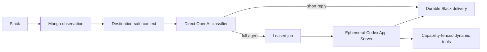

# tos-tag

tos-tag is TelemetryOS's Slack-native ambient agent. It observes authorized
Slack conversations, uses a fast direct OpenAI classifier to decide whether and
how to participate, and reserves Codex App Server for admitted full-agent work.

The current development deployment observes broadly authorized Slack input but
can post only to the configured `#tos-tag` channel. Private conversation context
is destination-local: one private channel, DM, or group DM can never influence
an answer sent elsewhere.

## What it does

- Ingests Slack messages, edits, deletes, threads, DMs, group DMs, private
  channels, public channels, and permitted Slack Connect events.
- Builds immutable, source-linked context packs with a 100k-token default cap.
- Calls OpenAI directly for stateless, tool-free classification.
- Chooses silence, reaction, short direct reply, channel/thread placement,
  model profile, strength, and reasoning effort.
- Runs admitted jobs in one disposable Codex App Server process per attempt.
- Injects the TelemetryOS headless skill plugin and tos-tag `base` plugin via
  Codex's `.agents/skills` discovery path.
- Exposes reviewed job-scoped tools without placing connector credentials in
  the Codex process or prompt.
- Posts validated Slack Block Kit, including native tables, with durable
  idempotent delivery.
- Supports Slack-native exact-action approvals, channel directive modals,
  scheduled routines, and classifier-gated trigger subscriptions.
- Records correlated redacted logs, usage, and append-only audit receipts.

### Verified development posture

As of 2026-08-01, the approved local deployment has this deliberately
asymmetric authority:

| Boundary | Development setting |
| --- | --- |
| Input discovery | All user-authorized observable public channels, private channels, DMs, and group DMs |
| New conversation policy | Enrolled as `observe`; no output |
| Interactive test channel | `#tos-tag` in `assist` mode |
| Output | Hard-restricted to `#tos-tag` by channel policy and `TAG__SLACK__OUTPUT_CHANNEL_IDS` |
| Private context | Destination-local; never usable outside its originating private conversation |
| Classifier | Direct OpenAI call, `gpt-5.6-luna`, reasoning effort `none` |
| Full-agent default | `gpt-5.6-luna`, effort `max`; classifier may route admitted work to lower profiles |
| Capacity | Eight channel admission slots, eight job workers, 120 responses/hour |

This is a development authorization, not a production default. The checked-in
configuration remains fail-closed (`stub`, `shadow`, tools disabled), and
credentials must be rotated before production.

## Architecture at a glance



The classifier and full agent are deliberately separate:

| Surface | Runtime | State | Tools | Credential |
| --- | --- | --- | --- | --- |
| Ambient classifier | Direct OpenAI Responses API | Stateless | None | `TAG__CLASSIFIER__OPENAI_API_KEY` |
| Full agent | Codex App Server JSON-RPC over stdio | Ephemeral thread | Two job-scoped dynamic tools | Private Codex login in `CODEX_HOME` |
| Authority | Go control plane + MongoDB | Durable | Reviewed helper gateway | Encrypted organization keystore |

See [architecture.md](architecture.md) for the full security and lifecycle
contract.

## Dependencies

The versions below are the reproducible development image defaults or pinned
bootstrap revisions.

| Dependency | Pinned version | Purpose |
| --- | --- | --- |
| Go | `1.26.5` | API, workers, tests, and tooling |
| Codex CLI / App Server | `0.146.0` | Full-agent JSON-RPC runtime |
| Node.js | `24.7.0` | Codex package and repository tooling |
| pnpm | `11.18.0` | Aion-managed frontend dependencies |
| GitHub CLI | `2.96.0` | Repository bootstrap and auth |
| MongoDB | `8.0.28` | Authoritative state |
| Docker Engine + Compose v2 | host-managed | Reproducible persistent development stack |
| Docker Buildx | host-managed, recommended | Modern Compose image builder; the classic builder remains a functional fallback |
| Bash, Git, Make, curl, jq, ripgrep, OpenSSL, Python 3 | image distribution versions | Reviewed helpers, bootstrap, keystore generation, skill builds, and source search |
| Aion | `v2.0.5` / `2b186d21…` | TelemetryOS workspace sync |
| telemetry-otel-fetch | `0e94e929…` | Reviewed SigNoz/OTel helper |
| Device-Log-Analyzer | `d885c144…` | Reviewed device-log helper |
| TelemetryOS-Mongo-Fetch | `4c39e789…` | Optional reviewed Mongo helper |
| telemetryos-agent-skills | plugin `telemetryos-automation` `3.6.1`; current configured checkout | 29 headless TelemetryOS behavioral skills |
| tag-agent-skills | plugin `base` `0.4.0`; current configured checkout | `slack-message-design`, `tag-triggers`, and `team-alignment` |

The exact image digests, versions, and helper commits live in
[Dockerfile.dev](Dockerfile.dev), [docker-compose.yml](docker-compose.yml), and
[container/bootstrap-workspace.sh](container/bootstrap-workspace.sh).
Skill repositories intentionally follow their configured checkout during
bootstrap; plugin versions and content hashes are validated before each worker
snapshot, while executable helper repositories remain commit-pinned.

## Repository layout

```text
cmd/                         API, admin, and eval entrypoints
core/classifier/             direct OpenAI classifier
core/contextpacks/           privacy-aware bounded context
core/harness/                Codex App Server JSON-RPC adapter
core/workers/                disposable process/workspace isolation
core/tools/                  reviewed capability and credential gateway
core/slack/                  Socket Mode ingress and Block Kit delivery
core/jobs/                   leased durable work
core/deliveries/             typed output, rendering, and reconciliation
core/approvals/              exact-action approval/resume
core/channelconfig/          Slack channel prompt directives
core/routines/, core/triggers/ scheduled and heartbeat work
tool-marketplace/            reviewed executable helper bundles
container/                   reproducible persistent development workspace
```

## Fast local setup

Prerequisites:

- Git and GitHub CLI authentication for private TelemetryOS repositories;
- Go matching `go.mod` and MongoDB reachable at the configured URI for a host
  run, or Docker Engine with Compose v2 for the persistent container path
  (Buildx is recommended to avoid Compose's classic-builder fallback warning);
- `codex` `0.146.0` or a compatible schema-tested version and an authenticated
  Codex login (`codex login status`) for full-agent work;
- sibling checkouts of `telemetryos-agent-skills` and `tag-agent-skills` when
  behavioral plugin injection is enabled;
- Bash, Make, curl, jq, ripgrep, OpenSSL, and Python 3 for the reviewed local
  helpers, keystore bootstrap, and skill builds; and
- Slack/OpenAI/helper credentials only for live integration.

```bash
mkdir -p TelemetryOS
cd TelemetryOS
gh repo clone telemetryOS/tos-tag
gh repo clone telemetryOS/telemetryos-agent-skills
gh repo clone telemetryOS/tag-agent-skills
cd tos-tag
cp runtime.env.example runtime.env
chmod 0600 runtime.env
make test
```

`runtime.env` is ignored and should remain mode `0600`. Do not paste its values
into issues, logs, prompts, or test artifacts.

Start MongoDB, then run the deterministic stub:

```bash
make run
```

The example plugin paths expect the three repositories to remain siblings:

```text
TelemetryOS/
├── tos-tag/
├── telemetryos-agent-skills/
└── tag-agent-skills/
```

Run `make sync-tool-env` after those checkouts exist. It imports only the
documented helper bindings, generates a keystore key if needed, enables the
reviewed default tools, and writes names and values only to ignored mode-0600
`runtime.env`. Its terminal output contains variable names, never values.

For live Slack, fill the required values in `runtime.env`, set the explicit
live flags and channel allowlist, then:

```bash
make run-live
```

## Container workspace

The Compose path installs every core dependency, persists source/auth/state,
and keeps individual Slack job workers disposable.

```bash
make container-build
make container-up
make container-shell
```

On the first setup, authenticate GitHub and bootstrap the repositories:

```bash
./container/docker-compose.sh run --rm workspace gh auth login --web
make container-bootstrap
```

Authenticate Codex once in the persistent container home:

```bash
make container-codex-login
```

Verify it with:

```bash
./container/docker-compose.sh exec workspace codex login status
```

Persistent layout:

```text
/workspace/projects/tos-tag
/workspace/skills/telemetryos-agent-skills
/workspace/skills/tag-agent-skills
/workspace/code                    Aion developer_path
/workspace/state/logs
/workspace/state/workers           disposable job roots
/home/tag/.codex                   private persistent Codex login/state
/data/db                            Mongo volume
```

The host Docker socket is not mounted. `runtime.env` is mounted read-only at
`/run/secrets/tos-tag-runtime.env` and sourced inside the service process so
Compose inspection does not expand secrets. Container startup overrides any
host `TAG_AION_DEVELOPER_PATH` with `/workspace/code`, preventing a host path
from becoming the code-tool binding inside the image. It likewise replaces the
host HTTP, Mongo, log, Codex, skill, and tool paths with their container-owned
addresses after the file is loaded.

## Configuration

### Slack labels and environment names

The local names mirror Slack's UI:

```dotenv
TAG__SLACK__APP_LEVEL_TOKEN=xapp-...
TAG__SLACK__USER_OAUTH_TOKEN=xoxp-...
TAG__SLACK__BOT_USER_OAUTH_TOKEN=xoxb-...
```

Also configure the organization, team, app, bot user, Socket Mode/live flags,
context sync, and explicit output channel allowlist shown in
[runtime.env.example](runtime.env.example).

### Direct classifier

```dotenv
TAG__CLASSIFIER__MODE=shadow
TAG__CLASSIFIER__PROVIDER=openai
TAG__CLASSIFIER__BASE_URL=https://api.openai.com/v1
TAG__CLASSIFIER__OPENAI_API_KEY=
TAG__CLASSIFIER__MODEL=gpt-5.6-luna
TAG__CLASSIFIER__REASONING_EFFORT=none
TAG__CLASSIFIER__TIMEOUT=60s
TAG__CLASSIFIER__MAX_RESPONSES_PER_HOUR=120
TAG__CLASSIFIER__MAX_CONCURRENT_JOBS=8
TAG__JOBS__WORKER_CONCURRENCY=8
```

This key is used only by the direct classifier. It is never passed to Codex App
Server or a tool subprocess. Begin with `shadow`, use `observe` channel mode,
and enable speaking only after natural-message precision is verified. Admission
defaults allow eight simultaneous admitted jobs per channel, backed by eight
execution workers, and 120 responses per hour per channel; tune these explicit
safety bounds for production traffic. The admission bound and worker-pool size
are separate so global execution capacity can be sized independently from each
channel's fairness limit.

Channel participation modes are durable Mongo policy, separate from the global
classifier mode:

| Mode | Behavior |
| --- | --- |
| `observe` | Persist authorized context; never react or answer |
| `mention` | Consider direct mentions and active tos-tag threads only |
| `assist` | Classify ordinary ambient conversation and act only above policy thresholds |
| `proactive` | Permit classifier-gated actionable background behavior as well as assist behavior |

A direct mention is a participation trigger, not a forced thread. Brief,
self-contained answers that are unlikely to continue belong in-channel;
investigations, tools, tables, artifacts, or likely follow-up belong in a
thread. Short greetings and thanks can be answered directly by the classifier
without starting Codex. Integration-authored messages are deterministically
suppressed to prevent loops.

For ambient team alignment, the classifier may surface a material conflict
between the current statement and a recent destination-safe public report from
another human or a clear fact. It stays silent on opinions, minor differences,
stale or ambiguous evidence, and anything that would not help the current
channel. Human reports remain attributed reports rather than verified truth.
Private channels, DMs, and group DMs never contribute to an intervention outside
their own destination. Trusted source author/channel IDs and timestamps travel
with the immutable context; only mentions from classifier-selected releasable
evidence are allowed through rendering.

The full agent also chooses between a Slack-native response and a durable
document. Short and medium explanations stay in Slack. Genuinely long,
expository, document-shaped work is published as Markdown in the Agent Wiki
`artifacts` namespace; about 20,000 visible characters (roughly half Slack's
overall 40,000-character text ceiling) is a soft planning signal, not a strict
cutoff. The agent then posts a concise synopsis plus an artifact link using the
exact URL returned by the successful Wiki write. It never predicts a URL or
claims publication after a failed write, and falls back to a compact Slack
answer when the Wiki path is unavailable. This is control-plane enforced:
model-created artifact segments are accepted only when their URL was produced
by a successful reviewed tool call in the same disposable worker attempt.

### Codex App Server

```dotenv
TAG__CODEX__ENABLED=true
TAG__CODEX__COMMAND=codex
TAG__CODEX__HOME=
TAG__CODEX__WORKER_ROOT=/tmp/tos-tag-workers
TAG__CODEX__TIMEOUT=15m
```

When `TAG__CODEX__HOME` is empty, tos-tag resolves `CODEX_HOME` and then
`$HOME/.codex`. The directory must contain a valid Codex login and be writable
by the service process. It is private runtime state, not a workspace shared
with the model.

Each job launches `codex app-server --stdio`, performs the official handshake,
creates an ephemeral thread, registers the scoped dynamic tools, and starts a
read-only/network-disabled turn with the classifier-selected model and effort.

### Model profiles

```dotenv
TAG__MODELS__DEFAULT_PROFILE=chatgpt-luna-max
TAG__MODELS__DEFAULT_PROVIDER=openai
TAG__MODELS__DEFAULT_MODEL=gpt-5.6-luna
TAG__MODELS__DEFAULT_VARIANT=max
```

Lower strength/effort profiles remain available so the classifier can choose a
faster path for straightforward admitted work.

### Skills and tools

The development configuration automatically injects:

1. plugin `telemetryos-automation` from `telemetryos-agent-skills`; and
2. plugin `base` from `tag-agent-skills`.

Snapshots are hash-verified and materialized read-only under
`.agents/skills/<name>`. Helper scripts from those repositories are excluded.
Execution requires a separately reviewed entry in `tool-marketplace/`.

The currently injected behavioral skill inventory is:

- `telemetryos-automation` (29): `bug`, `coderabbit`, `deploy`,
  `device-emulator`, `device-log-analyzer`, `failqa`, `fix`,
  `fix-and-deploy`, `fix-and-pr`, `github-workflow-manager`, `investigate`,
  `issue-worktree-runner`, `linear-issue-manager`, `local-fleet-test`, `merge`,
  `merge-and-qa`, `pr`, `qa`, `qafail`, `qapass`, `queue`, `review`,
  `secaudit`, `secscan`, `slackreport`, `suitability`,
  `telemetry-mongo-fetch`, `telemetry-otel-fetch`, and `wiki`;
- `base` (3): `slack-message-design`, `tag-triggers`, and `team-alignment`.

A behavioral skill explains a workflow; it does not grant executable
authority. The reviewed dynamic-tool catalog is the separate allowlist:

| Tool ID | Operations | Approval | Purpose | Default sync |
| --- | --- | --- | --- | --- |
| `telemetryos.code` | `read` | Risk-based | List/search/read bounded Aion source without a mount or shell | Enabled |
| `telemetryos.linear` | `read`, `write` | Risk-based | Linear issue workflows | Enabled |
| `telemetryos.wiki` | `read`, `write`, `delete` | Never for page read/write; always for recoverable page soft-delete | Page-only Agent Wiki CRUD | Enabled |
| `telemetryos.otel` | `read` | Risk-based | SigNoz/OpenTelemetry queries | Enabled |
| `telemetryos.device-logs` | `read`, `write` | Risk-based | Device log inspection and scoped log-level changes | Enabled |
| `telemetryos.mongo` | `read` | Risk-based | QA Mongo queries through a human-opened security-key session | Disabled by default |

Approval is declared by the reviewed operation manifest. The conservative
default remains risk-based: non-read operations suspend the worker and require
an independent exact-action Slack approval. The reviewed Agent Wiki bundle is
the explicit exception for normal page read/write authoring and executes those
operations without per-action approval; recoverable page soft-delete always
requires approval. Namespace, asset, publish-file, cascading move, activity,
generic undo, and admin Wiki actions are unavailable. Admin-risk operations are
invalid for all worker tools. Every operation remains job-scoped, allowlisted, hash-pinned,
bounded, kill-switchable, and fully audited.

Use `make sync-tool-env` to copy only known helper credential names from the
current shell or `~/.config/telemetryos` into ignored `runtime.env`. The script
reports names, never values. Enabling reviewed tools also requires the encrypted
keystore and an explicit tool-ID allowlist. The same setup enables
`telemetryos.code`, a reviewed read-only view of `TAG_AION_DEVELOPER_PATH` with
fixed-string search and bounded file reads. Full-agent workers do not receive a
source mount, a generic shell, runtime environment files, or credential paths.
When a worker publishes source-derived Wiki content, it passes the body through
the reviewed typed Wiki operation. The exact body is committed by the audit
receipt rather than copied into broad audit listings.

The same Wiki capability is the default overflow surface for long-form
expository results. It writes Markdown only after the worker decides the result
is document-shaped, then returns the exact successful tool URL through a typed
Slack artifact segment. Normal conversational and medium-length answers remain
in Slack.

## Slack application setup

The checked-in [slack-app-manifest.yaml](slack-app-manifest.yaml) defines the
development app's requested scopes, Socket Mode, events, slash command, and
agent surfaces. Install it in the intended development workspace, generate an
app-level token with `connections:write`, install the app, and copy the labeled
tokens to the matching local variables above.

Invite the bot to `#tos-tag`, enroll only that channel for output, and keep new
channels observe-only. Broad scopes do not authorize broad output.

The `/tag-directive` command opens a modal for the current channel directive.
Directives are revisioned in MongoDB, audited, and supplied to both classifier
and full agent.

### Logging and audit

Set `TAG__LOGGING__FILE_PATH` to an owner-readable path outside the repository
for JSONL diagnostics. Logs correlate organization, channel, observation,
decision, job, worker, tool, delivery, Slack envelope, and latency identifiers,
but record only sizes, counts, bounded error codes, and lifecycle metadata—not
message text, prompts, model responses, tool output, or credentials.

Tool executions and externally visible actions also produce append-only,
tamper-evident Mongo audit receipts. Tool receipts are paired as
`tool.execution.requested` / `tool.execution.completed`; operations whose
reviewed manifest requires approval also add approval receipts. Content is represented by commitments rather than
copied into broad audit listings.

## Verification

The full local gate is:

```bash
make verify
```

It runs formatting, all Go tests, race tests, vet, behavioral evals, gosec, and
govulncheck.

Latest complete baseline (2026-08-01):

- all Go tests, race tests, and `go vet`: pass;
- deterministic behavioral evaluation: `35/35` (33 natural classifier messages
  plus context-cap and deduplication invariants), including silence, placement,
  privacy, routing, and reaction contracts;
- live direct OpenAI classifier evaluation: `35/35`, with 25 real provider
  calls, eight hard-policy suppressions that bypassed the provider, complete
  grounding/disclosure/placement/routing/reaction scores, and approximately
  `1.26s` mean end-to-end case latency;
- `gosec`: 0 issues across 81 Go files and 19,460 lines;
- `govulncheck`: no reachable or imported vulnerable packages; one advisory is
  present in a required module but its affected package is not imported or
  called;
- live `#tos-tag`: direct social in-channel reply, ambient silence, stable
  non-urgent metric acknowledgement without a reply, mixed social/work
  disambiguation, destination-safe private-context refusal, emoji
  acknowledgement, deep threaded work, native tables, exact-action
  approval/resume, Wiki access, source inspection, and three overlapping jobs:
  pass; and
- broad user-authorized sync: 378 conversations registered, 527 messages
  imported, one inaccessible conversation safely skipped, with private/DM
  sources marked restricted.

In the latest concurrent adversarial wave, measured end-to-end latency was about
5 seconds for a direct social reply, 12-14 seconds for light/low in-channel
agent replies, 19 seconds for a medium-effort native table, and 197 seconds for
a strong/max production-telemetry investigation. Classifier calls over the
live 63k-64k-token channel context took about 2-3 seconds. Classifier and
full-agent latency are reported separately; max-effort work remains the
clearest optimization target.

The authenticated Codex App Server smoke is opt-in:

```bash
TOS_TAG_LIVE_CODEX=1 go test -tags=live ./integration \
  -run TestLiveCodexAppServerTurn -count=1 -v
```

That test verifies the installed App Server handshake, ephemeral thread,
dynamic-tool schema registration, model/effort routing, structured response,
event normalization, and teardown. It uses the private Codex login and makes a
real model call.

Live Slack tests are separate. Keep output constrained to `#tos-tag`, use
natural messages without evaluator hints, measure classifier and agent latency
separately, and inspect only redacted structured logs.

## Operational commands

```bash
make test                 # deterministic test suite
make race                 # race detector
make eval                 # deterministic 35-case behavioral gate
make eval-live            # opt-in 35-case live OpenAI classifier gate
make security             # gosec + govulncheck
make verify               # full local gate
make run-live             # host live runtime from ignored runtime.env
make sync-tool-env         # configure reviewed helper bindings without printing values
make container-build      # reproducible dev image
make container-bootstrap  # clone/sync code, skills, Aion, helpers
make container-up         # Mongo + workspace + tos-tag
make container-codex      # interactive operator Codex shell
make container-codex-login
```

## Safety notes

- Rotate the current development Slack and OpenAI credentials before production.
- Never log raw Slack envelopes, message bodies, access tokens, Codex auth, or
  connector secret values.
- Do not add arbitrary shell operations to the tool marketplace.
- Do not weaken private-channel destination filtering.
- Do not allow the classifier to call tools or retain provider state.
- Do not let Codex choose destinations, approvals, or privileged Slack blocks.
- Do not treat a passing local test as proof of production Slack membership,
  scopes, rate limits, or rendering.

## References

- [Codex App Server](https://learn.chatgpt.com/docs/app-server)
- [Codex skills](https://learn.chatgpt.com/docs/build-skills)
- [Slack Block Kit](https://docs.slack.dev/block-kit/)
- [Slack app manifests](https://docs.slack.dev/app-manifests/configuring-apps-with-app-manifests/)
