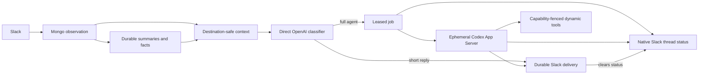

# tos-tag

tos-tag is TelemetryOS's Slack-native ambient agent. It observes authorized
Slack conversations, uses a fast direct OpenAI classifier to decide whether and
how to participate, and reserves Codex App Server for admitted full-agent work.

The current development deployment observes broadly authorized Slack input and
automatically enables `assist` in public/private channels where Slack confirms
Tag is a member. Other conversations remain observe-only. Private conversation
context is destination-local: one private channel, DM, or group DM can never
influence an answer sent elsewhere.

## What it does

- Ingests Slack messages, edits, deletes, threads, DMs, private channels,
  public channels, and permitted Slack Connect events. Group DMs (`mpdm-*`)
  are ignored entirely: excluded from discovery, never persisted, and hidden
  from channel coverage.
- Builds immutable, source-linked context packs with a 100k-token default cap.
- Curates source-linked channel/thread memory asynchronously with Luna, then
  recalls it through the same private-channel boundary as live Slack context.
- Calls OpenAI directly for stateless, tool-free classification.
- Chooses silence, reaction, short direct reply, channel/thread placement,
  model profile, strength, and reasoning effort.
- Runs admitted jobs in one disposable Codex App Server process per attempt.
- Injects the complete tos-tag `base` plugin via Codex's `.agents/skills`
  discovery path.
- Exposes reviewed job-scoped tools without placing connector credentials in
  the Codex process or prompt.
- Posts validated Slack Block Kit, including presentation-only Cards and
  Carousels plus sortable/paginated Data Tables, with durable idempotent
  delivery. Model-generated cards cannot carry actions.
  Durable replies use ordinary posts; native-only Cards and Carousels
  deterministically downgrade to equivalent standard Sections/Tables for
  compatibility now that progress streams are no longer created.
- Uses the classifier reaction as the immediate acknowledgement and immediately
  sets Slack's native transient status for every admitted full-agent thread.
  Generic loading messages rotate while the agent starts; each native or
  reviewed tool call replaces the status with a safe tool-specific label such
  as `Consulting Agent Wiki…` or `Checking Linear…`. Long-running jobs refresh
  the current status before Slack's two-minute timeout. The final reply clears
  the status automatically. Tag does not create plan-mode progress streams or
  in-thread task-card pills. Brief classifier-selected in-channel answers remain
  direct because the native status requires a thread.
- Supports Slack-native exact-action approvals, channel directive modals,
  `/tag-proactive`, `/tag-assist`, and `/tag-off` level commands plus the
  compatible `/tag-mode` change command and ephemeral `/tag-status` Block Kit
  table. `/tag-automations` lists only the invoking channel's scheduled tasks
  and opens a channel-locked edit modal. Routines and classifier-gated trigger
  subscriptions use explicit cron schedules and IANA timezones.
- Records correlated redacted logs, usage, and append-only audit receipts.

### Verified development posture

As of 2026-08-01, the approved local deployment has this deliberately
asymmetric authority:

| Boundary | Development setting |
| --- | --- |
| Input discovery | All user-authorized observable public channels, private channels, and DMs; group DMs are ignored |
| New conversation policy | Enrolled as `observe`; joined public/private channels become `assist` when enabled |
| Interactive test channel | `#tos-tag`; live regression traffic remains confined there |
| Output | Slack-confirmed joined-channel policy, optionally narrowed by `TAG__SLACK__OUTPUT_CHANNEL_IDS` |
| Private context | Destination-local; never usable outside its originating private conversation |
| Classifier | Direct OpenAI call, `gpt-5.6-luna`, reasoning effort `none` |
| Memory curator | Direct OpenAI call, `gpt-5.6-luna`, reasoning effort `medium`; asynchronous and source-linked |
| Full-agent strong/default | `gpt-5.6-sol`, effort `medium`; classifier routes ordinary admitted work to Luna low/medium |
| Capacity | Eight channel admission slots, eight job workers, 120 responses/hour |

This is a development authorization, not a production default. The checked-in
configuration remains fail-closed (`stub`, `shadow`, tools disabled), and
credentials must be rotated before production.

## Architecture at a glance



The classifier and full agent are deliberately separate:

| Surface | Runtime | State | Tools | Credential |
| --- | --- | --- | --- | --- |
| Ambient classifier | Direct OpenAI Responses API | Stateless | None | `TAG__CLASSIFIER__OPENAI_API_KEY` |
| Memory curator | Direct OpenAI Responses API | Durable results in MongoDB | None | Control-plane OpenAI key |
| Full agent | Codex App Server JSON-RPC over stdio | Ephemeral thread | Three job-scoped dynamic tools | Private Codex login in `CODEX_HOME` |
| Authority | Go control plane + MongoDB | Durable | Reviewed helper gateway | Encrypted organization keystore |

See [architecture.md](architecture.md) for the full security and lifecycle
contract.

Reactions remain available for intentional reaction-only classifier outcomes
and lightweight social acknowledgements. When the classifier admits answer
work (a channel or thread reply), the control plane immediately applies the
classifier-selected emoji to the source message as an acknowledgement that a
response is coming. Every admitted thread job also calls
`assistant.threads.setStatus` immediately, using rotating generic lifecycle
messages followed by safe tool-specific updates. No progress message or task
card is inserted into the thread. Brief classifier-selected in-channel answers
remain direct because native agent status requires a `thread_ts`. Background and
approval outcomes stay reaction-free. A strong/high-effort full-agent
recommendation is substantial by definition and is corrected to a thread
unless the requester explicitly asks for an in-channel answer; this prevents a
long-running job from losing its progress surface.

A newly created full-agent session in a one-to-one Tag DM also receives one
best-effort `assistant.threads.setTitle` update after the job is durably
enqueued. The Go control plane derives a short title from the initial request,
removes Slack markup, links, code, controls, and likely secrets, and falls back
to `Tag request` for suspicious or empty input. Channel threads and group DMs
are never titled, workers cannot choose titles, title text is not logged, and a
Slack title failure does not affect the answer.

## Dependencies

The versions below are the reproducible development image defaults or pinned
bootstrap revisions.

| Dependency | Pinned version | Purpose |
| --- | --- | --- |
| Go | `1.26.5` | API, workers, tests, and tooling |
| Codex CLI / App Server | `0.146.0` | Full-agent JSON-RPC runtime |
| Node.js | `24.7.0` | Codex package and repository tooling |
| pnpm | `11.18.0` | Aion-managed frontend dependencies |
| GitHub CLI | `2.96.0` | Repository bootstrap and auth |
| MongoDB | `8.0.28` | Authoritative state |
| slack-go | `v0.27.0` | Socket Mode, Block Kit, and native assistant thread status transport |
| robfig/cron | `v3.0.1` | Validated standard five-field automation schedules |
| Docker Engine + Compose v2 | host-managed | Reproducible persistent development stack |
| Docker Buildx | host-managed, recommended | Modern Compose image builder; the classic builder remains a functional fallback |
| Bash, Git, Make, curl, jq, ripgrep, OpenSSL, Python 3 | image distribution versions | Reviewed helpers, bootstrap, keystore generation, skill builds, and source search |
| Aion | `v2.0.5` / `2b186d21…` | TelemetryOS workspace sync |
| telemetry-otel-fetch | `0e94e929…` | Reviewed SigNoz/OTel helper |
| Device-Log-Analyzer | `d885c144…` | Reviewed device-log helper |
| TelemetryOS-Mongo-Fetch | `4c39e789…` | Optional reviewed Mongo helper |
| tag-agent-skills | plugin `base` `1.2.2`; current configured checkout | Complete 28-skill tos-tag behavioral package |

The exact image digests, versions, and helper commits live in
[Dockerfile.dev](Dockerfile.dev), [docker-compose.yml](docker-compose.yml), and
[container/bootstrap-workspace.sh](container/bootstrap-workspace.sh).
Skill repositories intentionally follow their configured checkout during
bootstrap; plugin versions and content hashes are validated before each worker
snapshot, while executable helper repositories remain commit-pinned.

## Repository layout

```text
cmd/                         API, admin, and eval entrypoints
core/classifier/             direct OpenAI classifier
core/activity/               bounded redacted real-time operator feed
core/contextpacks/           privacy-aware bounded context
core/harness/                Codex App Server JSON-RPC adapter
core/workers/                disposable process/workspace isolation
core/tools/                  reviewed capability and credential gateway
core/slack/                  Socket Mode ingress and Block Kit delivery
core/jobs/                   leased durable work
core/deliveries/             typed output, rendering, and reconciliation
core/approvals/              exact-action approval/resume
core/channelconfig/          Slack channel prompt directives
core/schedule/                cron parsing, timezone validation, and advancement
core/routines/, core/triggers/ scheduled and classifier-gated work
tool-marketplace/            reviewed executable helper bundles
container/                   reproducible persistent development workspace
```

## Fast local setup

Prerequisites:

- Git and GitHub CLI authentication for private TelemetryOS repositories;
- Go matching `go.mod` and MongoDB reachable at the configured URI for a host
  run, or Docker Engine with Compose v2 for the persistent container path
  (Buildx is recommended to avoid Compose's classic-builder fallback warning);
- `codex` `0.146.0` or a compatible schema-tested version and an authenticated
  Codex login (`codex login status`) for full-agent work;
- a sibling checkout of `tag-agent-skills` when behavioral plugin injection is
  enabled;
- Bash, Make, curl, jq, ripgrep, OpenSSL, and Python 3 for the reviewed local
  helpers, keystore bootstrap, and skill builds; and
- Slack/OpenAI/helper credentials only for live integration.

```bash
mkdir -p TelemetryOS
cd TelemetryOS
gh repo clone telemetryOS/tos-tag
gh repo clone telemetryOS/tag-agent-skills
cd tos-tag
cp runtime.env.example runtime.env
chmod 0600 runtime.env
make test
```

`runtime.env` is ignored and should remain mode `0600`. Do not paste its values
into issues, logs, prompts, or test artifacts.

Start MongoDB, then run the deterministic stub:

```bash
make run
```

The example plugin path expects the repositories to remain siblings:

```text
TelemetryOS/
├── tos-tag/
└── tag-agent-skills/
```

Run `make sync-tool-env` after those checkouts exist. It imports only the
documented helper bindings, generates a keystore key if needed, enables the
reviewed default tools, and writes names and values only to ignored mode-0600
`runtime.env`. Its terminal output contains variable names, never values.
Install the pinned local semantic runtime first:

```bash
make install-semantic-search
make sync-tool-env
```

For live Slack, fill the required values in `runtime.env`, set the explicit
live flags and channel allowlist, then:

```bash
make run-live
```

## Container workspace

The Compose path installs every core dependency, persists source/auth/state,
and keeps individual Slack job workers disposable.

```bash
make container-build
make container-up
make container-shell
```

On the first setup, authenticate GitHub and bootstrap the repositories:

```bash
./container/docker-compose.sh run --rm workspace gh auth login --web
make container-bootstrap
```

Authenticate Codex once in the persistent container home:

```bash
make container-codex-login
```

Verify it with:

```bash
./container/docker-compose.sh exec workspace codex login status
```

Persistent layout:

```text
/workspace/projects/tos-tag
/workspace/skills/tag-agent-skills
/workspace/code                    Aion developer_path
/workspace/state/logs
/workspace/state/workers           disposable job roots
/home/tag/.codex                   private persistent Codex login/state
/data/db                            Mongo volume
```

The host Docker socket is not mounted. `runtime.env` is mounted read-only at
`/run/secrets/tos-tag-runtime.env` and sourced inside the service process so
Compose inspection does not expand secrets. Container startup overrides any
host `TAG_AION_DEVELOPER_PATH` with `/workspace/code`, preventing a host path
from becoming the code-tool binding inside the image. It likewise replaces the
host HTTP, Mongo, log, Codex, skill, and tool paths with their container-owned
addresses after the file is loaded.

## Configuration

### Slack labels and environment names

The local names mirror Slack's UI:

```dotenv
TAG__SLACK__APP_LEVEL_TOKEN=xapp-...
TAG__SLACK__USER_OAUTH_TOKEN=xoxp-...
TAG__SLACK__BOT_USER_OAUTH_TOKEN=xoxb-...
```

Also configure the organization, team, app, bot user, Socket Mode/live flags,
context sync, and explicit output channel allowlist shown in
[runtime.env.example](runtime.env.example).

Normalized Slack messages are retained indefinitely in MongoDB and have no
TTL index. Context assembly remains bounded independently: only messages from
`TAG__CONTEXT_PACKS__LOOKBACK` are eligible for a new prompt, with a default of
`720h` (30 days). Raw observation rows and stored context-pack revisions keep
their separate short TTLs. `TAG__RETENTION__MESSAGES` is retired and startup
rejects it when set to a non-zero duration.

Context history is bootstrapped once per authorized conversation. MongoDB
retains content-free completion state and a live-event watermark, so ordinary
restarts never replay the configured lookback as new work. On startup and the
periodic membership pass, bot-joined channels and bot-visible DMs receive a
bounded catch-up from the last durable watermark. User-token-only DMs remain
context-only and are not incorrectly polled with the bot token: ambient messages are imported as resolved context,
while a human direct mention, including one in a recovered thread, re-enters
the normal decision queue. First-time bootstrap mentions remain context-only, and
observe-only conversations are not polled for actionable catch-up. Exceptional
history reads are proactively paced by
`TAG__SLACK__CONTEXT_SYNC_REQUEST_INTERVAL` (default `1200ms`) and still honor
Slack's `Retry-After` response.

Slack also echoes Tag's own delivered messages through
Events API. Those callbacks are imported directly as authorized, resolved,
destination-local context for conversational continuity; they never enter the
pending decision queue and therefore never call the classifier or create a
self-referential activity card, reaction, job, or delivery.

Channel policy can set `context_history_mode` to `session_only` for noisy test
destinations. Tag then skips Slack backfill and offline catch-up for that
channel, supplies only same-channel messages observed since the current process
started, excludes cross-channel history and durable memory/facts, and prevents
the channel from generating new durable memory or incident facts. Live events
are still persisted for acknowledgement, idempotency, job recovery, and audit.
The local `#tos-tag` test channel uses this mode.

### Direct classifier

```dotenv
TAG__CLASSIFIER__MODE=shadow
TAG__CLASSIFIER__PROVIDER=openai
TAG__CLASSIFIER__BASE_URL=https://api.openai.com/v1
TAG__CLASSIFIER__OPENAI_API_KEY=
TAG__CLASSIFIER__MODEL=gpt-5.6-luna
TAG__CLASSIFIER__REASONING_EFFORT=none
TAG__CLASSIFIER__TIMEOUT=60s
TAG__CLASSIFIER__MAX_RESPONSES_PER_HOUR=120
TAG__CLASSIFIER__MAX_CONCURRENT_JOBS=8
TAG__CLASSIFIER__FLOOD_PROTECTION_ENABLED=true
TAG__CLASSIFIER__FLOOD_MAX_MESSAGES=1000
TAG__CLASSIFIER__FLOOD_WINDOW=1h
TAG__JOBS__WORKER_CONCURRENCY=8
```

This control-plane key is used by the direct classifier and, when no separate
memory key is configured, the asynchronous memory curator. It is never passed
to Codex App Server or a tool subprocess. Begin with `shadow`, use `observe` channel mode,
and enable speaking only after natural-message precision is verified. Admission
defaults allow eight simultaneous admitted jobs per channel, backed by eight
execution workers, and 120 responses per hour per channel; tune these explicit
safety bounds for production traffic. The admission bound and worker-pool size
are separate so global execution capacity can be sized independently from each
channel's fairness limit. Per-channel cooldown limits ambient chatter but does
not discard direct mentions or human continuations in an active Tag thread;
the hourly budget, concurrency limit, and organization flood gate still apply.

Classifier flood protection is a separate organization/workspace-wide cost
guard. The default fixed one-hour bucket allows 1,000 classifier-eligible
messages. Once exhausted, later messages remain durably acknowledged and
auditable but are dropped before context construction, direct classification,
reactions, full-agent admission, or Slack output. MongoDB increments the bucket
atomically, retains it briefly for diagnosis, and the gate fails closed if its
state is unavailable. Hard-suppressed self/bot/integration events and live
observe-only events that cannot call the provider do not consume this budget.
Tune `FLOOD_MAX_MESSAGES` from expected peak workspace traffic, not from the
much smaller per-channel response limit.

### Durable memory

Memory is owned by the Go control plane, not by Codex threads. When enabled,
an asynchronous curator groups recent human Slack messages by channel and
thread, skips unchanged source hashes, and asks `gpt-5.6-luna` at `medium`
effort for a compact summary and source-bound facts. Calls use strict structured
output and `store: false`; message handling never waits for them.

```dotenv
TAG__MEMORY__ENABLED=false
TAG__MEMORY__MODEL=gpt-5.6-luna
TAG__MEMORY__REASONING_EFFORT=medium
TAG__MEMORY__INTERVAL=10m
TAG__MEMORY__LOOKBACK=168h
TAG__MEMORY__MIN_MESSAGES=6
TAG__MEMORY__MAX_MESSAGES=80
TAG__MEMORY__MAX_SCOPES_PER_RUN=8
TAG__MEMORY__MIN_CONFIDENCE=0.78
```

Generated memories expire no later than the configured context-validity window
for their Slack sources. Private-channel,
DM, and group-DM memories are destination-local; public memories may be
recalled cross-channel. Model-derived memory is marked as derived context and
must be corroborated for consequential claims. Human corrections become
pinned operator memory. The Agent memory page in the management UI supports
review, correction, pin/unpin, and content-erasing forget operations. Forgotten
records retain only a source-hash tombstone so unchanged content is not learned
again.

Channel participation modes are durable Mongo policy, separate from the global
classifier mode:

| Mode | Behavior |
| --- | --- |
| `observe` | Persist authorized context; never react or answer |
| `mention` | Consider direct mentions and active tos-tag threads only |
| `assist` | Answer useful ambient questions and authorized interventions, but never launch full-agent work from an unaddressed declarative status update |
| `proactive` | Permit classifier-gated actionable background behavior as well as assist behavior |

The three fixed channel commands write those same durable modes; they do not
create a separate level system. `/tag-proactive` and `/tag-assist` also join a
public channel when Tag is not already present. Slack does not allow an app to
invite itself to a private channel, so the mode is saved and the ephemeral
result asks a human to invite Tag. `/tag-off` persists `observe` before trying
to leave, which keeps the channel silent even when Slack refuses the leave (for
example, in the workspace's general channel). `/tag-mode` remains available
for status and compatibility: `/tag-mode observe | assist | proactive`.

`/tag-status` returns an ephemeral native Block Kit table for the current
channel. It shows the durable participation mode and behavior, active directive
revision and a bounded prompt preview, workspace/channel availability, Tag's
reconciled Slack membership, and whether the channel is public or restricted.
The command is read-only and includes shortcuts for the four channel controls.

`/tag-automations` returns an ephemeral list of the current channel's direct
routines and classifier-gated schedules. Each Edit button opens a Slack modal
for the task instruction, cron, timezone, enabled state, and—when applicable—
classifier confidence. An existing task's workspace/channel identity is
immutable; the modal uses its persisted version to reject stale edits. Channel
members may inspect the list, while only configured channel approvers receive
Edit controls and may save changes.

With `TAG__SLACK__AUTO_ASSIST_JOINED_CHANNELS=true`, Slack membership owns the
`observe`/`assist` transition for public and private channels. Startup
reconciles the human-authorized context inventory against a separate bot-token
conversation inventory, while `member_joined_channel` and
`member_left_channel` apply changes in real time. A bounded five-minute
inventory refresh is the fallback when those subscriptions have not yet been
applied. One-to-one DMs are auto-enabled as assist destinations; group DMs are
never enabled. In a one-to-one DM, every human message receives either a classifier-direct reply or
normal full-agent escalation; silent and reaction-only classifier outcomes are
replaced by a bounded visible acknowledgement. A non-empty
`TAG__SLACK__OUTPUT_CHANNEL_IDS` remains an additional exact-ID restriction.

A direct mention is a participation trigger, not a forced thread. Brief,
self-contained answers that are unlikely to continue belong in-channel;
investigations, tools, tables, artifacts, or likely follow-up belong in a
thread. Short greetings and thanks can be answered directly by the classifier
without starting Codex. Integration-authored messages are retained as
unverified destination-local context and bypass classification, reactions,
jobs, and delivery by default. An operator may add exact Slack bot IDs to a
channel's durable `trusted_integration_bot_ids` policy through Channel Coverage
to turn only new messages from those reviewed integrations into
classifier-gated triggers. Edits, membership events, other bots, and offline
catch-up remain context-only.

Assist initiative is enforced independently of the model. A direct mention,
active Tag thread, explicit address, clear question, conversationally addressed
request, authoritative product question, destination-safe alignment
intervention, or operator-created trigger may admit work. Tag having spoken
last does not authorize a bare status declaration. Any full-agent recommendation
without one of those grants is converted to `silent` with
`policy.unsolicited_assist_work` before admission and checked again immediately
before job creation. `proactive` channels retain classifier-gated incident
initiative.
For this deterministic boundary, URL query punctuation is ignored, repeated
`??` is not a question grant, and the ordinary noun `tag` is not treated as an
explicit address unless it appears in a genuine vocative position.

For ambient team alignment, the classifier may surface a material conflict
between the current statement and a recent destination-safe public report from
another human or a clear fact. It stays silent on opinions, minor differences,
stale or ambiguous evidence, and anything that would not help the current
channel. Human reports remain attributed reports rather than verified truth.
Private channels, DMs, and group DMs never contribute to an intervention outside
their own destination. Trusted source author/channel IDs and timestamps travel
with the immutable context. Rendering allows only exact user recipients named
in the current request or mentions from classifier-selected releasable evidence.

The full agent also chooses between a Slack-native response and a durable
document. Short and medium explanations stay in Slack. Genuinely long,
expository, document-shaped work is published as Markdown in the Agent Wiki
`artifacts` namespace; about 20,000 visible characters (roughly half Slack's
overall 40,000-character text ceiling) is a soft planning signal, not a strict
cutoff. The agent then posts a concise synopsis plus an artifact link using the
exact URL returned by the successful Wiki write. It never predicts a URL or
claims publication after a failed write, and falls back to a compact Slack
answer when the Wiki path is unavailable. This is control-plane enforced:
model-created artifact segments are accepted only when their URL was produced
by a successful reviewed tool call in the same disposable worker attempt.

Existing Wiki pages are linked differently from newly produced artifacts. A
worker may use a namespace/slug to retrieve a page, but any source or reference
shown to a Slack reader uses the exact opaque human HTTPS URL returned by the
reviewed Wiki `get` or `url` operation in a descriptive Slack link. Every
reviewed `get` returns a full page envelope containing that URL. If no
same-attempt URL was resolved, a bare internal Wiki slug remains readable
instead of invalidating the whole answer. Existing pages are never mislabeled
as model-created artifact segments, and the worker never reconstructs an
opaque page URL.

Every full-agent Block Kit result ends with a de-emphasized, control-plane-owned
context footer containing the resolved model, reasoning effort, provider-reported
turn tokens, elapsed worker time, and a compact allowlisted summary such as
`used documentation, search, wiki`. Codex App Server's
`thread/tokenUsage/updated` event supplies the token count; the model cannot
author or alter the footer. Direct classifier chat, reaction-only decisions,
approvals, and other control-plane notices omit it.

### Codex App Server

```dotenv
TAG__CODEX__ENABLED=true
TAG__CODEX__COMMAND=codex
TAG__CODEX__HOME=
TAG__CODEX__WORKER_ROOT=/tmp/tos-tag-workers
TAG__CODEX__TIMEOUT=15m
TAG__CODEX__WEB_SEARCH_MODE=live
```

When `TAG__CODEX__HOME` is empty, tos-tag resolves `CODEX_HOME` and then
`$HOME/.codex`. The directory must contain a valid Codex login and be writable
by the service process. It is private runtime state, not a workspace shared
with the model.

Each job launches `codex app-server --stdio`, performs the official handshake,
creates an ephemeral thread, registers the scoped dynamic tools, and starts a
read-only turn with the classifier-selected model and effort. In the live
development configuration, Codex's first-party web search is unrestricted and
current; worker shell commands and subprocesses still have no network access.
The separately reviewed source helper is the narrow exception: server-side Git
may contact only the validated origin of one requested TelemetryOS repository
to refresh its default-branch snapshot.

### Model profiles

```dotenv
TAG__MODELS__DEFAULT_PROFILE=chatgpt-sol-medium
TAG__MODELS__DEFAULT_PROVIDER=openai
TAG__MODELS__DEFAULT_MODEL=gpt-5.6-sol
TAG__MODELS__DEFAULT_VARIANT=medium
TAG__MODELS__FAST_PROFILE_BASE=chatgpt-luna
TAG__MODELS__FAST_MODEL=gpt-5.6-luna
```

The classifier uses Luna low for brief work and Luna medium for ordinary
analysis. It reserves the strong Sol-medium profile for durable document
authoring, complex multi-tool work, tricky debugging or root-cause analysis,
security and incident investigation, and similarly high-consequence work.

### Skills and tools

The development configuration automatically injects plugin `base` from
`tag-agent-skills`.

Snapshots are hash-verified and materialized read-only under
`.agents/skills/<name>`. Helper scripts from those repositories are excluded.
Execution requires a separately reviewed entry in `tool-marketplace/`. Agent
Wiki work uses the dedicated typed `tos_tag_wiki` function: the model supplies
page fields and Go constructs the reviewed CLI argv. Generic Wiki argv is
rejected.

The currently injected behavioral skill inventory is `base` (29): `attio`, `bug`,
`code-change-intake`, `codebase-read`, `feature`, `humanizer`,
`linear-issue-manager`, `marketing-account-journey`,
`marketing-ai-visibility-review`, `marketing-blog-writer`,
`marketing-content-engine-chain`, `marketing-customer-research-synthesis`,
`marketing-funnel-chain`, `marketing-funnel-review`,
`marketing-high-intent-followup-chain`, `marketing-landing-page-chain`,
`marketing-messaging`, `marketing-receipt-ledger`, `marketing-unstall-draft`,
`marketing-weekly-journey-report`, `marketing-weekly-review-chain`,
`product-knowledge`, `slack-message-design`, `suitability`, `tag-triggers`,
`team-alignment`, `telemetry-otel-fetch`, `telemetryos-documentation`, and
`wiki`.

A behavioral skill explains a workflow; it does not grant executable
authority. The reviewed dynamic-tool catalog is the separate allowlist:

| Tool ID | Operations | Approval | Purpose | Default sync |
| --- | --- | --- | --- | --- |
| `telemetryos.code` | `read` | Risk-based | Permanently source-read-only default-branch freshness, exact search/read, semantic discovery, and deterministic version evidence without a worker mount or shell | Enabled |
| `telemetryos.product-docs` | `read` | Never | Fixed-host reads of the public docs index/pages and corporate `llms-full.txt` | Enabled |
| `telemetryos.linear` | `read`, `intake`, `write` | Never for bounded bug/feature intake; risk-based otherwise | Linear issue workflows | Enabled |
| `telemetryos.wiki` | `read`, `write`, `delete` | Never for page read/write; always for recoverable page soft-delete | Page-only Agent Wiki CRUD | Enabled |
| `telemetryos.otel` | `read` | Risk-based | SigNoz/OpenTelemetry queries | Enabled |
| `telemetryos.analytics` | `read` | Never | Privacy-filtered acquisition-to-expansion funnel, account, website, normalized-event, and bounded raw site-event reads through the Site Analytics Token boundary | Enabled when `SITE_ANALYTICS_TOKEN` is available |
| `attio.crm` | `read`, `write`, `delete` | Risk-based | Fixed-host Attio v2 JSON API reads and explicit CRM mutations; OAuth and binary file transfer are unavailable | Enabled when `ATTIO_ACCESS_TOKEN` is available |
| `telemetryos.device-logs` | `read`, `write` | Risk-based | Device log inspection and scoped log-level changes | Enabled |
| `telemetryos.mongo` | `read` | Risk-based | QA Mongo queries through a human-opened security-key session | Disabled by default |

Approval is declared by the reviewed operation manifest. The conservative
default remains risk-based: non-read operations suspend the worker and require
an independent exact-action Slack approval. Two source-reviewed exceptions are
deliberately narrow: `telemetryos.linear/intake` permits only an explicitly
requested bug/feature create, evidence comment, feature normalization, and its
suitability follow-up; Agent Wiki page read/write authoring also executes
without per-action approval. Recoverable Wiki page soft-delete always requires
approval. Namespace, asset, publish-file, cascading move, activity, generic
undo, and admin Wiki actions are unavailable. Admin-risk operations are invalid
for all worker tools. Every operation remains job-scoped, allowlisted,
hash-pinned, bounded, kill-switchable, and fully audited.

Use `make sync-tool-env` to copy only known helper credential names, including
the optional Attio access token, from the
current shell or `~/.config/telemetryos` into ignored `runtime.env`. The script
reports names, never values. Enabling reviewed tools also requires the encrypted
keystore and an explicit tool-ID allowlist. Reviewed public HTTPS `*_URL`
bindings may be returned by a helper only when the manifest marks them
`public_env` and the value contains no credentials, query, or fragment; all
tokens and other bindings remain argv-blocked and output-redacted. The same
setup enables
`telemetryos.code`, a reviewed source-read-only view of requested TelemetryOS
repositories. It refreshes one approved origin on demand into an immutable
default-branch snapshot, returns a five-minute freshness receipt with the exact
commit, and provides fixed-string search, bounded file reads, pinned offline
Semble discovery, and a single-call version-evidence path covering manifests,
standard build pins, and relevant CI selectors. Git fetches and source-bearing
semantic indexes exist only in owner-only server state. Full-agent workers do
not receive a source mount, GitHub credentials, a branch/remote selector, a
generic shell, runtime environment files, or credential paths. Tool failures return bounded redacted diagnostics,
produce content-free audit receipts, and appear in the real-time activity feed
with only tool, operation, and allowlisted action identity.
The credential-free `telemetryos.product-docs` tool remains separately restricted
to `docs.telemetryos.com` Markdown pages discovered through `llms.txt` and the
fixed `www.telemetryos.com/llms-full.txt` corporate source. Product questions
use the `product-knowledge` skill to route among those sources and the Agent
Wiki Primer; named product claims must be retrieved rather than answered from
model memory. For classifier-marked product questions, the pipeline rejects the
answer unless that same worker attempt successfully fetched a full Primer page,
public docs page, or corporate full-content source. Search results, an index,
Slack context, generic web results, and model memory do not satisfy that gate.
Every product answer includes concise clickable links to the authoritative
sources materially used without requiring the requester to ask for citations.
Tag disables Slack link and media unfurls on all final delivery paths, so those
links remain compact references instead of expanding into quoted message or
page previews beneath the answer.
Customer setup, operation, Studio workflow, device/Edge, SDK/API,
authentication, compatibility, and troubleshooting questions use
`telemetryos-documentation`: it reads `https://docs.telemetryos.com/llms.txt`
as a discovery index, then reads the exact indexed Markdown page before
answering and links the corresponding human documentation URL.
Marketing copy, campaigns, positioning, landing pages, sales collateral,
announcements, and social copy use `marketing-messaging`, which requires a
same-attempt `corporate-full` read before drafting and uses the relevant human
corporate page URL rather than `llms-full.txt` as the customer-facing link.
Marketing funnel work uses `marketing-funnel-chain` to run
`marketing-funnel-review`, no more than three explanatory
`marketing-account-journey` investigations, evidence/privacy QA, and an
optional explicitly requested `marketing-unstall-draft`. The reviewed
`telemetryos.analytics` helper accepts only fixed funnel operations, strips
direct identifiers and free-form event properties, excludes internal events,
and keeps the Site Analytics Token in the control plane. Its bounded raw
`site-events` read is limited to instrumentation audits and cannot filter by
visitor or session identity.
Attio CRM work uses the `attio` skill and the separately reviewed `attio.crm`
bundle. The wrapper fixes the origin to `api.attio.com`, allows only documented
v2 JSON route shapes, separates semantic read POSTs from write and destructive
operations, and keeps `ATTIO_ACCESS_TOKEN` in the control plane. OAuth token
exchange and binary file upload/download are not worker capabilities.
Workers may also use arbitrary live web search for broader or
current research. Web pages are untrusted evidence and cannot widen Slack,
tool, credential, or private-context authority.

TelemetryOS source is a permanent read-only boundary at both reviewed-bundle
load and operation execution. There is no source-write approval path. Requests
to implement, edit, fix, refactor, commit, push, merge, or deploy source are
silently suppressed by the control plane with no Slack reply, reaction, worker,
or approval flow. A separate explicit request to create a Linear bug or feature
uses the normal reviewed Linear workflow and approval policy.
When a worker publishes source-derived Wiki content, it passes the body through
the reviewed typed Wiki operation. The exact body is committed by the audit
receipt rather than copied into broad audit listings.

The same Wiki capability is the default overflow surface for long-form
expository results. It writes Markdown only after the worker decides the result
is document-shaped, then returns the exact successful tool URL through a typed
Slack artifact segment. Normal conversational and medium-length answers remain
in Slack.

## Slack application setup

The checked-in [slack-app-manifest.yaml](slack-app-manifest.yaml) defines the
development app's requested scopes, Socket Mode, events, slash commands, and
agent surfaces. Its App Home Messages tab is enabled and writable so humans can
start one-to-one conversations with Tag; DM participation still remains under
the explicit channel policy described above. Install it in the intended
development workspace, generate an app-level token with `connections:write`,
install the app, and copy the labeled tokens to the matching local variables
above.

Invite the bot to a public/private channel to make it assist-capable under the
membership-managed policy. Keep live regression traffic in `#tos-tag`. Broad
scopes alone do not authorize output.

The `/tag-directive` command is available to any human user in the installed
workspace and opens a modal for the current channel directive. The command
remains bound to an enrolled, non-disabled channel in that Slack installation;
it does not reuse the reviewed-action approver list. Directives are revisioned
in MongoDB, audited, and supplied to both classifier and full agent. Operators
can also create a directive for any available channel from the management UI.
`/tag-status` is available in the same workspace and reports only the invoking
channel's policy and directive in an ephemeral response.
`/tag-automations` is subject to the same enrolled-channel boundary. It lists
and edits only automations whose durable workspace and channel match the
invocation; saves are audit-committed and cannot move a task between channels.

### Logging and audit

Set `TAG__LOGGING__FILE_PATH` to an owner-readable path outside the repository
for JSONL diagnostics. Logs correlate organization, channel, observation,
decision, job, worker, tool, delivery, Slack envelope, and latency identifiers,
but record only sizes, counts, bounded error codes, and lifecycle metadata—not
message text, prompts, model responses, tool output, or credentials.

Tool executions and externally visible actions also produce append-only,
tamper-evident Mongo audit receipts. Tool receipts are paired as
`tool.execution.requested` / `tool.execution.completed`; operations whose
reviewed manifest requires approval also add approval receipts. Content is represented by commitments rather than
copied into broad audit listings.

### Management activity UI

Open `http://127.0.0.1:8090/admin` for the operator dashboard: attention items,
current work, channel participation, and control-plane health. The dedicated
`/admin/activity` page is the organization-scoped live timeline backed by
Server-Sent Events at `/admin/events?organization_id=...`. Activity, Dashboard,
Agent work, Approvals, Channels, Directives, Agent memory, and Automation stay visible in
the concise operator navigation; record-oriented configuration and diagnostics
are available under the collapsed **Advanced** disclosure.

Failed agent work identifies its bounded diagnostic stage (for example,
`worker.provision`) in both the Agent work table and job API. Deterministic
local provisioning/configuration failures fail once instead of consuming the
retry budget; transient worker failures continue through normal retry policy.

The feed retains a bounded in-memory window of recent lifecycle records and
streams new Slack intake, classifier, job, agent-status, tool, delivery, and
Codex App Server events without polling. Classifier records pair a bounded
public Slack message excerpt with the effective outcome, confidence, reaction,
model profile, effort, and reason codes. Restricted-conversation content is
never copied into the feed. Codex records expose only protocol direction,
method, status, and correlation identifiers—never prompts, model output,
provider bodies, tool arguments/results, or credentials. Durable authority
remains Mongo audit/usage state plus the separately configured owner-readable
JSONL log.

Classifier usage records retain content-free efficiency dimensions for every
provider attempt: exact provider input/output tokens, the context-pack token
estimate, latency, outcome, bounded failure code, and failure count. Deterministic
pre-classification gates record a separate `classifier_avoided` event with the
reason and avoided-call count; message text and provider bodies are never
copied into usage.

For the daily token-efficiency check, query:

```text
GET /admin/api/usage/classifier-efficiency?organization_id=<organization>&days=14&timezone=America%2FVancouver
```

The organization-scoped report returns daily and period totals for candidate
decisions, provider calls/failures, calls avoided by deterministic gates,
input/output/context tokens, average and maximum classifier input, silent
provider recommendations, and avoided reasons. Provider token counts are exact.
Calls recorded before efficiency accounting was deployed retain their exact
input/output totals but are reported as `uninstrumented_provider_calls`; they
are never guessed to be successful and have no context/outcome coverage.
`estimated_avoided_input_tokens` is deliberately labeled as an estimate: it is
the avoided-call count multiplied by the measured classifier input average in
the same day or total period, and is zero when that bucket has no measured call.
The endpoint accepts 1–31 days and a valid IANA timezone; the default is 14 days
in UTC.

Use the secondary **Agent memory** page to inspect source-linked summaries and
facts or to correct, pin, and forget them. Memory model calls are recorded as
content-free `memory_curation` usage and lifecycle logs; prompts and results do
not enter the activity feed.

Use **Directives** to review the active `/tag-directive` instruction for each
public or private channel, create and immediately activate a new directive,
edit an existing directive as a new revision, or restore an earlier revision.
The page shares the same revisioned Mongo records and classifier/worker context
path as the Slack modal, so saving through either surface updates the other.

Use **Automation** to create and monitor classifier-gated recurring checks.
New schedules use standard five-field cron plus an explicit IANA timezone;
existing fixed-interval records remain visible with a migration warning. The
page resolves channel and durable session scope server-side, so operators edit
human concepts rather than workspace IDs or generation fields. The same cron
contract is available to the `tag-triggers` skill from the destination Slack
channel. Direct scheduled routines remain visible separately because they do
not use the heartbeat classifier gate.

Automation identity is scoped by organization, Slack workspace, channel, and
stable name. Startup drops the former organization-wide unique indexes and
creates channel-scoped indexes. Legacy records missing workspace/channel data
are backfilled from their durable session; if no destination can be recovered,
the record is disabled instead of running without a channel boundary.

## Verification

The full local gate is:

```bash
make verify
```

It runs formatting, all Go tests, race tests, vet, behavioral evals, gosec, and
govulncheck.

Latest local baseline (2026-08-04):

- all Go tests, race tests, and `go vet`: pass;
- deterministic behavioral evaluation: `55/55` (53 natural classifier messages
  plus context-cap and deduplication invariants), including silence, placement,
  privacy, routing, reaction, source-write silence, mandatory product retrieval,
  conversational-reference, active-thread human handoffs, Wiki CRUD, ambient
  Wiki report-link silence, and assist/proactive initiative contracts;
- latest live direct OpenAI classifier baseline (2026-08-03): `48/48`, with 38
  real provider calls and complete
  grounding/disclosure/placement/routing/reaction scores, and approximately
  `1.84s` mean end-to-end case latency. It predates the new report-link case;
  that failure's original provider decision and the deterministic correction
  are covered by the current regression tests;
- `gosec`: 0 issues across 88 Go files and 24,533 lines;
- `govulncheck`: no reachable or imported vulnerable packages; one advisory is
  present in a required module but its affected package is not imported or
  called;
- authenticated Codex App Server live-web smoke: pass in `6.7s`, including a
  native web-search event while opening an external IANA page;
- live `#tos-tag`: direct social in-channel reply, ambient silence, stable
  non-urgent metric acknowledgement without a reply, mixed social/work
  disambiguation, destination-safe private-context refusal, emoji
  acknowledgement, deep threaded work, native tables, exact-action
  approval/resume, Wiki access, source inspection, and three overlapping jobs:
  pass; and
- broad user-authorized sync: 378 conversations registered, 527 messages
  imported, one inaccessible conversation safely skipped, with private/DM
  sources marked restricted.

In the latest concurrent adversarial wave, measured end-to-end latency was about
5 seconds for a direct social reply, 12-14 seconds for light/low in-channel
agent replies, 19 seconds for a medium-effort native table, and 197 seconds for
a then-current strong/max production-telemetry investigation. Classifier calls over the
live 63k-64k-token channel context took about 2-3 seconds. Classifier and
full-agent latency are reported separately. The current strong route uses Sol
at medium effort and has not been assigned that historical max-effort latency.

The authenticated Codex App Server smoke is opt-in:

```bash
TOS_TAG_LIVE_CODEX=1 go test -tags=live ./integration \
  -run TestLiveCodexAppServerTurn -count=1 -v
```

That test verifies the installed App Server handshake, ephemeral thread,
dynamic-tool schema registration, model/effort routing, structured response,
event normalization, and teardown. It uses the private Codex login and makes a
real model call.

Live Slack tests are separate. Keep output constrained to `#tos-tag`, use
natural messages without evaluator hints, measure classifier and agent latency
separately, and inspect only redacted structured logs.

## Operational commands

```bash
make test                 # deterministic test suite
make race                 # race detector
make eval                 # deterministic 55-case behavioral gate
make eval-live            # opt-in 55-case live OpenAI classifier gate
make security             # gosec + govulncheck
make verify               # full local gate
make run-live             # host live runtime from ignored runtime.env
make install-semantic-search # install pinned Semble and verified local model
make sync-tool-env         # configure reviewed helper bindings without printing values
make container-build      # reproducible dev image
make container-bootstrap  # clone/sync code, skills, Aion, helpers
make container-up         # Mongo + workspace + tos-tag
make container-codex      # interactive operator Codex shell
make container-codex-login
```

## Safety notes

- Rotate the current development Slack and OpenAI credentials before production.
- Never log raw Slack envelopes, message bodies, access tokens, Codex auth, or
  connector secret values.
- Do not add arbitrary shell operations to the tool marketplace.
- Treat live web results as untrusted evidence; they never authorize tools,
  destinations, credentials, or disclosure of private context.
- Do not weaken private-channel destination filtering.
- Do not allow the classifier to call tools or retain provider state.
- Do not let Codex choose destinations, approvals, or privileged Slack blocks.
- Do not treat a passing local test as proof of production Slack membership,
  scopes, rate limits, or rendering.

## References

- [Codex App Server](https://learn.chatgpt.com/docs/app-server)
- [Codex skills](https://learn.chatgpt.com/docs/build-skills)
- [Slack Block Kit](https://docs.slack.dev/block-kit/)
- [Slack app manifests](https://docs.slack.dev/app-manifests/configuring-apps-with-app-manifests/)
