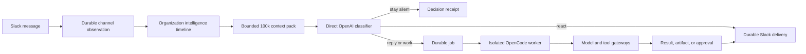
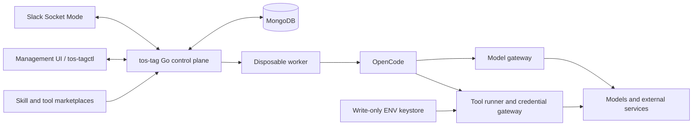

# tos-tag

An open-source, model-agnostic Slack agent control plane for teams.

> **Status:** the pre-live system is code-complete and locally tested, and the
> dedicated development installation has now passed live Socket Mode ingestion,
> message/edit/delete/thread handling, a mention-only threaded reply, native
> Block Kit delivery, duplicate-delivery reconciliation, desktop table
> accessibility, and a controlled observe-only shadow sample. Private/Slack
> Connect audience semantics, natural Slack-requested refresh timing, mobile/web
> accessibility, and longer organic shadow precision evaluation remain.
> See [IMPLEMENTATION_STATUS.md](IMPLEMENTATION_STATUS.md).

tos-tag is designed to follow every eligible communication in every Slack
channel its bot joins, maintain channel-scoped context, decide when it should
help or remain silent, and run longer work through isolated OpenCode workers.

It is inspired by the collaborative interaction model of Claude Tag and by
ideas from Block's Buzz, but it is an independent project. It is not affiliated
with or endorsed by Anthropic, Block, Slack, or OpenCode.

## What makes it different

A normal Slack bot waits for a command and returns one response. tos-tag is
intended to behave more like a persistent teammate:

- It observes all eligible messages, edits, and deletions in channels where it
  is present.
- It evaluates every eligible human message against a bounded organization-wide
  context pack, initially capped at 100,000 input tokens.
- It treats a channel as a durable policy, context, and memory scope.
- It treats each Slack thread as a separate conversational session.
- It can decide to stay silent, react, reply, start background work, or request
  approval.
- It can use different models for different channels, routines, skills, and
  inference steps.
- It can run multi-step coding and tool work in disposable isolated workers.
- It can load approved skills from plugin marketplaces such as
  `telemetryos-agent-skills`.
- It can load reviewed executable tools from a separate marketplace, with each
  tool packaged as instructions, an enforced manifest, and a shell helper.
- It shares authorized knowledge across sessions through conversational search
  while preserving private-channel boundaries.
- It can correlate a new `#alerts` incident with an unmentioned question in
  `#support`, including reconsidering a recent unanswered question when the
  alert arrives slightly later.
- It supports revisioned per-channel notes and per-channel prompt directives.
- It never copies Slack, classifier, repository, or connector credentials into
  OpenCode. The control plane holds the direct OpenAI classifier key; admitted
  agent work uses the separately configured OpenCode/provider boundary.
- It leaves durable receipts explaining its decisions and actions.

## Core interaction model



Every message is processed, but not every message starts a model session. The
system uses deterministic rules first, then one stateless, tool-free OpenAI
Responses API classification over bounded local and cross-channel context. The
classifier selects silence/action, channel-versus-thread placement, an
allowlisted Slack acknowledgement reaction, evidence IDs, and the model profile
and reasoning effort for admitted work—not final prose. A full OpenCode job with
the injected skills and agent harness starts only after policy and budget admit
that decision.

Silence is the default for social chatter, repetition, already-answered
questions, and low-confidence interventions. Direct mentions and replies in an
active tos-tag thread are hard triggers unless a stronger policy denies them.

All Slack-destined agents receive a mandatory Slack `mrkdwn` output contract.
They use `<url|label>` links, `*bold*`, `_italic_`, inline backticks for
variables, codes, and IDs, and fenced code blocks for multiline code or logs.
When a table materially improves the answer, they return a complete structured
table that the renderer emits as a native Block Kit table; aligned fenced tables
remain available for literal console-style output or fallback. The delivery
renderer validates and safely escapes the result while preserving intentional
Slack formatting.

## Channel and session hierarchy

One channel is not one endless AI conversation:

```text
Slack workspace
  -> channel scope                     directives, notes, policy, model defaults
     -> observation stream             every normalized message/edit/delete
     -> thread session                 one task or conversation
        -> session generation          restart or branch boundary
           -> job and attempts         durable execution
              -> OpenCode session      disposable compute
```

This lets unrelated threads run independently without mixing context. A channel
observer handles continuous awareness; one writer at a time owns each thread
generation. Sessions can retrieve source-linked messages and notes from other
authorized channels through a bounded search tool only when both the requester
and the complete destination audience may receive that content. They do not
share one mutable model session or receive a wholesale workspace transcript.

All observed messages remain retrieval candidates. For each classification,
tos-tag builds a fresh immutable pack from the target thread, target-channel
history, an organization-wide recent timeline, related cross-channel evidence,
active incident facts, and rolling summaries. The initial cap is 100k input
tokens; it is a ceiling, not a quota that must be filled.

## Participation modes

Each channel can be configured independently:

| Mode | Behavior |
| --- | --- |
| `observe` | Process and index eligible events without speech; when global shadow mode is enabled, also record assist-style predictions while enforcing silence |
| `mention` | Respond only to direct triggers |
| `assist` | Offer high-confidence, low-frequency ambient help |
| `proactive` | Run channel-specific alerts, suggestions, and routines within budgets |

The classifier can choose `reply_in_thread` or `reply_in_channel`. Thread replies are
the quiet default for answering one message. A top-level channel response needs
higher confidence and must be broadly useful, such as a confirmed incident.

Live ambient behavior should be deployed in shadow mode first. An `observe`
channel with global shadow mode enabled records the assist-style prediction it
would have made, but the effective decision remains `silent` and cannot create
a job or delivery. Operators can review that precision before enabling
`assist` or `proactive` mode; outside this evaluation path, `observe` remains an
absolute no-speech policy.

After shadow precision has been reviewed, `TAG__CLASSIFIER__MODE=live` enables the
effective decisions of channels explicitly configured as `assist` or
`proactive`. It does not expand channel enrollment or override organization,
workspace, channel, membership, kill-switch, cooldown, budget, or concurrency
policy. `observe` remains silent and `mention` still requires a direct mention
or an active tos-tag thread.

## Dynamic model routing

Models are selected through named profiles and deterministic routing policy,
not one global setting.

Illustrative configuration:

| Context | Profile | Intended behavior |
| --- | --- | --- |
| Deployment default | `chatgpt-luna-max` | OpenAI `gpt-5.6-luna` with `max` reasoning effort |
| Ambient classifier | direct OpenAI | Configurable `gpt-5.6-luna` with `none` effort for bounded latency; no OpenCode session or tools |
| `#alerts` | `alerts-fast` | Low-latency incident triage with moderate compute |
| `#product` | `product-deep` | Higher-cost, deep product reasoning |
| Security review skill | `security-deep` | Bounded high-reasoning override for one step |

A stable agent principal remains the same even when the selected model changes.
Model profiles, instructions, skill snapshots, tool snapshots, secret bindings,
and access bundles are separate versioned concepts.

## High-level architecture



### Control plane

The Go service owns:

- Slack ingestion and delivery;
- channel observation and ambient decisions;
- organization intelligence projection, active situation facts, 100k context
  packs, and retroactive correlation;
- tenancy, identity, scope, and policy;
- sessions, durable jobs, retries, and cancellation;
- model catalog, routing, fallbacks, and budgets;
- behavioral-skill and executable-tool marketplaces with immutable snapshots;
- authorized conversational search, channel notes, channel directives, memory,
  routines, classifier-gated trigger subscriptions, and approvals;
- worker provisioning and teardown;
- the tool credential gateway and the configured OpenCode provider boundary;
- receipts, audit, usage, and retention; and
- the management web interface and operator CLI.

### OpenCode workers

OpenCode owns the in-worker prompt/model/tool loop, coding tools, provider
adapters, context compaction, and structured output. Each active Slack thread
generation receives one disposable worker containing one loopback-only OpenCode
server with a clean home/XDG environment. This local worker boundary is process
and environment isolation, not a hostile multi-tenant network sandbox.

OpenCode is not the tenant, queue, authorization, credential, memory, or audit
boundary. Its local state is disposable.

### Credentials and tools

The local worker receives only short-lived, task-scoped tool capabilities and
no credentials from tos-tag. Credentialed models use the explicitly configured
external OpenCode deployment/provider boundary; anonymous models work in local
worker mode. Slack and connector credentials remain in the control plane and
write-only keystore. Tool requests are validated against the pinned tool
manifest, destination, operation, arguments, budget, and live policy. Declared
secret ENV values are then injected only into the exact trusted tool subprocess
for that call—not into OpenCode or its general worker environment.

Behavioral skills come from a prompt-oriented marketplace such as
`telemetryos-agent-skills`. Executable helpers come from a distinct proposed
`telemetryos-agent-tools` marketplace. A tool bundle contains `SKILL.md`, an
enforced `tool.yaml`, a reviewed shell helper, and contract tests. The UI can
install, promote, scope-bind, and roll back these bundles, but it does not
hand-author their operations or scripts.

The worker cannot assert its own principal, requester, policy, destination,
credential, or tool version. Gateways derive those from a short-lived capability
and verify the live lease and steering epoch on every call. Tool processes have
no direct internet route and must use a manifest-enforcing egress proxy.

The automatically injected `tag-triggers` skill uses the separate
`tos_tag_trigger` job-scoped capability to list and inspect current-channel
subscriptions. Create, update, pause, and resume calls suspend the worker and
render Slack-native Approve/Deny controls. Approval releases the old lease and
queues a fresh worker with only the exact, single-use approved action.

Ambient observation never implicitly authorizes an external write.

## Planned technology

| Area | Initial choice |
| --- | --- |
| Language | Go 1.26 |
| Slack | `slack-go/slack`, Events API through Socket Mode, Web API for output |
| State and queues | MongoDB with leases, idempotency keys, and compare-and-swap transitions |
| Agent harness | Headless OpenCode HTTP/SSE server inside each worker |
| Classifier | Direct, stateless OpenAI Responses API call with strict structured output over immutable context packs capped initially at 100k input tokens |
| Management UI | Go `html/template`, `go:embed`, Navaros/plain `net/http`, small JavaScript/SSE layer |
| Workers | Clean disposable process groups for the single-user local experiment; Docker or stronger isolation required for untrusted/multi-tenant deployment |
| Tool protocol | Typed project tools and reviewed MCP adapters behind a gateway |
| Skills | Immutable, scope-bound `SKILL.md` snapshots materialized into OpenCode |
| Executable tools | Immutable `SKILL.md` + manifest + reviewed shell-helper bundles run outside OpenCode |
| Shared knowledge | MongoDB organization timeline, situation facts, context packs, conversational search, and revisioned channel notes/directives |
| Observability | Blackbox logging and TelemetryOS `go-shared` OpenTelemetry/build/status conventions |

Redis, Temporal, Kubernetes, NATS, a separate SPA, Nostr, and ACP are not
required for the first version. They should be added only after a measured need
or compatibility proof.

## Management interface

The management application is embedded in the service. It exposes dedicated
server-rendered pages and redacted JSON APIs for:

- service and Slack connection health;
- channel participation modes and ambient thresholds;
- shadow and live speak/silent decisions;
- jobs, sessions, attempts, progress, artifacts, and receipts;
- model catalog, profiles, routes, fallbacks, spend, and a route simulator;
- agent principals, instructions, access bundles, and scope bindings;
- per-channel directive editing with revision preview, activation, rollback, and
  effective-prompt inspection;
- per-channel source-linked notes and authorized conversational-search testing;
- organization situation-board and context-pack inspection, including source
  channels, token partitions, disclosure classes, and classifier reply mode;
- separate skill and tool marketplaces, compatibility reports, immutable
  snapshots, dependency resolution, and worker previews;
- routines and approvals;
- memory and retention controls, with every normalized channel message stored
  in MongoDB under a default 30-day rolling TTL;
- a write-only MongoDB keystore that binds tool-manifest ENV names to encrypted
  secret references;
  and
- audit-chain verification and usage.

Secret values are write-only and are never rendered back to the browser.

Message retention is enforced twice: queries exclude documents whose absolute
`expires_at` has passed, and MongoDB TTL indexes physically remove them later.
Raw Slack envelopes and materialized prompt payloads default to 24 hours;
search documents, context segments, summaries, and signals cannot outlive their
source messages. Durable jobs, explicit human-approved notes, artifacts, and
content-free audit receipts use separate policies so a message TTL does not
silently destroy operational history or preserve copied message text forever.

## Repository contents

The repository contains both the design record and a runnable Go control-plane
slice:

- [architecture.md](architecture.md) — implementation architecture, component
  contracts, persistence, security, reliability, deployment, and testing.
- [research.md](research.md) — Claude Tag research, OpenCode evaluation, Agent
  Wiki patterns, Buzz comparison, marketplace investigation, and design
  rationale.
- [CLAUDE.md](CLAUDE.md) — implementation guidance and invariants for coding
  agents working in this repository.
- [claude-fable-review.md](claude-fable-review.md) — adversarial findings,
  dispositions, and the resulting Phase 0/Phase 1 gates.
- [IMPLEMENTATION_CHECKLIST.md](IMPLEMENTATION_CHECKLIST.md) — detailed,
  evidence-oriented implementation checklist and explicit live-Slack deferral.
- [IMPLEMENTATION_STATUS.md](IMPLEMENTATION_STATUS.md) — verified implemented
  scope and the precise remaining gap list.
- `cmd/api`, `cmd/admin`, and `cmd/eval` — service, JSON-first operator client,
  and deterministic behavioral evaluation commands.
- `core/*` — Mongo-backed observations, sessions, jobs, deliveries, admission,
  routes, notes/directives, encrypted secret references, live/stub Slack,
  cross-channel context/classification, OpenCode workers, policy/approval/tool/
  marketplace controls, search, audit, usage, retention, and management HTTP.

The implemented package layout and intended hardened deployment shape are defined in
[architecture.md](architecture.md#111-repository-layout).

## Delivery plan

### Phase 0: observation and shadow decisions (implemented and verified locally)

- Scaffold the Go service, MongoDB, lifecycle, health, management shell, and
  audit receipts.
- Use deterministic alert/support fixtures behind the Slack boundary. Live
  workspace connection is deferred.
- Ingest every eligible message/edit/delete.
- Build the organization timeline, situation board, 100k context packs, and
  synthetic alert-to-support correlation in shadow mode.
- Add confirmed revisioned channel directives and human-reviewed notes, while
  keeping notes out of the instruction-authority chain.
- Run ambient decisions in shadow mode.
- Let only mentions create deterministic echo jobs.

### Phase 1: disposable OpenCode and assist controls (implemented)

- Add the OpenCode harness, dynamic model routing, secret-minimized worker
  isolation, and an explicitly allowlisted read-only skill set.
- Stub/eval classification is deterministic. Live ambient classification uses
  the direct OpenAI Responses API, never creates an OpenCode session, and may
  select only an enabled agent model profile for admitted full-agent work.
- The separate tool marketplace injects only explicit tool IDs and their
  read-only `SKILL.md` instructions. A job-scoped custom OpenCode tool reaches
  reviewed helpers through a lease-fenced loopback gateway.
- Supply the source-linked authorized MongoDB projection in every immutable
  response context pack.
- Enable conservative `assist` mode with a kill switch, cooldown, and response
  budget.

### Phase 2: richer tools, memory, and routines (implemented)

- Expand selected read-only connectors, source-linked memory and notes, and
  durable schedules/watches.
- Add durable heartbeat subscriptions whose due runs reauthorize scope, rebuild
  the full destination-filtered context pack, and pass a tool-free classifier
  gate before an idempotent OpenCode job can be created.

### Phase 3: access bundles and write approvals (implemented)

- Add credential references, destination/schema policy, hard budgets, and
  narrowly approved write operations.

### Phase 4: coding workflow (supported by external tool bundles)

- Authorized checkout, branch, test, checkpoint, artifact, and draft-PR
  operations are composed from reviewed bundles in the separate executable-tool
  marketplace. The tos-tag control plane supplies their immutable snapshot,
  capability, approval, secret, result, and receipt boundaries; no
  repository-specific GitHub helper is embedded in this repository.

## Reproducible container workspace

The recommended development layout runs MongoDB, the tos-tag Go control plane,
and OpenCode in Compose-managed containers. GitHub, Aion, OpenCode, package
caches, skill repositories, and every checkout survive container replacement in
named volumes. The only host prerequisites are:

- Docker CLI/Engine with the `docker compose` subcommand (tested with Docker
  `29.7.0` and Compose `5.3.1`);
- a Git client for the initial clone of this repository; and
- a GitHub account that can read the private `telemetryOS` repositories.

The development image pins the toolchain used to reproduce this environment:

| Dependency | Pinned version | Purpose / source |
| --- | ---: | --- |
| Go | `1.26.5` | Build and run tos-tag and install Aion |
| MongoDB | `8.0.28` | Durable tos-tag authority in a separate Compose service |
| OpenCode | `1.18.10` | Headless agent loop, installed from `opencode-ai` |
| Aion | `v2.0.5` (`2b186d2`) | Built from its authenticated, commit-verified source checkout during bootstrap |
| GitHub CLI | `2.96.0` | GitHub authentication, cloning, PRs, and repository operations |
| Node.js | `24.7.0` | OpenCode and Node-based repository tooling |
| pnpm | `11.18.0` | Aion-managed frontend dependency installation |
| Git, Bash, Make, `rg`, `jq` | image package versions | Repository and agent support tooling |

The optional host-side Slack lifecycle uses Slack CLI `4.6.0`. Its checked-in
manifest hook uses Ruby's standard `json` and `yaml` libraries; this is present
on the tested macOS host and is not required by the running Go service or
container stack.

Dependency sources of truth are intentionally checked in: application modules
in `go.mod`/`go.sum`, container tools and base-image digests in
`Dockerfile.dev`, MongoDB and persistent volumes in `docker-compose.yml`, and
repository/Aion pins in `container/bootstrap-workspace.sh`. Update those files
and this table together when changing the environment.

The Make targets route Compose through `container/docker-compose.sh`. Normally
that delegates directly to `docker compose`. If a Colima installation has
inherited an unavailable Docker Desktop credential helper, it preserves the
global Docker configuration and uses the checked-in empty registry config only
for this stack's public base images.

The bootstrap owns this persistent layout:

```text
/workspace/
  AGENTS.md                         default umbrella agent guidance
  projects/tos-tag/                 this control-plane repository
  skills/telemetryos-agent-skills/  headless TelemetryOS plugin source
  skills/tag-agent-skills/          tos-tag base plugin and helper source
  tools/Aion/                       pinned authenticated Aion CLI source
  code/                             Aion developer_path and managed repos
  state/logs/                       retained redacted control-plane logs
  state/workers/                    disposable OpenCode worker roots
/home/tag/                           gh, Aion, OpenCode, Go, npm, and pnpm state
```

The source repositories are
[telemetryOS/tos-tag](https://github.com/telemetryOS/tos-tag),
[telemetryOS/telemetryos-agent-skills](https://github.com/telemetryOS/telemetryos-agent-skills),
[telemetryOS/tag-agent-skills](https://github.com/telemetryOS/tag-agent-skills),
and [telemetryOS/Aion](https://github.com/telemetryOS/Aion). `/workspace/code`
is an umbrella directory containing all repositories managed by the TelemetryOS
Aion profile; it is deliberately not another monorepo.

The corresponding named volumes are `tos-tag-workspace`, `tos-tag-home`, and
`tos-tag-mongo`. Do not use `docker compose down --volumes` unless intentionally
deleting all checkouts, authentication state, and database data.

### First installation

Clone this repository, then build the pinned development image:

```text
git clone git@github.com:telemetryOS/tos-tag.git
cd tos-tag
make container-build
```

Authenticate GitHub once inside the persistent container home. The bootstrap
rewrites Aion's SSH repository URLs to authenticated HTTPS, so no private SSH
key is copied into the image or volume:

```text
docker compose run --rm workspace gh auth login --web
make container-bootstrap
```

`make container-bootstrap` performs these idempotent operations:

1. creates `/workspace/AGENTS.md` from the checked-in default without
   overwriting an existing file;
2. configures Aion's `developer_path` as `/workspace/code`;
3. clones `telemetryOS/tos-tag`, `telemetryOS/telemetryos-agent-skills`, and
   `telemetryOS/tag-agent-skills` into the paths above;
4. checks out and builds `telemetryOS/Aion` at the pinned version; and
5. runs `aion sync`, which clones every Aion-managed repository and installs
   its declared Go/Node dependencies. Dirty repositories are preserved.

The full Aion sync is intentionally explicit because it is network- and
disk-intensive. To refresh the three control-plane repositories and the entire
Aion workspace later, run:

```text
docker compose run --rm workspace bootstrap-workspace --sync --update
```

### Start the stack and OpenCode

Copy `runtime.env.example` to the gitignored, owner-readable `runtime.env` and
add only the credentials needed for the selected live features. The file is
mounted read-only and sourced inside the Go-process container; Compose config
and image metadata therefore contain its path, not expanded secret values. The
launcher overrides host-only addresses and marketplace paths with their
container equivalents.

```text
cp runtime.env.example runtime.env
make container-up
make container-opencode
```

`make container-up` starts MongoDB, a long-running operator workspace, and the
tos-tag Go process. The API remains bound to `127.0.0.1:8090`. Run
`opencode auth login` from the operator workspace when a provider needs login;
that state survives in `tos-tag-home`.

The operator OpenCode shell starts in `/workspace` and sees its default
`AGENTS.md` plus all persistent checkouts. Slack-triggered OpenCode sessions are
still separate, disposable, default-deny workers. The durable operator
workspace is not silently mounted into those jobs, and worker state is never an
authority for jobs, conversations, policy, or receipts.

Useful maintenance commands:

```text
make container-shell
docker compose exec workspace aion status all
docker compose exec workspace aion sync
docker compose logs -f tag mongo
docker compose restart tag
```

The environment deliberately does not mount the host Docker socket. Aion can
sync, inspect, and prepare repositories inside the container, while
Docker-backed `aion start` components require a separately reviewed nested
runtime rather than broad host-daemon access.

## Run locally without Slack

The API requires MongoDB, but does not require Slack, OpenCode, a model
provider, or connector credentials:

```text
docker compose up -d mongo
go run ./cmd/api
```

The Compose profile publishes its project-owned MongoDB on
`127.0.0.1:27018`; `runtime.env.example` points there so a separate local
MongoDB can continue using the conventional `27017` port.

Open `http://127.0.0.1:8090/admin/` to inspect the management sections and
inject a normalized Slack fixture. The UI obtains a CSRF token before each
mutation. On non-loopback listeners, bearer authentication and
`TAG__AUTH__ADMIN_TOKEN` are mandatory. The operator client supports `status`,
`jobs`, `deliveries`, `decisions`, and `inject FILE`.

## Run locally with Slack

Live Slack testing is opt-in and starts with one dedicated development workspace
and explicitly enrolled test channels. Create the app from
`slack-app-manifest.yaml`, then collect:

- Slack's *App-Level Token* (`xapp-...`) with `connections:write`;
- Slack's *Bot User OAuth Token* (`xoxb-...`);
- Slack's *User OAuth Token* (`xoxp-...`) when explicitly enabling
  user-authorized cross-channel context sync;
- the Slack App ID, plus the `team_id` and bot `user_id` returned by
  `auth.test`; and
- a stable internal tos-tag organization ID such as `org-tos-tag-dev`.

The development manifest intentionally disables Slack token rotation because
the current adapter accepts a long-lived `xoxb-...` token and does not yet store
or refresh rotating credentials. Implement refresh-token lifecycle support
before enabling rotation. Rotate the development App-Level, Bot User OAuth, and
User OAuth tokens before any production deployment, then update the local
gitignored `runtime.env` without copying token values into logs or Compose
configuration output.

The development installation deliberately requests a broad future-agent grant:
native Agent view, channel and DM/MPIM context, files, reactions, pins,
bookmarks, canvases, lists, user metadata, public real-time search, Slack
Connect, and matching user-consented private search scopes. This avoids repeated
web-based permission edits during exploration. The grant does not authorize
tos-tag behavior: runtime organization/channel enrollment, requester and
destination scope, explicit tool policy, approvals, and kill switches remain
authoritative. Production installations should narrow scopes to measured use.

Slack app lifecycle can be driven from the terminal with the official Slack
CLI after the one-time `slack login` authorization. The checked-in
`.slack/hooks.json` emits `slack-app-manifest.yaml` through
`scripts/slack-manifest-json.sh`, so `slack manifest validate`, `slack manifest
diff`, and `slack app install` all use the checked-in manifest as their source
of truth.

Copy `runtime.env.example` to the gitignored `runtime.env`, set
`TAG__SLACK__MODE=socket_mode`, set `TAG__SLACK__LIVE_ENABLED=true`, and fill
the Slack identity fields plus `TAG__SLACK__APP_LEVEL_TOKEN` and
`TAG__SLACK__BOT_USER_OAUTH_TOKEN`. Set `TAG__SLACK__USER_OAUTH_TOKEN` and
`TAG__SLACK__CONTEXT_SYNC_ENABLED=true` only for the reviewed cross-channel
context path. Set `TAG__CLASSIFIER__OPENAI_API_KEY`, keep
`TAG__CLASSIFIER__MODE=shadow`, and keep `TAG__OPENCODE__ENABLED=false` for the
first classifier/transport test. Never commit,
print, or paste the tokens into an issue, prompt, log, or artifact.

Context sync uses the User OAuth Token only in the Go Slack adapter. It
enumerates up to `TAG__SLACK__CONTEXT_SYNC_MAX_CHANNELS` visible conversations,
refreshes policy membership before live ingress, then fairly backfills recent
roots and thread replies in the background within the configured lookback,
global message cap, per-channel cap, and overall sync timeout. Slack
`Retry-After` responses are honored without delaying Socket Mode event capture.
Imported history is idempotent, marked resolved, and cannot trigger output.
Conversations that become stale or inaccessible between discovery and history
fetch are logged by channel ID and skipped only for Slack's explicit
`channel_not_found`, `not_in_channel`, or `is_archived` responses; auth and scope
errors still stop the backfill. Existing channel enrollment and participation
modes are preserved. New conversations
are enrolled as `observe` only when the organization enrollment mode is
`all_observable_channels`; `allowlist` continues to discard unknown-channel
events before content persistence. Public sources may contribute cross-channel
context. Private channels, DMs, and MPIMs remain destination-local and are
excluded before every other destination's database query.

`TAG__SLACK__OUTPUT_CHANNEL_IDS` is an optional comma-separated, exact Slack
channel-ID allowlist for reactions and deliveries. It is enforced both before
job admission and again by the delivery worker. Empty means that live channel
policy is authoritative; set it to the dedicated test channel during broad
observation trials.

For live debugging, set `TAG__LOGGING__LEVEL=debug` and
`TAG__LOGGING__USE_JSON=true`. Slack transport, normalization,
acknowledgement, persistence, classification, reactions, jobs, deliveries, and management actions
emit correlated metadata and timing without logging tokens, raw envelopes, or
message text. Set `TAG__LOGGING__FILE_PATH` to retain the same structured JSONL
stream in private local storage, such as a dated file under `../.testruns/`.

Start MongoDB and the credentialed local process:

```text
docker compose up -d mongo
make run-live
```

In `http://127.0.0.1:8090/admin/`, create the organization with enrollment mode
`allowlist`, enable the workspace by its Slack `team_id`, and enroll one channel
with fresh `membership_refreshed_at`, positive `max_responses_per_hour`, and
positive `max_concurrent_jobs`. Set `approver_user_ids` to the explicit Slack
user IDs allowed to approve actions in that channel. An empty list fails closed,
and the requester can never approve their own request. Begin in `observe`; after
confirming message, edit, and delete ingestion, change only the test channel to
`mention` and send a direct mention. Do not enable ambient speech until the
shadow evaluation and operator approval gates pass.

After reviewing the privacy boundary and Slack grant, change the organization
to `all_observable_channels` to admit every user-authorized conversation as
context. This does not enable speech: discovered channels remain `observe`, and
an explicit channel exclusion remains authoritative.

Optional features are explicit:

- `TAG__CLASSIFIER__PROVIDER=openai` sends the immutable 100k-bounded context
  directly to the configurable Responses API endpoint using
  `TAG__CLASSIFIER__MODEL=gpt-5.6-luna` and
  `TAG__CLASSIFIER__REASONING_EFFORT=none`; the response is strict structured
  output and cannot call tools;
- set `TAG__OPENCODE__ENABLED=true` and keep
  `TAG__OPENCODE__MODE=local_worker` to provision one clean, disposable
  `opencode serve` process per harness session; the live template sets
  `TAG__OPENCODE__TIMEOUT=5m` because admitted full-agent work may legitimately
  exceed the ambient classifier's latency budget. For the OpenAI-backed Luna
  profile, tos-tag keeps the upstream key in its control-plane model gateway and
  gives each worker only a random, attempt-scoped loopback capability that is
  revoked at teardown. The anonymous `opencode` provider needs no gateway;
  other credentialed providers require `external` mode and an independently
  secured OpenCode gateway;
- the local live template automatically selects all behavioral skills from
  `telemetryos-automation` in sibling `telemetryos-agent-skills` and `base` in
  sibling `tag-agent-skills`; each source is configured by root, Claude
  marketplace manifest, and exact plugin name, and a missing source fails
  startup;
- configure `TAG__MARKETPLACES__SKILL_ROOT` only for an additional legacy
  Claude-compatible behavioral marketplace and
  `TAG__MARKETPLACES__TOOL_ROOT` for the separate reviewed tool catalog;
- set `TAG__MARKETPLACES__INJECTED_SKILLS` to the explicit behavioral skill
  allowlist from that additional marketplace; the selected headless and base
  plugins are injected in full automatically;
- set `TAG__MARKETPLACES__INJECTED_TOOLS` and
  `TAG__MARKETPLACES__TOOLS_ENABLED=true` to inject only that reviewed tool
  subset; write/admin/destructive operations create independent single-use
  approvals with Slack-native Approve/Deny messages and a management fallback;
- enable the write-only keystore only with a base64-encoded 32-byte master key
  supplied through `TAG__KEYSTORE__MASTER_KEY`; and
- keep `TAG__SLACK__MODE=stub` for normal local tests and any run that does not
  explicitly exercise the live Slack transport.

Plugin manifests, hooks, agents, and Bash helpers are not executable OpenCode
configuration. tos-tag reads only validated behavioral skill files and mounts
them read-only. Helper scripts stay in their owning skill repository until a
separate reviewed tool manifest makes an exact operation available through the
job-scoped capability gateway.

The verification chain is:

```text
go test ./...
go test -race ./...
go vet ./...
make eval
make security
```

`make eval` writes `.artifacts/eval-score.json` and fails unless every current
behavioral metric is `1.0`. Network-dependent security scanners may require a
pre-populated Go module cache.

Live Slack and credential-bearing external connector effects remain explicit
and separately reported. The real OpenCode smoke uses an anonymous free model.

## Security posture

tos-tag processes shared workplace communications and may eventually act on
external systems. Security boundaries are architectural requirements:

- Slack membership grants visibility, not tool authority.
- Policy decisions happen outside the model.
- Models and skills cannot grant permissions.
- OpenCode and arbitrary worker commands receive no raw long-lived credentials;
  a reviewed tool subprocess may receive only its declared secrets for one call.
- Network access is default-deny and gateway-mediated.
- Cross-channel search intersects agent, requester, complete destination
  audience, organization, active bot authority, and job scope before querying;
  private-channel names and result counts do not leak.
- A private channel's messages are usable only when that same channel is the
  destination. Every other private channel is excluded before context/search
  queries, including content-free derived awareness.
- Channel directives are versioned instructions; channel notes remain reference
  data, require human activation when agent-authored, and cannot grant authority.
- Gateway capabilities are fenced by the live attempt lease and steering epoch;
  worker-supplied identity or policy fields are never authoritative.
- Security receipts use serialized compare-and-swap append and keyed content
  commitments rather than public hashes of potentially deleted content.
- External actions are typed, authorized, idempotent where possible, and
  receipted.
- Live ambient speech is calibrated in shadow mode first.

Security-sensitive implementation changes must update the architecture and add
tests for the affected invariant.

## Naming and license

`tos-tag` is an internal experiment name. A public release should use an
independent brand and must not imply Anthropic compatibility or endorsement.

No project license has been added yet. Select and add a license before public
distribution or accepting external contributions.

## References

- [Detailed architecture](architecture.md)
- [Research and source analysis](research.md)
- [Slack Socket Mode](https://docs.slack.dev/apis/events-api/using-socket-mode/)
- [Slack message events](https://docs.slack.dev/reference/events/message/)
- [Slack text formatting](https://docs.slack.dev/messaging/formatting-message-text/)
- [Slack Block Kit table block](https://docs.slack.dev/reference/block-kit/blocks/table-block/)
- [OpenCode server](https://opencode.ai/docs/server/)
- [OpenCode skills](https://opencode.ai/docs/skills/)
- [Block Buzz](https://github.com/block/buzz)
