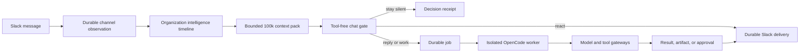
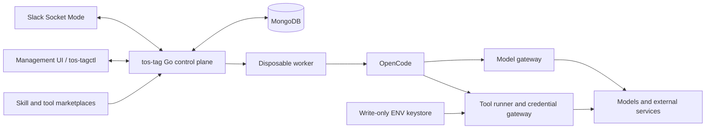

# tos-tag

An open-source, model-agnostic Slack agent control plane for teams.

> **Status:** the pre-live system is code-complete and locally tested with
> Slack stubbed. Observation, cross-channel context, decisions, jobs, disposable
> OpenCode, marketplace tools, approvals, routines, reconciliation, management,
> and an anonymous real-provider smoke all pass. Live Slack validation remains.
> See [IMPLEMENTATION_STATUS.md](IMPLEMENTATION_STATUS.md).

tos-tag is designed to follow every eligible communication in every Slack
channel its bot joins, maintain channel-scoped context, decide when it should
help or remain silent, and run longer work through isolated OpenCode workers.

It is inspired by the collaborative interaction model of Claude Tag and by
ideas from Block's Buzz, but it is an independent project. It is not affiliated
with or endorsed by Anthropic, Block, Slack, or OpenCode.

## What makes it different

A normal Slack bot waits for a command and returns one response. tos-tag is
intended to behave more like a persistent teammate:

- It observes all eligible messages, edits, and deletions in channels where it
  is present.
- It evaluates every eligible human message against a bounded organization-wide
  context pack, initially capped at 100,000 input tokens.
- It treats a channel as a durable policy, context, and memory scope.
- It treats each Slack thread as a separate conversational session.
- It can decide to stay silent, react, reply, start background work, or request
  approval.
- It can use different models for different channels, routines, skills, and
  inference steps.
- It can run multi-step coding and tool work in disposable isolated workers.
- It can load approved skills from plugin marketplaces such as
  `telemetryos-agent-skills`.
- It can load reviewed executable tools from a separate marketplace, with each
  tool packaged as instructions, an enforced manifest, and a shell helper.
- It shares authorized knowledge across sessions through conversational search
  while preserving private-channel boundaries.
- It can correlate a new `#alerts` incident with an unmentioned question in
  `#support`, including reconsidering a recent unanswered question when the
  alert arrives slightly later.
- It supports revisioned per-channel notes and per-channel prompt directives.
- It never copies Slack, repository, or connector credentials into OpenCode;
  credentialed models use an explicitly configured external OpenCode/provider
  boundary.
- It leaves durable receipts explaining its decisions and actions.

## Core interaction model



Every message is processed, but not every message starts a model session. The
system uses deterministic rules first, then a tool-free chat-gating model over
bounded local and cross-channel context. The gate selects an action and evidence
IDs, not final prose. A full OpenCode job starts only after the decision is
admitted by policy and budget.

Silence is the default for social chatter, repetition, already-answered
questions, and low-confidence interventions. Direct mentions and replies in an
active tos-tag thread are hard triggers unless a stronger policy denies them.

All Slack-destined agents receive a mandatory Slack `mrkdwn` output contract.
They use `<url|label>` links, `*bold*`, `_italic_`, inline backticks for
variables, codes, and IDs, and fenced code blocks for multiline code or logs.
When a table materially improves the answer, they return a complete structured
table that the renderer emits as a native Block Kit table; aligned fenced tables
remain available for literal console-style output or fallback. The delivery
renderer validates and safely escapes the result while preserving intentional
Slack formatting.

## Channel and session hierarchy

One channel is not one endless AI conversation:

```text
Slack workspace
  -> channel scope                     directives, notes, policy, model defaults
     -> observation stream             every normalized message/edit/delete
     -> thread session                 one task or conversation
        -> session generation          restart or branch boundary
           -> job and attempts         durable execution
              -> OpenCode session      disposable compute
```

This lets unrelated threads run independently without mixing context. A channel
observer handles continuous awareness; one writer at a time owns each thread
generation. Sessions can retrieve source-linked messages and notes from other
authorized channels through a bounded search tool only when both the requester
and the complete destination audience may receive that content. They do not
share one mutable model session or receive a wholesale workspace transcript.

All observed messages remain retrieval candidates. For each gating decision,
tos-tag builds a fresh immutable pack from the target thread, target-channel
history, an organization-wide recent timeline, related cross-channel evidence,
active incident facts, and rolling summaries. The initial cap is 100k input
tokens; it is a ceiling, not a quota that must be filled.

## Participation modes

Each channel can be configured independently:

| Mode | Behavior |
| --- | --- |
| `observe` | Process and index eligible events without proactive speech |
| `mention` | Respond only to direct triggers |
| `assist` | Offer high-confidence, low-frequency ambient help |
| `proactive` | Run channel-specific alerts, suggestions, and routines within budgets |

The gate can choose `reply_in_thread` or `reply_in_channel`. Thread replies are
the quiet default for answering one message. A top-level channel response needs
higher confidence and must be broadly useful, such as a confirmed incident.

Live ambient behavior should be deployed in shadow mode first: tos-tag records
what it would have done while only mentions receive responses. Operators can
review its precision before enabling `assist` or `proactive` mode.

## Dynamic model routing

Models are selected through named profiles and deterministic routing policy,
not one global setting.

Illustrative configuration:

| Context | Profile | Intended behavior |
| --- | --- | --- |
| `#alerts` | `alerts-fast` | Low-latency incident triage with moderate compute |
| `#product` | `product-deep` | Higher-cost, deep product reasoning |
| Organization chat gating | `chat-gating` | Tool-free structured classification over the bounded 100k context pack |
| Security review skill | `security-deep` | Bounded high-reasoning override for one step |

A stable agent principal remains the same even when the selected model changes.
Model profiles, instructions, skill snapshots, tool snapshots, secret bindings,
and access bundles are separate versioned concepts.

## High-level architecture



### Control plane

The Go service owns:

- Slack ingestion and delivery;
- channel observation and ambient decisions;
- organization intelligence projection, active situation facts, 100k context
  packs, and retroactive correlation;
- tenancy, identity, scope, and policy;
- sessions, durable jobs, retries, and cancellation;
- model catalog, routing, fallbacks, and budgets;
- behavioral-skill and executable-tool marketplaces with immutable snapshots;
- authorized conversational search, channel notes, channel directives, memory,
  routines, and approvals;
- worker provisioning and teardown;
- the tool credential gateway and the configured OpenCode provider boundary;
- receipts, audit, usage, and retention; and
- the management web interface and operator CLI.

### OpenCode workers

OpenCode owns the in-worker prompt/model/tool loop, coding tools, provider
adapters, context compaction, and structured output. Each active Slack thread
generation receives one disposable worker containing one loopback-only OpenCode
server with a clean home/XDG environment. This local worker boundary is process
and environment isolation, not a hostile multi-tenant network sandbox.

OpenCode is not the tenant, queue, authorization, credential, memory, or audit
boundary. Its local state is disposable.

### Credentials and tools

The local worker receives only short-lived, task-scoped tool capabilities and
no credentials from tos-tag. Credentialed models use the explicitly configured
external OpenCode deployment/provider boundary; anonymous models work in local
worker mode. Slack and connector credentials remain in the control plane and
write-only keystore. Tool requests are validated against the pinned tool
manifest, destination, operation, arguments, budget, and live policy. Declared
secret ENV values are then injected only into the exact trusted tool subprocess
for that call—not into OpenCode or its general worker environment.

Behavioral skills come from a prompt-oriented marketplace such as
`telemetryos-agent-skills`. Executable helpers come from a distinct proposed
`telemetryos-agent-tools` marketplace. A tool bundle contains `SKILL.md`, an
enforced `tool.yaml`, a reviewed shell helper, and contract tests. The UI can
install, promote, scope-bind, and roll back these bundles, but it does not
hand-author their operations or scripts.

The worker cannot assert its own principal, requester, policy, destination,
credential, or tool version. Gateways derive those from a short-lived capability
and verify the live lease and steering epoch on every call. Tool processes have
no direct internet route and must use a manifest-enforcing egress proxy.

Ambient observation never implicitly authorizes an external write.

## Planned technology

| Area | Initial choice |
| --- | --- |
| Language | Go 1.26 |
| Slack | `slack-go/slack`, Events API through Socket Mode, Web API for output |
| State and queues | MongoDB with leases, idempotency keys, and compare-and-swap transitions |
| Agent harness | Headless OpenCode HTTP/SSE server inside each worker |
| Chat gating | Dedicated no-tools structured model over immutable context packs capped initially at 100k input tokens |
| Management UI | Go `html/template`, `go:embed`, Navaros/plain `net/http`, small JavaScript/SSE layer |
| Workers | Clean disposable process groups for the single-user local experiment; Docker or stronger isolation required for untrusted/multi-tenant deployment |
| Tool protocol | Typed project tools and reviewed MCP adapters behind a gateway |
| Skills | Immutable, scope-bound `SKILL.md` snapshots materialized into OpenCode |
| Executable tools | Immutable `SKILL.md` + manifest + reviewed shell-helper bundles run outside OpenCode |
| Shared knowledge | MongoDB organization timeline, situation facts, context packs, conversational search, and revisioned channel notes/directives |
| Observability | Blackbox logging and TelemetryOS `go-shared` OpenTelemetry/build/status conventions |

Redis, Temporal, Kubernetes, NATS, a separate SPA, Nostr, and ACP are not
required for the first version. They should be added only after a measured need
or compatibility proof.

## Management interface

The management application is embedded in the service. It exposes dedicated
server-rendered pages and redacted JSON APIs for:

- service and Slack connection health;
- channel participation modes and ambient thresholds;
- shadow and live speak/silent decisions;
- jobs, sessions, attempts, progress, artifacts, and receipts;
- model catalog, profiles, routes, fallbacks, spend, and a route simulator;
- agent principals, instructions, access bundles, and scope bindings;
- per-channel directive editing with revision preview, activation, rollback, and
  effective-prompt inspection;
- per-channel source-linked notes and authorized conversational-search testing;
- organization situation-board and context-pack inspection, including source
  channels, token partitions, disclosure classes, and gating reply mode;
- separate skill and tool marketplaces, compatibility reports, immutable
  snapshots, dependency resolution, and worker previews;
- routines and approvals;
- memory and retention controls, with every normalized channel message stored
  in MongoDB under a default 30-day rolling TTL;
- a write-only MongoDB keystore that binds tool-manifest ENV names to encrypted
  secret references;
  and
- audit-chain verification and usage.

Secret values are write-only and are never rendered back to the browser.

Message retention is enforced twice: queries exclude documents whose absolute
`expires_at` has passed, and MongoDB TTL indexes physically remove them later.
Raw Slack envelopes and materialized prompt payloads default to 24 hours;
search documents, context segments, summaries, and signals cannot outlive their
source messages. Durable jobs, explicit human-approved notes, artifacts, and
content-free audit receipts use separate policies so a message TTL does not
silently destroy operational history or preserve copied message text forever.

## Repository contents

The repository contains both the design record and a runnable Go control-plane
slice:

- [architecture.md](architecture.md) — implementation architecture, component
  contracts, persistence, security, reliability, deployment, and testing.
- [research.md](research.md) — Claude Tag research, OpenCode evaluation, Agent
  Wiki patterns, Buzz comparison, marketplace investigation, and design
  rationale.
- [CLAUDE.md](CLAUDE.md) — implementation guidance and invariants for coding
  agents working in this repository.
- [claude-fable-review.md](claude-fable-review.md) — adversarial findings,
  dispositions, and the resulting Phase 0/Phase 1 gates.
- [IMPLEMENTATION_CHECKLIST.md](IMPLEMENTATION_CHECKLIST.md) — detailed,
  evidence-oriented implementation checklist and explicit live-Slack deferral.
- [IMPLEMENTATION_STATUS.md](IMPLEMENTATION_STATUS.md) — verified implemented
  scope and the precise remaining gap list.
- `cmd/api`, `cmd/admin`, and `cmd/eval` — service, JSON-first operator client,
  and deterministic behavioral evaluation commands.
- `core/*` — Mongo-backed observations, sessions, jobs, deliveries, admission,
  routes, notes/directives, encrypted secret references, live/stub Slack,
  cross-channel context/gating, OpenCode workers, policy/approval/tool/
  marketplace controls, search, audit, usage, retention, and management HTTP.

The implemented package layout and intended hardened deployment shape are defined in
[architecture.md](architecture.md#111-repository-layout).

## Delivery plan

### Phase 0: observation and shadow decisions (implemented and verified locally)

- Scaffold the Go service, MongoDB, lifecycle, health, management shell, and
  audit receipts.
- Use deterministic alert/support fixtures behind the Slack boundary. Live
  workspace connection is deferred.
- Ingest every eligible message/edit/delete.
- Build the organization timeline, situation board, 100k context packs, and
  synthetic alert-to-support correlation in shadow mode.
- Add confirmed revisioned channel directives and human-reviewed notes, while
  keeping notes out of the instruction-authority chain.
- Run ambient decisions in shadow mode.
- Let only mentions create deterministic echo jobs.

### Phase 1: disposable OpenCode and assist controls (implemented)

- Add the OpenCode harness, dynamic model routing, secret-minimized worker
  isolation, and an explicitly allowlisted read-only skill set.
- Stub/eval gating is deterministic. OpenCode-enabled deployments use a
  separately isolated, tool-free model gate over the bounded context pack and
  route it through the same phase-aware model policy.
- The separate tool marketplace injects only explicit tool IDs and their
  read-only `SKILL.md` instructions. A job-scoped custom OpenCode tool reaches
  reviewed helpers through a lease-fenced loopback gateway.
- Supply the source-linked authorized MongoDB projection in every immutable
  response context pack.
- Enable conservative `assist` mode with a kill switch, cooldown, and response
  budget.

### Phase 2: richer tools, memory, and routines (implemented)

- Expand selected read-only connectors, source-linked memory and notes, and
  durable schedules/watches.

### Phase 3: access bundles and write approvals (implemented)

- Add credential references, destination/schema policy, hard budgets, and
  narrowly approved write operations.

### Phase 4: coding workflow (supported by external tool bundles)

- Authorized checkout, branch, test, checkpoint, artifact, and draft-PR
  operations are composed from reviewed bundles in the separate executable-tool
  marketplace. The tos-tag control plane supplies their immutable snapshot,
  capability, approval, secret, result, and receipt boundaries; no
  repository-specific GitHub helper is embedded in this repository.

## Run locally without Slack

The API requires MongoDB, but does not require Slack, OpenCode, a model
provider, or connector credentials:

```text
docker compose up -d mongo
go run ./cmd/api
```

Open `http://127.0.0.1:8090/admin/` to inspect the management sections and
inject a normalized Slack fixture. The UI obtains a CSRF token before each
mutation. On non-loopback listeners, bearer authentication and
`TAG__AUTH__ADMIN_TOKEN` are mandatory. The operator client supports `status`,
`jobs`, `deliveries`, `decisions`, and `inject FILE`.

Optional pre-live features are explicit:

- set `TAG__OPENCODE__ENABLED=true` and keep
  `TAG__OPENCODE__MODE=local_worker` to provision one clean, disposable
  `opencode serve` process per harness session;
- configure `TAG__MARKETPLACES__SKILL_ROOT` for a Claude-compatible behavioral
  plugin marketplace and `TAG__MARKETPLACES__TOOL_ROOT` for the separate tool
  catalog;
- set `TAG__MARKETPLACES__INJECTED_SKILLS` to the explicit behavioral skill
  allowlist; configuring a marketplace alone does not inject its entire catalog;
- set `TAG__MARKETPLACES__INJECTED_TOOLS` and
  `TAG__MARKETPLACES__TOOLS_ENABLED=true` to inject only that reviewed tool
  subset; write/admin/destructive operations create independent single-use
  approvals in the management UI;
- enable the write-only keystore only with a base64-encoded 32-byte master key
  supplied through `TAG__KEYSTORE__MASTER_KEY`; and
- keep `TAG__SLACK__MODE=stub` until the live Slack initiative begins.

The verification chain is:

```text
go test ./...
go test -race ./...
go vet ./...
make eval
make security
```

`make eval` writes `.artifacts/eval-score.json` and fails unless every current
behavioral metric is `1.0`. Network-dependent security scanners may require a
pre-populated Go module cache.

Live Slack and credential-bearing external connector effects remain explicit
and separately reported. The real OpenCode smoke uses an anonymous free model.

## Security posture

tos-tag processes shared workplace communications and may eventually act on
external systems. Security boundaries are architectural requirements:

- Slack membership grants visibility, not tool authority.
- Policy decisions happen outside the model.
- Models and skills cannot grant permissions.
- OpenCode and arbitrary worker commands receive no raw long-lived credentials;
  a reviewed tool subprocess may receive only its declared secrets for one call.
- Network access is default-deny and gateway-mediated.
- Cross-channel search intersects agent, requester, complete destination
  audience, organization, active bot authority, and job scope before querying;
  private-channel names and result counts do not leak.
- Gating may receive a content-free restricted incident signal for broader
  awareness, but the final response model receives only evidence releasable to
  the destination audience.
- Channel directives are versioned instructions; channel notes remain reference
  data, require human activation when agent-authored, and cannot grant authority.
- Gateway capabilities are fenced by the live attempt lease and steering epoch;
  worker-supplied identity or policy fields are never authoritative.
- Security receipts use serialized compare-and-swap append and keyed content
  commitments rather than public hashes of potentially deleted content.
- External actions are typed, authorized, idempotent where possible, and
  receipted.
- Live ambient speech is calibrated in shadow mode first.

Security-sensitive implementation changes must update the architecture and add
tests for the affected invariant.

## Naming and license

`tos-tag` is an internal experiment name. A public release should use an
independent brand and must not imply Anthropic compatibility or endorsement.

No project license has been added yet. Select and add a license before public
distribution or accepting external contributions.

## References

- [Detailed architecture](architecture.md)
- [Research and source analysis](research.md)
- [Slack Socket Mode](https://docs.slack.dev/apis/events-api/using-socket-mode/)
- [Slack message events](https://docs.slack.dev/reference/events/message/)
- [Slack text formatting](https://docs.slack.dev/messaging/formatting-message-text/)
- [Slack Block Kit table block](https://docs.slack.dev/reference/block-kit/blocks/table-block/)
- [OpenCode server](https://opencode.ai/docs/server/)
- [OpenCode skills](https://opencode.ai/docs/skills/)
- [Block Buzz](https://github.com/block/buzz)
