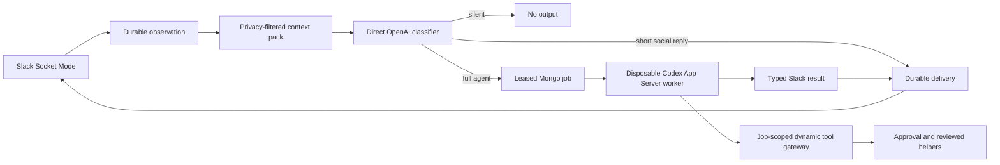

# tos-tag architecture

Status: implemented development architecture, 2026-08-01.

tos-tag is a Slack-native ambient agent control plane. It observes authorized
Slack traffic, builds privacy-filtered context, asks a small direct classifier
whether and how to participate, and starts a full Codex agent only for admitted
work. MongoDB is authoritative for observations, policy, decisions, jobs,
approvals, deliveries, directives, routines, triggers, usage, and audit data.

## Non-negotiable invariants

1. The classifier is a direct, stateless OpenAI Responses API call. It has no
   tools and never starts Codex App Server.
2. A private-channel, DM, or group-DM message is usable only for work whose
   destination is that same conversation. Private-channel awareness does not
   cross destinations, even without message text.
3. Slack scopes describe API capability, not runtime authority. Enrollment,
   participation mode, destination allowlists, requester policy, membership
   freshness, approvals, and kill switches are rechecked at every boundary.
4. MongoDB and external systems are authoritative. Classifier calls, Codex
   threads, workers, and delivery attempts are disposable compute.
5. Raw Slack, Mongo, provider, and connector credentials never enter prompts,
   behavioral skills, model-visible tool arguments, logs, or artifacts.
6. Models cannot choose a Slack destination or create privileged interactive
   blocks. The control plane owns both.
7. Every externally visible write is idempotent, auditable, and independently
   approved when its reviewed operation risk is not `read`.

## Runtime flow



The Slack event is persisted before acknowledgement. Duplicate Slack callbacks
may be observed, but only one observation wins admission and only one delivery
with a given idempotency key is accepted.

The optional user-authorized sync discovers public channels, private channels,
DMs, and group DMs visible to the configured Slack user token and backfills a
bounded history. Discovery grants observation only: every new conversation is
enrolled as `observe`, private content remains destination-local, and no output
authority is inferred. Slack pagination and `Retry-After` handling run in the
background so Socket Mode acknowledgement and live message processing remain
responsive during a broad sync.

## Context and privacy

The context builder selects authorized channels before querying content. It
then applies a second post-query disclosure filter and creates an immutable,
source-linked context-pack revision capped by configured partition budgets.

Partitions distinguish operator directives, current-thread history,
destination history, releasable public cross-channel history, reviewed notes,
and unverified prior agent output. Content from other private conversations is
never queried into the pack. Deleted and edited messages follow source event
ordering, and derived projections expire no later than their source data.

The response worker receives a JSON envelope with `request`, classifier
`response_intent`, selected `releasable_evidence_ids`, and
`authorized_context`. Every source includes its channel ID/name, author ID,
observation time, partition, provenance, and text. Sources are data unless
explicitly placed in the operator-directive partition.

## Direct classifier

`core/classifier` calls OpenAI directly with a bounded structured-output schema.
The call is stateless, tool-free, independently timed, and separately metered.
Its API key remains in the Go control plane and is never reused by Codex App
Server.

The classifier chooses:

- silence, reaction only, a short direct social reply, or full-agent work;
- in-channel versus threaded placement;
- a reaction from the configured Slack emoji allowlist;
- one enabled model profile and its corresponding model strength and reasoning
  effort; and
- source-linked reason codes and evidence.

A brief, self-contained answer unlikely to continue normally belongs in the
channel. A narrow investigation, multi-step answer, tool-heavy action, or
conversation likely to continue belongs in a thread. Once a tos-tag thread is
active, the same direct classifier evaluates each human reply before any
full-agent fail-safe, and any response stays in that thread. The classifier may
answer greetings, thanks, and light banter directly, but substantive content
must be admitted to the full agent.

The classifier may also admit an ambient alignment intervention when a current
human statement materially conflicts with a recent destination-safe public
report from another human or a clear fact and surfacing it would prevent
confusion, duplicated work, a bad decision, or a missed incident. It defaults
silent for opinions, weak inferences, ambiguous entities, and stale or
immaterial differences. Recent destination participants are a conversational
signal, not a channel-membership claim. The worker uses `team-alignment` to
attribute reports neutrally and verify when needed. Restricted context and
unverified agent output can never ground this behavior.

Natural messages are evaluated without prompt-like hints such as “stay silent”
or “reply in a thread.” Those phrases are tested only when they are the user's
actual placement instruction.

## Jobs, routing, and concurrency

Accepted full-agent work becomes a Mongo job with an immutable model-route
snapshot, context revision, destination, generation, lease, steering epoch,
attempt counter, and expiry. Workers claim jobs with compare-and-swap leases,
heartbeat while active, and abort immediately when the lease, policy, channel
membership, generation, or kill switch changes.

Concurrency is configurable and intended to allow several independent jobs at
once. Admission (`classifier.maxConcurrentJobs`) and execution
(`jobs.workerConcurrency`) are separate controls; both default to `8` in
development. Ordering is enforced per Slack thread generation; unrelated
channels and threads can run concurrently. A suspended approval releases its
worker and later resumes as a fresh, newly fenced attempt carrying the exact
approved action hash.

Model profiles are project-owned policy. The development default is
`chatgpt-luna-max`, which resolves to OpenAI model `gpt-5.6-luna` and effort
`max`. The classifier can select lower profiles for faster work. The selected
model and effort are passed directly to Codex App Server at turn start.

## Codex App Server boundary

`core/harness` implements the project-owned `Harness` interface over the
official Codex App Server JSON-RPC protocol. One disposable process is started
for each admitted job:

```text
codex app-server --stdio
```

The client performs the required `initialize` request and `initialized`
notification, creates an ephemeral thread, then starts one turn. It consumes
authoritative `item/completed` agent messages and finishes on
`turn/completed`. `turn/interrupt` handles cancellation. Protocol errors are
reduced to bounded diagnostic codes before they can reach structured logs.

Each thread receives:

- the resolved model and effort;
- the disposable workspace as `cwd`;
- tos-tag's Slack result contract as developer instructions;
- `ephemeral: true`;
- `approvalPolicy: never` for Codex built-ins;
- a read-only, network-disabled sandbox policy;
- disabled shell, web search, MCP servers, plugins, and multi-agent tools; and
- only the two job-scoped dynamic tools described below.

The Codex process uses a private configured `CODEX_HOME` solely for its own
login and runtime state. Its generated command environment is otherwise clean:
no inherited Slack, Mongo, OpenAI classifier, GitHub, Linear, SigNoz, Wiki, or
connector secrets. Shell subprocess inheritance is disabled as defense in
depth.

The Codex thread is not a queue, authorization boundary, delivery ledger, or
memory store. Teardown closes stdio, terminates the process group, revokes the
attempt capability, and removes the disposable worker root.

Official protocol reference: [Codex App Server](https://learn.chatgpt.com/docs/app-server).

## Skills

Behavioral skills come from two sibling repositories:

- `telemetryos-agent-skills`, plugin `telemetryos-automation`; and
- `tag-agent-skills`, plugin `base`.

The Go control plane validates marketplace manifests, rejects flat-name
collisions, snapshots exact files and hashes, and materializes the selected
content read-only at:

```text
<worker>/work/.agents/skills/<skill>/SKILL.md
```

This is Codex's repository skill discovery path. Supporting references are
materialized only when declared and hashed. Behavioral snapshots exclude
helper scripts and executable plugin surfaces. The whole source repository is
never copied into a worker.

tos-tag-specific skills and helper source belong in `tag-agent-skills`; this
repository contains only the separately reviewed runtime bundles needed to
execute selected helpers.

## Dynamic tools and credentials

Codex App Server receives two experimental dynamic function tools at
`thread/start`:

- `tos_tag_tool` accepts a reviewed `tool_id`, `operation_id`, typed argv, and
  optional exact `approval_id`.
- `tos_tag_trigger` manages classifier-gated heartbeat subscriptions in the
  current Slack channel.

The App Server sends `item/tool/call` to the Go client. The control plane, not
the Codex process, attaches the random attempt capability and calls a loopback
gateway. Every call rechecks the job lease, steering epoch, expiry,
organization, workspace, channel, and tool allowlist.

Reviewed tool bundles contain `SKILL.md`, `tool.json`, and one pinned script.
Each operation declares exact environment names, timeout, output bound, and
risk. Secret values are encrypted in the organization-scoped keystore and are
resolved only into the exact helper subprocess environment. Arguments that
contain a secret value are rejected, and output is redacted and bounded.

The current reviewed catalog is:

| Tool | Risk classes | Approval | Boundary |
| --- | --- | --- | --- |
| `telemetryos.code` | `read` | Risk-based | Bounded list/search/read below the server-owned Aion source root; no mount, shell, traversal, symlinks, runtime env, credential ledger, or private tool state |
| `telemetryos.linear` | `read`, `write` | Risk-based | Typed Linear helper operations |
| `telemetryos.wiki` | `read`, `write`, `delete` | Never for page read/write; always for recoverable page soft-delete | Page-only CRUD; namespace, asset, publish-file, cascading move, activity, undo, and admin operations are unavailable |
| `telemetryos.otel` | `read` | Risk-based | Bounded SigNoz/OpenTelemetry queries |
| `telemetryos.device-logs` | `read`, `write` | Risk-based | Device-log queries and reviewed log-level changes |
| `telemetryos.mongo` | `read` | Risk-based | Bounded Mongo fetch operations |

`telemetryos.code` is the only source-tree capability. The worker never receives
the Aion checkout or its path. The server validates typed read arguments against
`TAG_AION_DEVELOPER_PATH` and returns only bounded results through the same
capability gateway.

Because source reads return content rather than a shared filename, Wiki writes
accept an explicit inline body. The complete body is committed in the Wiki tool
execution audit receipt without being copied into broad audit listings.

Each operation manifest declares an approval policy. If omitted, the policy is
risk-based: `write` and `destructive` persist an exact canonical action and
require Slack-native approval. Admin-risk worker operations are invalid. The
reviewed Agent Wiki page read/write operations declare `never`, eliminating
normal authoring prompts without giving the model generic authority; its
recoverable page soft-delete declares `always`. Namespace and generic
administrative/destructive Wiki surfaces are absent. All executions still use attempt-scoped capabilities,
immutable reviewed scripts, exact argv and environment allowlists, bounded
timeouts/output, organization kill switches, and tamper-evident audit receipts.

## Slack rendering and delivery

The model returns `slack-output/v2`, a typed JSON result whose segment palette
is limited to header, mrkdwn text, context, divider, table, image, and artifact.
Tables render as native Block Kit tables. Approval buttons, notices, and
destination selection are control-plane-owned. Generated Slack mentions are
rejected unless the exact user/channel ID came from classifier-selected
destination-safe evidence; broadcast and user-group mentions remain forbidden.

Delivery uses a graduated surface policy. Short and medium answers remain
Slack-native. When the expected result is genuinely long and expository, or
its sections/evidence/navigation make it a durable document, the strong/max
worker first writes Markdown under the Agent Wiki `artifacts` namespace through
the reviewed page-only capability. Roughly 20,000 visible characters is a soft
signal, not a renderer cutoff. Only a successful tool result can supply the
artifact URL; otherwise the worker produces a compact Slack fallback and does
not claim publication. The Codex harness records artifact URLs from successful
reviewed tool responses as attempt-local events. Before completing the job, the
pipeline rejects every model-created artifact segment that does not match that
same-attempt provenance.

Before posting, the renderer validates every field, rejects privileged segment
types and generated special mentions, and creates a safe fallback string.
Delivery records are durable and leased. Multipart sends reconcile immutable
metadata so restart cannot duplicate already accepted parts.

The approved local development posture observes all user-authorized
conversations, enrolls new conversations as `observe`, enables `assist` only in
`#tos-tag`, and hard-restricts all reactions and messages to the `#tos-tag`
destination allowlist. Checked-in defaults remain stub/shadow/disabled and do
not encode the live IDs or secrets.

## Channel directives, routines, and triggers

`/tag-directive` opens a Slack modal that edits a revisioned channel directive.
The directive is stored in MongoDB, audited, placed in the system context
partition, and shown to both classifier and admitted agent.

Routines enqueue ordinary reauthorized jobs on a schedule. Trigger
subscriptions wake on an interval, rebuild the full destination-safe context,
run the same direct classifier gate, and enqueue work only when admitted.
Neither path bypasses policy, model routing, approval, or delivery controls.

## Container topology

The development stack uses one Mongo container and a persistent workspace/home
volume shared by an operator container and the tos-tag service. Persistent data
includes source checkouts, Aion-managed code, Codex login state, logs, and
Mongo data. Slack job workspaces remain disposable under
`/workspace/state/workers`.

The host Docker socket is not mounted. Runtime secrets are bind-mounted as one
read-only ignored file and sourced only inside the process. Compose inspection
does not expand them.

The same ignored `runtime.env` may be used for host development and can contain
a host `TAG_AION_DEVELOPER_PATH`. Container startup overrides that value after
sourcing the file so reviewed source access always binds `/workspace/code`.
It also replaces host HTTP, Mongo, log, Codex, skill, and tool locations with
their container-owned addresses.

## Logging, audit, and retention

Every observation, classifier decision, reaction/delivery attempt, job lease,
worker stage, tool call, approval decision, directive change, routine/trigger
run, and usage record carries correlation identifiers. Operator diagnostics can
be written to an owner-readable JSONL file, while durable audit receipts remain
in MongoDB. Logs and broad management listings omit Slack message text,
provider bodies, prompts, results, secrets, lease tokens, and connector
credentials. Raw observations, normalized messages, prompt/context data, and
derived state follow configured TTL and source-linked deletion rules.

## Failure behavior

- Classifier failure selects a conservative deterministic fallback.
- Invalid classifier structure fails to silence or the deterministic fallback;
  it never starts unbounded work.
- App Server initialization, thread, or turn failure records only a bounded
  stage/code and releases the job according to retry policy.
- Empty or invalid model output is not posted.
- Lease, policy, membership, or kill-switch revocation interrupts the turn and
  revokes tools.
- Tool transport failure exposes a bounded structured error to the model.
- Approval suspension releases compute and keeps only authoritative Mongo data.
- Slack retry or process crash resumes from durable delivery state.

## Verification gates

The normal gate is `make verify`: formatting, unit/integration tests, race
tests, vet, behavioral evals, gosec, and govulncheck. Network and credential
tests are opt-in. `integration/codex_live_test.go` verifies the installed App
Server handshake, dynamic-tool registration, model/effort routing, structured
output, event normalization, and teardown against a real authenticated Codex
runtime. `make eval-live` sends the 33 natural classifier messages through the
configured direct OpenAI provider and scores outcomes, source grounding,
restricted disclosure, placement, reaction semantics, and model/effort routing;
fixture names and expected results are never part of the provider request.

Live Slack validation must name the workspace and channel, keep output inside
the configured allowlist, watch redacted logs, measure latency, and distinguish
classifier evidence from full-agent evidence.

The maintained regression matrix also covers irrelevant-message silence,
direct social replies, mixed social/work messages, stable non-urgent metric
reactions without replies, destination-safe private-context refusals, reactions,
channel versus thread placement, model/effort routing, native Block Kit tables,
reviewed tool calls, exact-action
approval/resume, and multiple independent workers running concurrently.
