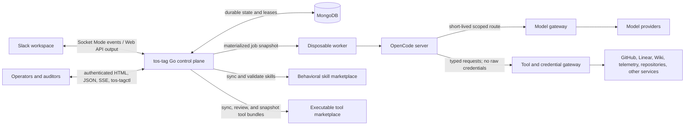
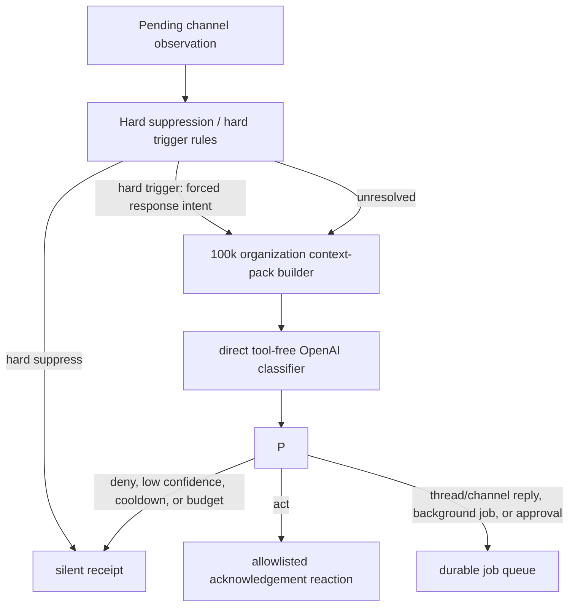
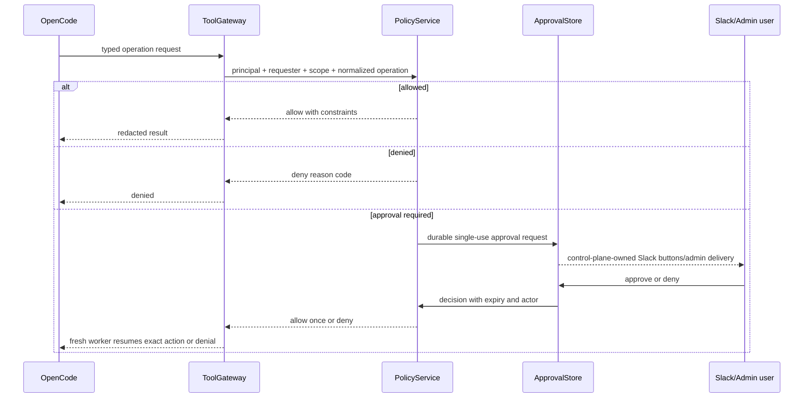
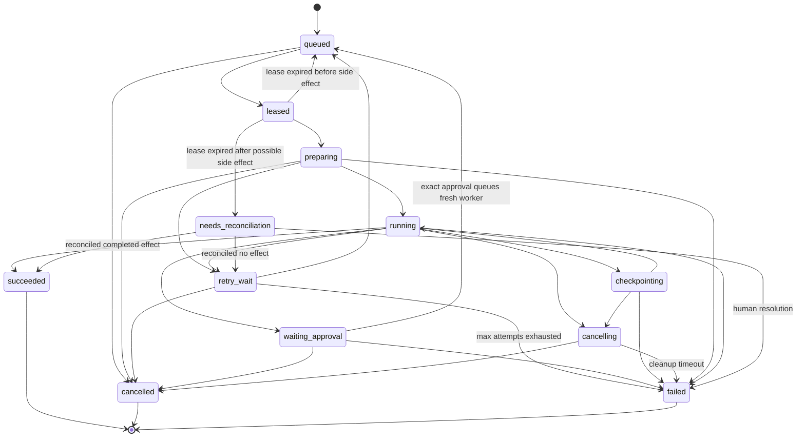

# tos-tag architecture

Status: proposed implementation architecture
Version: 0.3
Date: 2026-07-30
Language: Go 1.26

## 1. Purpose

tos-tag is an open-source, model-agnostic Slack agent control plane. It follows
every eligible communication in every Slack channel to which its bot is added,
maintains channel-scoped context, decides when to speak or stay silent, and runs
longer agent work through isolated OpenCode workers.

The system is not a conventional request/response Slack bot. It combines:

- continuous channel observation;
- organization-wide cross-channel situation awareness;
- thread-scoped conversational sessions;
- durable asynchronous jobs and proactive routines;
- policy-driven model selection at each inference boundary;
- versioned instructions, skills, and plugin marketplace content;
- marketplace-defined executable tool bundles backed by reviewed shell helpers;
- isolated code and tool execution;
- credential and network brokering outside the worker;
- explicit approvals, budgets, receipts, and audit history; and
- a first-party management web interface.

This document is the implementation architecture. Product research, source
analysis, and rejected alternatives live in [research.md](research.md).

## 2. Goals and non-goals

### 2.1 Goals

1. Process every eligible message, edit, and deletion in channels where the
   Slack bot is a member.
2. Let direct mentions reliably start work while allowing conservative,
   explainable ambient participation without a mention.
3. Use messages from every eligible observed channel to recognize cross-channel
   relationships before deciding whether to answer a particular message.
4. Keep unrelated conversations isolated: a channel is a context and policy
   scope; a Slack thread is a conversational session.
5. Support long-running tasks that survive process and worker failure.
6. Route different channels, routines, skills, and inference phases to
   different provider/model profiles.
7. Run OpenCode headlessly without treating it as the tenant, policy,
   credential, queue, or memory boundary.
8. Install approved skills from plugin marketplaces, including
   `telemetryos-agent-skills`, into individual worker snapshots.
9. Install tools from a separate tool marketplace as versioned skill, manifest,
   and shell-helper bundles rather than defining tools by hand in the web UI.
10. Share authorized conversation history across otherwise isolated sessions
   through an injected search tool, while keeping private-channel boundaries.
11. Support revisioned channel notes and channel-specific prompt directives.
12. Keep provider, Slack, repository, and connector credentials outside
   disposable workers.
13. Make all consequential decisions and external actions attributable to a
   stable agent principal and an authorized requester or routine.
14. Provide operators with health, policy, routing, jobs, decisions, approvals,
    memory, plugins, usage, and audit controls in one Go service.

### 2.2 Non-goals

- Replacing Slack, GitHub, CI, or the TelemetryOS Agent Wiki.
- Reimplementing OpenCode's agent loop, coding tools, provider adapters, or
  context compaction.
- Treating a whole Slack channel as one infinite model conversation.
- Treating an organization-wide raw transcript as one infinite model session or
  pasting every retained message into every classifier prompt.
- Sending every Slack message to a full-cost model or starting an OpenCode
  worker for every message.
- Letting a model, prompt, skill, or marketplace plugin grant itself authority.
- Requiring operators to author executable tool definitions or shell commands
  in the management web UI.
- Putting raw organization credentials in prompts, worker environments, files,
  MCP server environments, or model-visible logs.
- Running one shared, multi-tenant OpenCode server for the whole workspace.
- Making Nostr, Buzz, Redis, Temporal, Kubernetes, or a separate SPA mandatory
  for the first deployment.
- Claiming wire, prompt, or implementation compatibility with Claude Tag.

## 3. Architectural principles

### 3.1 Observe, decide, then act

Every Slack message becomes a durable observation. Only a positive response
decision becomes a job. Only an authorized job may run a tool or send output.
This keeps continuous awareness separate from expensive or consequential work.

### 3.2 Slack membership is the ingestion boundary, not the authority boundary

The bot can observe messages only in conversations allowed by its Slack scopes
and membership. That visibility does not authorize external writes. Tool,
credential, repository, destination, data, and model policy are evaluated
separately.

### 3.3 Channel scope, thread session

The channel owns participation mode, instructions, model defaults, memory,
notes, plugin/tool bindings, access bundles, budgets, and an observation cursor.
Each Slack thread owns its live conversational session and execution
serialization. Sessions share knowledge by authorized retrieval, never by
sharing mutable model state.

### 3.4 Durable control plane, disposable execution plane

MongoDB and external systems hold authoritative state. OpenCode databases,
worker filesystems, process memory, and SSE streams are recoverable caches or
execution details.

### 3.5 Stable identity, dynamic implementation

These are independent, versioned concepts:

```text
agent principal      who acted and whose authority was evaluated
model profile        provider/model/options used for an inference step
instruction profile  behavioral instructions active for the scope
skill snapshot       immutable prompt-visible capabilities for the job
tool snapshot        immutable executable tool contracts for the job
access bundle        permitted external operations
secret binding       scoped mapping from a declared ENV name to a secret ref
```

Changing the model must not change identity, memory scope, ownership, or
permissions.

### 3.6 Fail closed at trust boundaries

Ambiguous scope, stale membership, missing policy, unavailable credentials,
unknown model capabilities, conflicting skills, exhausted budgets, and
unverifiable approvals result in no action. A useful error can be posted only
when posting itself is authorized.

### 3.7 Evidence is a product surface

Answers and actions should carry receipts linking source messages, tool
observations, approvals, artifacts, commits, model route decisions, and audit
events. The system must explain why it spoke without storing hidden
chain-of-thought.

### 3.8 Private-channel context is destination-local

The classifier path may use organization-wide public observations to recognize
that two conversations are related. Private-channel content has a stricter
boundary: it is eligible only when that exact private channel is the destination.
A context pack for a private `#management` channel may therefore contain
`#management` plus eligible public-channel context, but it must exclude every
other private channel before the observation query is issued.

No raw text, source metadata, channel identity, result count, or content-free
derived awareness from one private channel may enter another channel's context
pack. The classifier selects an action and evidence IDs and never writes final Slack
prose; final response generation receives only the destination-safe sources
selected from the same authorized pack.

## 4. System context



### 4.1 Trust boundaries

| Boundary | Trusted side | Untrusted or less-trusted side | Required control |
| --- | --- | --- | --- |
| Slack ingress | Verified Socket Mode installation and resolved scope | Message text, files, links, bot content | Dedupe, subtype handling, prompt-injection treatment, membership resolution |
| Management interface | Authenticated authorized operator | Browser input and CSRF-capable origins | Sessions, same-origin policy, CSRF, live authorization, audit |
| Worker boundary | tos-tag control plane | OpenCode, skills, repository content, shell processes | Disposable isolation, resource limits, default-deny egress, no raw secrets |
| Model boundary | Model gateway policy | Provider and generated output | Profile allowlist, data class, budget, timeout, redaction, usage receipt |
| Tool boundary | Tool gateway policy | Model arguments and remote responses | Typed schemas, destination/method/path policy, credential injection, result limits |
| Marketplace boundary | Reviewed immutable install | Remote manifests, skills, scripts, plugins | Pinning, compatibility classification, no worker-side install/update |

## 5. Runtime topology

### 5.1 Initial deployment

The target deployment consists of:

- one `tos-tag` Go control-plane process;
- one MongoDB deployment;
- outbound Slack Socket Mode and Slack Web API connections;
- zero or more disposable Docker workers, each containing one OpenCode server;
- a model gateway and tool/credential gateway, initially allowed to run as
  modules in the control-plane process if their network boundary remains
  explicit; and
- server-rendered management pages, JSON endpoints, and SSE served by the same
  Go binary.

The implemented local-development profile uses the same `WorkerManager`
contract but launches one clean-environment, process-group-isolated
`opencode serve` process per harness session. It binds an ephemeral loopback
port, receives isolated HOME/XDG/temp/artifact directories and read-only
hash-verified skills, and is killed as a process group on completion. This
profile is for the single-user experiment and real harness tests; it is not a
filesystem, network-namespace, or multi-tenant security boundary. The Docker/
gVisor/microVM topology below remains the required hardened deployment profile.

The control plane is horizontally scalable later, but the experiment should
begin with one instance. The durable lease and idempotency design must not rely
on that single-instance assumption.

### 5.2 Worker topology

One active Slack thread generation receives one isolated worker at a time:

```text
thread generation
  -> single-writer lease
  -> disposable container or microVM
     -> isolated working directory and OpenCode state
     -> one opencode serve process on a private per-worker interface
        reachable only by its control-plane supervisor; no published port
     -> materialized instructions and skill snapshot
     -> short-lived model-gateway route
     -> short-lived tool-gateway capability
```

The worker may execute several steering prompts for its thread while it remains
warm. It is destroyed after an idle timeout or at the end of a hard lifetime.
A worker crash or idle teardown does not end the thread session: a replacement
worker rehydrates from tos-tag's durable transcript, memory, policy snapshot,
and declared external artifacts.

An explicit user restart, administrator restart, deliberate branch, or
incompatible policy adoption creates a new session generation. A retry after a
crash normally creates a new attempt within the same generation.

### 5.3 Future scaled topology

Multiple control-plane instances may share MongoDB. Job claims, observation
claims, routine leadership, delivery claims, and janitor work use leases and
compare-and-swap transitions. Multiple Socket Mode connections may deliver any
event to any instance, so event IDs and unique indexes—not connection affinity—
provide correctness.

Workers can later run on a separate pool or hardened sandbox service. The
`WorkerManager` interface must keep Docker, gVisor, Kata, or microVM choice out
of orchestration code.

## 6. Identity, scope, and session model

### 6.1 Scope hierarchy

```text
organization
  -> Slack workspace / installation
     -> channel
        -> thread session
           -> generation
              -> job
                 -> attempt
                    -> OpenCode session and tool/model calls
```

Every durable record carries `organization_id` and the narrowest applicable
scope identifiers. Authorization queries fail closed when scope resolution is
ambiguous.

### 6.2 Canonical external keys

| Object | Canonical key |
| --- | --- |
| Slack installation | `enterprise_id? + team_id + app_id` |
| Observation dedupe | `team_id + event_id` |
| Channel observer | `team_id + channel_id` |
| Thread session | `team_id + channel_id + root_thread_ts` |
| Session generation | thread-session key + monotonically increasing generation |
| Observation-derived job | `observation_id + decision_kind` |
| Non-observation job | `trigger_type + stable_trigger_id + decision_kind` |
| Routine run | `routine_id + scheduled_window_or_source_event_id` |
| Approval | `job_id + step_id + tool_version + operation + canonical_argument_hash + destination` |
| External action | `job_id + step_id + tool_version + operation + canonical_argument_hash + destination` |

Policy, directive, model, skill, and tool revisions are recorded on a job but
are deliberately excluded from an observation-derived job key. Re-evaluating
one observation under a new revision must not create a second logical job or
reply. `canonical_argument_hash` is computed by the control plane from a
versioned canonical encoding of the exact typed arguments shown to an approver;
the worker cannot supply this hash.

For an existing reply, `root_thread_ts` is Slack's `thread_ts`. For a top-level
message it is the message's own `ts`. If tos-tag responds, it replies under that
root and the new thread becomes the conversational session.

### 6.3 Agent principals

An `AgentPrincipal` is the stable internal actor shown in audit and receipts. It
has:

- stable ID and display metadata;
- organization owner and lifecycle status;
- workspace/channel bindings;
- instruction-profile binding;
- default model-policy binding;
- skill/plugin bindings;
- access-bundle bindings;
- budget bindings; and
- creation, update, disablement, and rotation history.

The Slack bot is the transport identity, not sufficient proof of authority. A
principal may post through the same Slack bot while retaining a distinct
internal identity and receipt trail.

### 6.4 Participation modes

Each channel has one participation mode:

| Mode | Processing | Speech policy |
| --- | --- | --- |
| `observe` | Ingest and index every eligible event; optionally record assist-style predictions under global shadow mode | No output; the effective decision is always silent |
| `mention` | Same observation behavior | Only direct triggers |
| `assist` | Same observation behavior | High-confidence, rate-limited ambient help |
| `proactive` | Same observation behavior | Tuned alerts, suggestions, and routines within policy |

Organization enrollment supports `allowlist` for Phase 0 and
`all_observable_channels` for the intended deployment. In the latter mode, every
channel the Slack installation is authorized and technically able to observe is
automatically enrolled unless an explicit audited exclusion applies. New
channels inherit `observe` until their speech mode/directive is configured, but
their eligible messages still contribute to organization intelligence.

The deployment capability for user-authorized context synchronization is
separate from organization enrollment. When both are enabled, the control plane
uses the consented Slack User OAuth identity to enumerate that user's public,
private, DM, and MPIM conversations, refresh membership metadata, and import a
bounded recent-history snapshot. Complete bounded discovery and policy
registration happen before live ingress. History backfill then runs
concurrently with Socket Mode so Slack API rate limits cannot create a gap in
event capture; it honors `Retry-After`, has an overall deadline, and shares
canonical event IDs with live ingestion. A conversation that becomes stale or
inaccessible after discovery is safely skipped only for Slack's explicit
channel/thread disappearance responses; authorization and scope failures remain
terminal. Existing channel policy is never replaced. An explicit exclusion
remains excluded; a newly
discovered conversation is created only under `all_observable_channels` and is
always `observe`. Under `allowlist`, user-subscribed events for unknown channels
are acknowledged without retaining message content.

Global shadow mode does not expand channel authority. For an `observe` channel,
the classifier may run the same classifier path used by `assist` and retain that
prediction for precision review, but it persists `admission.channel_mode` as the
effective silent decision. This path cannot create jobs or deliveries. Hard
suppressions such as self-authored messages are applied before classification.

Once that precision review passes, the explicit global `live` classifier mode lets
only an already-authorized `assist` or `proactive` channel apply its ambient
decision. It does not alter enrollment, membership, disclosure, kill-switch,
cooldown, response-budget, or concurrency checks, and `observe` remains an
absolute no-output mode.

A deployment may additionally configure a hard Slack output-channel allowlist.
Channels outside it are forced to effective `observe` behavior before job
admission, and the delivery worker independently rejects any queued destination
outside the same allowlist. This is a deployment safety boundary layered below
organization and channel participation policy.

Removing the bot from a channel stops future ingestion and marks the channel
`ingestion_revoked_at`. Historical local data then follows retention and
deletion policy and is excluded from active conversational search by default.
Continued historical search requires an explicit audited retention/search
policy; channel removal never silently merges its memory into another scope.

### 6.5 Shared retrieval, channel notes, and directives

Thread sessions do not directly share OpenCode state or append to one another's
prompts. They share authorized knowledge through the control plane:

- every normalized Slack message in every eligible channel observed by the app
  is stored in MongoDB, enters the organization intelligence timeline, and is
  indexed for bounded conversational search;
- every eligible human-authored message becomes a classifier target after
  deterministic suppressions and a short burst debounce, whether or not it
  mentions tos-tag;
- each classification decision uses a versioned organization context pack capped by a
  configurable token budget, initially 100,000 input tokens;
- every admitted worker receives the core `conversation-search` tool;
- results include source channel/thread/message IDs and excerpts so answers can
  cite their evidence;
- a session can retrieve other-channel context only when the effective agent
  principal, requester/routine, and organization sharing policy all allow it;
- ambient classification may use the organization context pack, while the
  target channel still supplies the active directive, speech budget, reply
  mode, and output audience; and
- no session receives raw database credentials.

The previous current-channel-only ambient default is replaced by
organization-wide classification for enrolled channels. “All channels” means all
conversations the Slack installation can lawfully observe under its scopes,
membership, enrollment, and retention policy; it never bypasses private-channel
membership or Slack authorization.

Raw public cross-channel excerpts enter the releasable partition only when
requester and destination-audience policy permit them. Private-channel messages
are destination-local and excluded from every other destination's pre-query
channel set, including derived incident or awareness signals.

Channel notes and channel directives are different objects:

- **Channel notes** are revisioned, source-linked reference material. They are
  retrieved as memory or through the conversation/notes tool and may be edited
  in the management UI or by an explicitly authorized note-write operation.
- **Channel directives** are revisioned prompt instructions configured in the
  management UI. The active revision is injected into both ambient and full
  agent context for that channel, below immutable system/safety policy and above
  task/skill instructions.

Neither notes nor directives grant tool authority. Notes are not automatically
treated as instructions, and directives cannot override policy or safety denies.
Agent-authored note revisions enter `pending_review` and are excluded from
prompt context and cross-channel sharing until a human authorized for the
channel activates them. Every rendered note is delimited and labeled as
untrusted reference data with its source link. Human-authored notes may be
activated directly when policy permits; cross-channel sharing always requires
explicit human activation.

## 7. End-to-end flows

### 7.1 Slack ingestion and acknowledgement

```mermaid
sequenceDiagram
    participant S as Slack
    participant I as SlackIngress
    participant O as ObservationStore
    participant D as AmbientDispatcher

    S->>I: Socket Mode envelope
    I->>O: normalize and insert by team_id + event_id
    alt durable insert or known duplicate
        O-->>I: accepted
        I-->>S: acknowledge envelope
        O-->>D: observation pending decision
    else Mongo unavailable or invalid installation/envelope
        O-->>I: not durably accepted
        Note over I,S: do not claim successful processing; Slack may retry
    end
```

Ingress performs only bounded work before acknowledgement:

1. validate installation and envelope shape;
2. normalize the event without trusting message content;
3. insert the observation under a unique Slack event key with
   `scope_state: unresolved` when current channel/membership state is not
   already available locally; and
4. acknowledge after durable insert or confirmed duplicate.

Channel and membership resolution happens asynchronously before an observation
becomes decision-eligible. A stale, unavailable, or ambiguous resolution fails
closed to stored/no-action rather than holding the Socket Mode acknowledgement
open on a rate-limited Slack Web API request. The unresolved-scope backlog and
oldest age are readiness/status signals.

Message edits and deletions are first-class observations. They update the
current message projection while retaining policy-compliant audit metadata.
Bulk history-change events mark a channel cursor for reconciliation. Unsupported
message subtypes remain observable metadata but do not automatically enter
model context.

### 7.2 Ambient classification



The decision enum is:

```text
silent | react | reply_in_thread | reply_in_channel | start_background_job | escalate_for_approval
```

Hard suppressions include the agent's own output, duplicates, deleted content,
unsupported hidden subtypes, muted policy, known workflow-loop markers, and—by
default—messages authored by other integrations. Those messages are still
stored as observations where policy allows. Suppression means “do not answer
this message directly”; it does not exclude the message from intelligence
projection. Approved alert integrations may update incident/status facts and
trigger bounded correlation while remaining ineligible as conversational reply
targets.

Hard triggers include a direct mention, an authorized explicit command, a reply
inside an active tos-tag thread, an assigned request, a matched alert rule, and
an approved routine trigger. A stronger deny can still block them.

Hard triggers still receive an organization context pack so the resulting
answer has the same cross-channel intelligence. They bypass debounce and the
ambient classifier, deterministically acknowledge with an allowlisted reaction,
default to a thread reply, and use normal model-routing defaults unless policy
denies the request. If context construction is unavailable, the explicit request
continues with narrower safe context and a recorded degraded-context reason.

Every eligible human message not deterministically suppressed is evaluated by a
stateless direct OpenAI classifier configured independently from OpenCode. It receives the target message/thread, bounded
target-channel history, organization-wide recent public context, related
destination-safe cross-channel excerpts, and current eligible situation facts
within the 100k-token cap. It has no tools, OpenCode worker, long-lived session,
or ability to send Slack output. Its OpenAI credential remains only in the Go
control plane. It returns strict structured output containing outcome,
confidence, reason codes, topic/evidence IDs, response intent, disclosure class,
channel/thread placement, an allowlisted Slack emoji reaction, whether full
agent work is justified, and the exact permitted model profile/strength/reasoning
effort for that OpenCode job. It returns no user-facing prose.

Reply placement is policy-driven:

- `reply_in_thread` is the default for a direct answer to a specific top-level
  message, an existing thread, or an answer that would otherwise add channel
  noise;
- `reply_in_channel` is allowed only for a top-level response whose value is
  broadly relevant to the channel, such as a confirmed active incident, and is
  subject to a stricter confidence, rate, and disclosure threshold; and
- an answer may be rendered as a thread reply with Slack broadcast only when a
  separate channel policy explicitly permits that mode.

For example, an alert in `#alerts` creates or updates an active incident fact.
When a later message in `#support` asks whether the system is down, its context
pack includes the releasable alert evidence or a restricted incident signal.
The classifier can therefore start a grounded response even though the support
message never mentioned the agent.

Admission then applies channel confidence threshold, cooloff, response-rate
budget, model budget, concurrency, data policy, and agent-principal policy. A
compact decision receipt is stored for every outcome. No hidden chain-of-thought
is requested or persisted.

Short bursts are debounced before an ambient classification so a person can
finish a thought. Direct mentions bypass the debounce and receive an immediate
acknowledgement after job creation.

A high-signal new observation also runs bounded retroactive correlation against
recent `silent` or unresolved messages, initially a five-minute window. If a
new alert makes a recent support question answerable, tos-tag may re-evaluate
that target using a new context-pack revision. The observation-level output
guard prevents duplicate replies; correction/supersession is explicit when an
earlier answer already exists.

### 7.3 Explicit or admitted agent task

1. The decision service creates a job using the canonical deterministic key and
   atomically marks the observation's terminal `output_produced` guard in the
   same MongoDB transaction or compare-and-swap protocol. Re-evaluation may add
   a decision receipt but cannot produce a second delivery/job.
2. The orchestrator resolves the thread session and current generation.
3. It snapshots instructions, policy revision, behavioral skill bundle,
   executable tool bundle, secret bindings, access bindings, and model-routing
   policy.
4. It claims the thread-generation single-writer lease.
5. The worker manager provisions an isolated filesystem and resource envelope.
6. The materializers write only the approved immutable skill/tool snapshots and
   generated OpenCode skill/tool configuration.
7. The model gateway and tool gateway issue task-scoped, short-lived
   capabilities.
8. The harness starts `opencode serve` on loopback with Basic authentication and
   isolated XDG state.
9. The context materializer builds the initial prompt from the active thread,
   triggering observation, bounded recent channel context, source-linked memory,
   and instructions.
10. The model router resolves a profile for the inference step; the harness
    sends a model/agent selection to OpenCode.
11. The orchestrator consumes OpenCode SSE events, persists normalized progress,
    handles permissions, and schedules Slack progress deliveries.
12. The result is persisted before the final Slack message is dispatched.
13. External artifacts are exported, usage and receipts are finalized, and the
    worker becomes idle or is destroyed.

### 7.4 Steering, interruption, restart, and branching

- A reply in the same Slack thread is appended to the same thread session.
- If no model/tool step is active, it becomes the next prompt.
- If work is active, channel policy chooses `queue`, `interrupt`, or
  `explicit-branch`; `queue` is the safe default.
- Every admitted generation has a monotonically increasing steering epoch.
  Interrupt increments it before aborting work; model/tool gateways reject
  calls using an earlier epoch.
- Cancellation marks the job cancel-requested, aborts OpenCode, revokes
  task-scoped capabilities, terminates child processes, and records a terminal
  state only after cleanup or timeout.
- Interrupt follows the same capability revocation and process-drain boundary
  as cancellation. A new prompt is not admitted until in-flight external
  actions are complete, cancelled, or recorded as `uncertain_in_flight_action`
  requiring reconciliation or human resolution.
- Retry creates a new attempt. It does not duplicate completed external actions;
  action idempotency records are checked before execution.
- Restart creates a new generation and re-resolves current policy, instructions,
  skills, and model bindings.
- Branching creates a new generation with a parent-generation reference and a
  clearly labeled Slack progress/result message.

### 7.5 Permission and approval



An OpenCode `ask` event is a request for a tos-tag policy decision, not proof of
authorization. “Always allow” is stored only as a scoped tos-tag policy change
performed by an authorized operator; it is not trusted as worker-local state.

An approval is bound to exact server-canonicalized bytes: tool version,
operation, typed arguments, destination, requester, job/step, expiry, and risk.
The UI/Slack rendering is generated from those same bytes; the gateway
recomputes and requires an exact match before one-time use. Policy supplies the
authorized approver set. For `write` risk and above, the requester cannot approve
their own request. The current channel policy expresses that set as explicit
Slack user IDs in `approver_user_ids`; an empty or stale set fails closed. The
control plane verifies organization/workspace/channel scope, current membership,
and requester independence before recording an authorization audit receipt and
mutating the approval. It never treats channel visibility as approval authority.

If an approval wait outlives the worker-retention threshold, tos-tag releases
the worker and stores a durable suspended action. Approval either executes that
exact action through the tool runner and records its result, or resumes a fresh
worker with an approved-action reference and result; it never attempts to
resolve a permission event in a destroyed OpenCode session.

### 7.6 Routine execution

Schedules, webhooks, channel watches, repository events, and other triggers are
normalized into the same job admission path as Slack observations. A routine
stores owner, scope, trigger, instruction, model policy, skill snapshot rule,
output channel, budget, and enabled revision. It is reauthorized at execution
time. Trigger and emitted events carry loop-prevention metadata.

The first durable event-subscription implementation is a classifier-gated
heartbeat. Each due window reauthorizes the destination and configured output
allowlist, rebuilds the same 100k-bounded context pack used for Slack decisions,
and records a tool-free classification. Other restricted destinations are
excluded before the observation query. Only an effective job-producing outcome
at or above the subscription confidence threshold enqueues an idempotent
`heartbeat` job; shadow mode, observe mode, policy denial, classifier failure,
or silence advances the schedule without output.

### 7.7 Outbound Slack delivery

Slack output is a durable delivery record, not an inline side effect of model
streaming. The renderer converts normalized progress/result events into Slack
text, blocks, reactions, files, or message edits. The delivery worker retries
with idempotency metadata, records the returned message timestamp, and stops on
permanent Slack errors. A permanent failure becomes terminal
`delivery_abandoned`, alerts operators, and marks the originating job
`completed_undelivered`; it does not silently disappear or rerun model/tool
work.

Every Slack-destined agent generation receives an immutable Slack `mrkdwn`
output contract in its system instructions. Channel directives may adjust tone
and structure but cannot replace this contract. Agents must produce readable,
fully formatted Slack messages rather than generic GitHub-flavored Markdown:

- links use Slack syntax such as `<https://example.com|descriptive label>`;
- emphasis uses `*bold*`, `_italic_`, and `~strikethrough~` where useful;
- variable names, environment variables, literal values, commands, flags,
  paths, model names, codes, issue keys, UUIDs, job IDs, and other identifiers
  are enclosed in single backticks;
- multiline code, commands, logs, JSON, or other literal output uses fenced
  triple-backtick code blocks;
- comparisons with several rows or repeated fields use a complete structured
  table result that the renderer emits as a native Block Kit `table` block;
  aligned fenced tables are reserved for literal terminal-style output or
  fallback when a native table cannot faithfully represent the result; and
- prose outside code blocks uses headings, short paragraphs, lists, links, and
  emphasis as appropriate instead of placing an entire response in a code
  block.

The normalized agent result is an ordered sequence of typed Slack segments:
`mrkdwn_text`, `table`, and `artifact`. A `table` segment contains column
settings and typed rows rather than a table encoded inside prose. This lets the
renderer preserve the agent's intended ordering while constructing valid Block
Kit JSON. A plain-string agent response is accepted as one `mrkdwn_text`
segment, but it cannot request a native table.

The agent must not emit GitHub link syntax (`[label](url)`), double-asterisk
bold, HTML tables, or an unaligned pipe table and assume a `mrkdwn` text object
will render it.
Formatting is part of the result contract, including progress updates,
approvals, corrections, routine output, and final answers.

The Slack renderer treats model text as untrusted. It validates supported
`mrkdwn`, preserves intentional code spans/blocks, applies Slack-safe escaping
without corrupting link or mention tokens, enforces message and Block Kit
limits, and falls back to a file or split delivery when a faithful message does
not fit. It must not invent links, mentions, identifiers, or formatting that
changes the agent's meaning. Native tables use typed `raw_text`, `raw_number`,
or `rich_text` cells and respect Slack's current limits: at most 100 rows, 20
cells per row, and 10,000 aggregate cell characters. Larger tables are split or
attached as an artifact with a readable summary and link.

The model cannot choose an arbitrary channel. Output destination is derived
from the target observation and authorized job/routine scope. The classifier may
propose thread versus top-level placement within that fixed channel; admission
validates the proposal against channel policy. Final output includes a
management receipt link when available and source references appropriate for
channel members.

## 8. Component architecture

### 8.1 Process lifecycle and composition root

`cmd/api/main.go` is a thin entry point. It loads configuration, constructs
logging and telemetry, creates `core`, starts it, waits for coordinated exit,
and stops it. `core.New` validates and wires the complete object graph without
network I/O. `core.Start` and `core.Stop` own ordered lifecycle.

Startup order:

1. Load and validate configuration; initialize logging, build metadata, and
   optional OpenTelemetry.
2. Construct the complete dependency graph.
3. Connect to MongoDB and ensure required indexes and invariants.
4. Recover expired observation, job, delivery, approval, routine, and worker
   leases.
5. Refresh the Slack installation identity and validate configured channel
   policy references.
6. Refresh the configured model catalog and validate active model profiles.
7. Start janitors, decision dispatchers, job dispatchers, delivery dispatchers,
   routine scheduler, marketplace scheduler, and worker supervisor.
8. Bind the management HTTP listener.
9. Mark readiness only when durable observation acceptance is available.
10. Open Slack Socket Mode last.

Shutdown reverses ingress first:

1. Stop accepting Slack envelopes and mark not ready.
2. Stop claiming observations, jobs, routines, and deliveries.
3. Allow active jobs a bounded checkpoint/drain interval.
4. Cancel remaining jobs, revoke capabilities, and terminate workers.
5. Drain HTTP and SSE consumers.
6. Stop schedulers/janitors, flush telemetry, and disconnect MongoDB.

### 8.2 Slack adapter

Responsibilities:

- manage the app-level Socket Mode token and bot Web API token;
- confine the separately consented User OAuth token to read-only conversation
  discovery and bounded history/reply backfill when context sync is explicitly
  enabled;
- open, refresh, and reconnect WebSocket connections using `slack-go/slack`;
- acknowledge envelopes after durable acceptance;
- normalize Slack events into project-owned boundary types;
- map Web API responses and errors into stable delivery results;
- expose connection and rate-limit health; and
- never expose Slack tokens to workers, prompts, model providers, or plugins.

Initial subscriptions:

- `message.channels` with `channels:history`;
- `message.groups` with `groups:history`;
- `app_mention` with `app_mentions:read`; and
- membership and channel lifecycle events needed to keep scope state current.

The all-observable development path adds matching user-event subscriptions for
`message.channels`, `message.groups`, `message.im`, and `message.mpim`. Duplicate
bot/user callbacks converge on the canonical message event key. Startup history
imports are persisted as resolved context rather than pending observations, so
they cannot cause a reaction, classifier decision, job, or Slack delivery.

Phase 1 cross-channel search additionally requires the reviewed Slack scopes
needed to enumerate users and conversation membership, initially `users:read`,
`channels:read`, and `groups:read` for channels the bot may access. Scope names
and API behavior are compatibility-tested against the pinned Slack app
configuration before enablement. If per-user visibility is stale, rate-limited,
or unavailable, search fails closed to the current destination channel; bot
membership alone is never used as a proxy for requester visibility.

`message.im`, `message.mpim`, files, reactions, canvases, and workspace search
are separate capabilities and are added only with corresponding product policy
and scopes.

The adapter does not decide whether to respond and does not call OpenCode.

### 8.3 Observation store and channel observer

The observation store is the durable boundary between Slack delivery and agent
behavior. It:

- inserts idempotently by Slack event ID;
- assigns a per-channel receive sequence;
- stores original Slack timestamp, event timestamp, subtype, author, thread
  root, normalized text/file references, and mutation metadata;
- updates the current message projection for edit/delete events;
- records channel membership/policy resolution state;
- exposes pending observations to decision workers through leases; and
- honors per-scope retention, redaction, and deletion rules.

Per-channel sequencing guarantees deterministic processing order for tos-tag's
own decisions. It does not claim that Socket Mode delivery is globally ordered.
When a late event arrives, policy decides whether it is decision-eligible or
stored only for context/replay.

`received_seq` is allocated atomically with `findOneAndUpdate` on a per-channel
counter document; it is never computed by reading the current maximum. Sequence
is advisory ordering rather than an infinite contiguous barrier. After a
bounded configurable gap timeout, the decider proceeds and records
`late_or_missing_predecessor`; a later event cannot retroactively duplicate an
already guarded output.

### 8.4 Organization classification and ambient decision service

The ambient decision service is a pure coordinator around:

- hard trigger and suppression rules;
- channel participation policy;
- bounded context materialization;
- deterministic test classification or a direct structured OpenAI call;
- confidence, cooldown, cost, and concurrency admission; and
- decision receipts and resulting job/delivery creation.

The service cannot call external tools. The direct provider request declares no
tools, disables provider-side storage, and requires strict structured output. A
classification failure falls back to the deterministic classifier, which still
defaults ambiguity and ordinary chatter to `silent`. Hard triggers bypass the
ambient provider call.

The rules engine and classifier emit stable reason codes, for example:

```text
hard.direct_mention
hard.active_thread_reply
suppress.self_message
suppress.workflow_loop
suppress.unsupported_subtype
ambient.clear_unanswered_question
ambient.material_error_with_evidence
ambient.cross_channel_incident_match
ambient.late_evidence_reconsideration
ambient.social_chatter
admission.cooldown
admission.response_budget
admission.low_confidence
admission.destination_disclosure_denied
```

The ambient subsystem also owns a durable, revisioned kill-switch projection at
deployment, organization, workspace, and channel scope. `pause_speech` blocks
new decisions that could emit Slack output while preserving observation;
`abort_all` additionally revokes capabilities, cancels active jobs, drains or
marks uncertain actions, and abandons pending non-required deliveries. The
switch is checked on decision admission, job claim, every model/tool gateway
call, and delivery claim. Instances watch durable revisions and may cache them
for at most five seconds; an explicit deny or switch-on state wins. Health and
status report effective switch state and propagation lag.

#### 8.4.1 Organization intelligence projector

Every eligible normalized message is appended to an organization observation
timeline as well as its channel sequence. An intelligence projector maintains:

- recent content-addressed message segments by organization/channel;
- active topics and incident/status facts with source IDs, first/last seen,
  confidence, affected services, and expiry;
- channel rolling summaries for history older than the raw recency window;
- lexical/metadata and optional semantic retrieval indexes; and
- destination-local restricted projections for authorized inspection inside
  their source channel; they are never shared into another channel's context.

Derived topics, summaries, and signals are untrusted retrieval aids, not factual
authority. A final answer must ground factual claims in releasable source
messages or an approved external tool result. Every derived item retains source
provenance so edits/deletions can invalidate and rebuild it.

The projector processes all enrolled channels fairly. Per-channel contribution
caps, source diversity, recency decay, and incident priority prevent one noisy
channel from consuming the entire organization context. High-signal events may
enqueue bounded reconsideration of recent unanswered targets; normal chatter
only updates indexes and future context packs.

#### 8.4.2 Versioned 100k-token context pack

The classifier model receives a fresh immutable `ContextPackRevision` rather
than owning a permanent organization conversation. The revision records the
target observation, organization observation watermark, membership/policy
revisions, tokenizer/model profile, selected source IDs and versions, per-source
token counts, summaries/signals, disclosure partition, and content hash.

Before classifying an unmentioned target, the builder waits a bounded interval for
the intelligence projector to reach at least the target's organization sequence.
It can always select authorized raw timeline segments through that watermark,
so projector lag cannot erase an earlier alert; missing derived facts are
recorded as degraded context. Explicit triggers may proceed immediately with
the most recent safe watermark.

The initial maximum input budget is 100,000 tokens:

| Partition | Initial ceiling | Selection |
| --- | ---: | --- |
| System, safety, output schema, organization/agent instructions, target-channel directive | 8,000 | Always first; never truncated below its required minimum |
| Target thread | 20,000 | Exact recent thread, trigger, edits, and agent outputs |
| Target-channel history | 20,000 | Recent raw messages plus relevant older excerpts |
| Organization-wide recent timeline | 15,000 | Fair-sampled recent messages across enrolled channels |
| Cross-channel related evidence | 22,000 | Incident/topic, lexical, metadata, and optional semantic matches |
| Situation board and rolling summaries | 10,000 | Active facts and source-linked compressed history |
| Safety/headroom | 5,000 | Tokenizer variance and required delimiters |

Unused budget is reassigned in that order of relevance. The pack may be much
smaller than 100k; the cap is not a target. Within each partition, selection is
deterministic for a fixed pack revision: hard source eligibility, disclosure
class, causal/thread links, incident/topic match, recency, source diversity,
then stable IDs. Exact target/thread content displaces summaries, and deleted or
superseded source versions are excluded.

Provisional history horizons are 24 hours for the organization-wide raw recent
timeline, seven days for related raw retrieval, and 30 days for rolling
summaries, all bounded further by source retention. Active incidents remain
eligible until resolved/expired even when their originating message leaves the
raw recent window. These are configuration defaults, not authority to retain
content longer than channel/organization policy.

All retained messages remain retrieval candidates even when they do not fit the
pack. Older history is represented by rolling summaries and retrieved raw
excerpts rather than silently dropped forever. Channel, organization, and
deployment policy may lower the cap or time horizon. The selected model must
support the pack plus output headroom and must be authorized for the union of
its data classifications; otherwise routing chooses an approved capable/local
profile or fails closed.

Context segments are content-addressed and ordered to maximize provider prompt
cache reuse: stable instructions and situation-board revisions precede target
deltas. Cache availability is an optimization only. Token counting, truncation,
and decision correctness never depend on a provider cache hit.

#### 8.4.3 Classifier output and response admission

The classifier returns a schema equivalent to:

```json
{
  "outcome": "silent|react|reply_in_thread|reply_in_channel|start_background_job|escalate_for_approval",
  "confidence": 0.0,
  "reason_codes": [],
  "topic_ids": [],
  "releasable_evidence_ids": [],
  "restricted_signal_ids": [],
  "response_intent": "short non-user-facing plan",
  "disclosure_class": "destination_safe|restricted_awareness_only",
  "requires_full_agent": true,
  "reaction": "eyes",
  "agent_model_profile": "chatgpt-luna-max",
  "agent_model_strength": "strong",
  "agent_reasoning_effort": "max"
}
```

Admission validates every returned evidence/signal ID against the exact context
pack, recomputes destination disclosure, applies confidence/rate/budget policy,
and rejects model-selected channels or authority. The response job receives the
target thread/channel, response intent, and releasable evidence only. Restricted
signals remain in the classification receipt and may cause silence, escalation, or an
evidence-gathering job, but cannot support a factual response or be copied into
the response prompt. A coarse public-status statement is allowed only when that
separate statement is itself marked releasable by policy or an approved status
source.

### 8.5 Scope and policy service

The policy service resolves effective policy from:

1. deployment hard limits;
2. organization policy;
3. Slack workspace policy;
4. channel policy;
5. thread/session policy;
6. routine or job-specific policy; and
7. explicit one-time approvals.

Explicit denies and hard safety constraints always win. Policy input includes
agent principal, authorized requester or routine owner, Slack scope, operation,
destination, method, path, repository, credential reference, data class, model
profile, cost, and current membership.

Policy evaluation is deterministic and returns a structured decision trace. It
does not call a model. Mutable policy is revisioned; a job records the revision
it admitted under, while revocations and hard live constraints are evaluated on
every sensitive action.

### 8.6 Session and job orchestrator

The orchestrator owns:

- Slack thread-to-session mapping;
- generation and branch semantics;
- durable job state transitions;
- per-thread single-writer leases;
- attempt creation and retry policy;
- steering queue and cancellation;
- worker allocation and teardown;
- context, policy, model, and skill snapshot coordination;
- normalized OpenCode event consumption;
- approval suspension/resumption;
- checkpoint and artifact export; and
- result finalization before Slack delivery.

It does not know provider-specific APIs, Slack transport details, or sandbox
implementation details. Those are project-owned interfaces.

### 8.7 Context and memory service

The context service keeps six data classes separate:

1. **Raw observations:** normalized Slack history subject to Slack/local
   retention and edits/deletions.
2. **Thread transcript:** the exact visible conversational session plus
   normalized tool/model events required for recovery.
3. **Curated memory:** explicit, source-linked facts with scope, author, time,
   confidence, revisions, and supersession.
4. **Channel notes:** revisioned human/agent-maintained reference material for a
   channel; separate from behavioral instructions.
5. **Channel directives:** revisioned channel-specific prompt instructions,
   edited and activated through the management interface.
6. **Ephemeral model context:** the bounded prompt assembled for one inference
   and discarded after usage/audit metadata is recorded.

The following order applies to an admitted response job; classifier uses the
separate 100k-token pack in Section 8.4.2:

1. system and safety instructions;
2. organization/workspace and agent instruction profiles;
3. the active revision of the target channel directive;
4. active thread transcript;
5. triggering observation;
6. bounded recent channel window;
7. classifier-selected releasable cross-channel evidence and situation facts;
8. relevant target-channel notes and curated memories;
9. selected skill and tool descriptions; and
10. task contract and the immutable Slack `mrkdwn` output contract when the
    destination is Slack.

Retrieval always includes tenant/channel/audience filters in the database query,
not only in prompt instructions. Private-channel raw text or memory cannot enter
a different destination unless the complete audience and source quote-out
policy permit it. A non-disclosable source may contribute only a restricted
signal to classifier and never appears in response-job context. Curated memory
starts as an explicit user/admin operation; automatic extraction is deferred
until provenance and correction behavior are proven.

Cross-channel sharing is retrieval-based. A `ConversationSearch` service queries
the normalized MongoDB message projection through mandatory authorization
filters and returns capped, source-linked excerpts. Workers access it only
through a generated core tool; they never receive a MongoDB connection string.
The initial implementation uses text/metadata search behind an interface. Atlas
Search or semantic/vector retrieval may be added later without changing the
tool contract.

The searchable channel set is the intersection of:

1. channels covered by the agent principal's access bundle;
2. channels visible to the explicit requester or routine owner;
3. organization cross-channel sharing policy; and
4. channels whose content is releasable to the complete destination audience;
5. active bot ingestion/search authority with no `ingestion_revoked_at`; and
6. any narrower channel/job restriction.

Destination-audience authorization is evaluated before the query. By default,
every current member able to see the destination must be entitled to the source
channel/content class, and source policy must allow quotation into that
destination. A future requester-private delivery mode may relax this only for
an ephemeral or DM result with an explicit `quote_out` policy and receipt; it is
not enabled in the initial channel-posting flow. Search policy, UI simulation,
and receipts show both requester and audience dimensions without leaking
unauthorized channel identities.

Requester and destination membership are cached only for a short configured
TTL and revalidated before sensitive retrieval. Stale or failed membership
resolution reduces the searchable set to the current destination channel or
denies the query; it never broadens results.

For ambient classification without an explicit requester, releasable raw search defaults
to content safe for the complete target-channel audience. A private channel is
included only when it is the current destination; every other private channel is
excluded before query. The admitted response job and its `conversation-search`
tool receive the same destination-safe boundary. Search never reveals the
existence, name, count, snippets, or derived awareness of a channel outside the
authorized set.

### 8.8 Model catalog, router, and gateway

The model subsystem has three distinct responsibilities:

- **Catalog:** available provider/model IDs, capabilities, context/output limits,
  variants, supported options, pricing metadata, and health.
- **Router:** deterministic resolution of a named profile from inference
  context and policy.
- **Gateway:** credential isolation, provider request forwarding, timeouts,
  usage enforcement, and response accounting.

OpenCode owns provider adapters and the actual model invocation. tos-tag owns
which provider/model is allowed, how it is selected, what data may reach it,
how much it may spend, and what fallback is permitted.

The worker receives a short-lived gateway credential restricted to:

- job and attempt;
- live lease/fencing token and steering epoch;
- model profile and resolved provider/model;
- permitted endpoint/API shape;
- maximum calls/tokens/cost;
- expiry; and
- allowed data classification.

It never receives the upstream provider credential. For a local OpenAI worker,
the control plane materializes only a random attempt-scoped capability and a
loopback gateway URL in the disposable OpenCode configuration. The gateway
exchanges that capability for the upstream credential, fixes the upstream host,
bounds methods and request size, and revokes the capability at worker teardown.
Other credentialed providers use an external OpenCode/model gateway; anonymous
providers need no secret route.

Every gateway call verifies that the claimed attempt still owns the live Mongo
lease/fencing token, that the steering epoch is current, and that the job is not
cancelled or kill-switched. Lease loss, interrupt, or cancellation actively
revokes the capability; expiry is only a secondary bound.

### 8.9 OpenCode harness adapter

`core/opencode` implements the project `Harness` interface over OpenCode's
HTTP/OpenAPI and SSE APIs. It is responsible for:

- starting or attaching to a worker-local `opencode serve` process;
- health and pinned-version compatibility checks;
- session creation, prompt submission, model/agent selection, abort, and close;
- SSE reconnect and normalized event mapping;
- permission request/response mapping;
- structured output requests;
- message, todo, diff, usage, and result retrieval; and
- redaction of OpenCode internals before persistence or Slack rendering.

OpenCode local storage is not authoritative. The adapter records OpenCode
session, message, part, tool, and permission IDs only as correlation fields.

In the hardened profile, one OpenCode server is local to one disposable worker.
It binds to a dedicated worker-private interface on a per-worker internal
network, uses a generated Basic-auth secret, and accepts traffic only from the
owning control-plane supervisor through source/destination firewall rules. No
host/public port is published. Its model/tool egress routes only to the
gateways, and it receives isolated XDG directories. A Unix-socket proxy may
replace the private interface only after a compatibility test; loopback inside
an isolated network namespace is not assumed reachable by the control plane.

The implemented single-user local profile instead binds an ephemeral
`127.0.0.1` port and tears the process down after the OpenCode session becomes
idle or is aborted. It deliberately inherits no host environment or provider,
Slack, MongoDB, GitHub, Linear, or tool credential. External-server mode uses
OpenCode Basic auth. Do not promote the local process profile to an untrusted or
multi-user deployment.

ACP is a possible future `Harness` implementation. It is not in the initial
critical path because model selection, permission, event, cancellation, and
recovery semantics must first be proven equivalent.

### 8.10 Worker manager

The hardened worker manager prepares and enforces:

- immutable base image and version;
- non-root process identity;
- CPU, memory, process, file, and wall-clock limits;
- isolated working, XDG, temp, and artifact directories;
- optional repository checkout at an authorized revision;
- read-only instruction and skill snapshot mounts;
- default-deny network namespace;
- explicit routes only to the model and tool gateways;
- process-group cancellation and teardown; and
- declared artifact extraction before destruction.

Docker is acceptable for the initial single-user experiment. Hardened
multi-tenant deployments should evaluate gVisor, Kata Containers, Firecracker,
or another maintained sandbox. OpenCode's permission system is defense in depth,
not the isolation boundary.

### 8.11 Tool runner, credential gateway, and keystore

The worker sees one compact generated `tos_tool` interface plus the tool skills
resolved for its job. The tool skill explains when and how to invoke a logical
tool; the tool snapshot supplies a validated manifest and reviewed shell
entrypoint. OpenCode never invokes the script directly through its arbitrary
shell. It sends a structured request to the gateway, which executes the pinned
script in a separate tool subprocess.

The untrusted worker request contains only:

- a task capability in the authenticated transport, not in model-visible
  arguments;
- tool ID and operation;
- typed arguments; and
- an idempotency key.

The signed/opaque capability resolves server-side to job, attempt, live lease
token, thread generation, steering epoch, principal, requester/routine,
destination channel, policy revision, allowed `ToolSnapshot` entries,
operations, budgets, and expiry. The gateway derives credential binding,
destination, method, path, and repository from those claims, live policy, the
pinned manifest, and typed arguments. It ignores or rejects any client-supplied
identity, policy, snapshot, destination, or credential fields.

The tool runner/gateway:

1. validates the task-scoped capability and derives authoritative identity and
   scope from it;
2. verifies the attempt still owns the live lease/fencing token, steering epoch
   is current, and the job is neither cancelled nor kill-switched;
3. re-resolves live policy and membership;
4. validates tool bundle/version, operation, typed arguments, and declared
   runtime dependencies;
5. resolves required ENV names to scoped secret references in the keystore;
6. creates a minimal per-call environment and injects secret values only into
   the individual trusted tool subprocess;
7. enforces destination, schema, filesystem exchange, size, timeout, output,
   and redirect policy through a mandatory egress boundary;
8. executes the exact pinned entrypoint with an argv array—never `bash -c` or a
   model-supplied command string;
9. redacts and parses the bounded result;
10. records an external-action receipt; and
11. returns only the permitted result to the worker.

The subprocess environment contains only reviewed runtime values such as
`PATH`, locale, a private temporary directory, declared non-secret settings,
and the tool's declared secret ENV bindings. It does not inherit the
control-plane or OpenCode environment. Secret values never enter the worker,
tool arguments, stdout/stderr, receipts, or process argv.

The tool runs in a per-call network namespace with no direct route to the
internet or metadata services. HTTP(S) exits through a mandatory egress proxy
that pins DNS resolution for the call, validates TLS, blocks private/link-local
addresses, and enforces the manifest host/port allowlist. Redirect following is
manifest-declared and defaults to false; every redirect target is independently
authorized. Setting `HTTPS_PROXY` without removing direct routes is not an
enforcement mechanism.

The management web interface is the keystore and binding surface. It stores a
secret value write-only and binds it to a manifest-declared ENV requirement at
organization, workspace, channel, principal, user, or routine scope. It shows
only name, scope, tool/version compatibility, validation status, last rotation,
and last successful use. Operators do not author scripts, argument schemas,
operations, or network destinations in the UI; those come from the reviewed
tool marketplace revision.

A user-scoped binding resolves only when that same user is the explicit
requester of record. It is unavailable to ambient-originated work, routines,
other requesters, and jobs inferred merely from the user's channel presence.

Write operations require an authorized requester, approved routine authority,
or valid approval. Ambient observation alone is never a requester.

### 8.12 Behavioral skill marketplace

The control plane—not a worker—syncs Git or local marketplaces and stores an
immutable catalog revision. Installation has these stages:

1. fetch into a control-plane quarantine area;
2. resolve commit/revision and calculate content hashes;
3. parse Codex, Claude, Cursor, and project manifests as catalog metadata;
4. inventory skills, agents, commands, hooks, MCP declarations, legacy helper
   scripts, and executable plugins;
5. validate each `SKILL.md` and its referenced files;
6. classify compatibility and requested capabilities;
7. require review/approval where policy says so;
8. install an immutable plugin version; and
9. bind an exact installed content hash of the plugin or selected skills to
   scopes.

Compatibility classes:

| Surface | Initial handling |
| --- | --- |
| Portable `SKILL.md` instructions and referenced assets | Validate, snapshot, and materialize |
| Explicit commands | Map to an approved skill/operation in tos-tag |
| MCP declarations | Adapt only through the tool gateway after review |
| Helper scripts | Not executed from the skill marketplace; migrate/register as a reviewed tool bundle |
| Hooks | Disabled until a reviewed tos-tag/OpenCode adapter exists |
| JavaScript/TypeScript OpenCode plugins | Disabled by default; executable in-process code |
| Runtime-specific marketplace manifests | Catalog metadata, not executable configuration |

The development response-worker baseline combines two explicitly named plugin
sources from separate private repositories:

- `telemetryos-automation` from `telemetryos-agent-skills`; and
- `base` from `tag-agent-skills`.

All behavioral skills in those two selected plugins are injected automatically;
the initial `base` plugin may validly be empty. Selection is by exact repository
root, marketplace manifest, and plugin name rather than by loading every plugin
advertised by either marketplace. Runtime skill names remain flat under
`.opencode/skills/<name>/SKILL.md` and must be unique across the combined set.
A missing source/plugin or a collision fails startup. The manifests themselves,
agents, hooks, MCP declarations, and helper scripts are not installed as
executable OpenCode configuration.

Development checkouts are hashed when tos-tag starts, and workers verify those
hashes again while materializing files read-only. A changed checkout therefore
requires an intentional control-plane restart and cannot silently alter an
already admitted worker. Production still requires immutable revision pinning,
sync/promotion, and audited scope binding as described below.

At job admission, the skill resolver computes an immutable `SkillSnapshot` from
organization, workspace, channel, routine, and job bindings. Collision order is
deterministic and visible before execution. The materializer creates a fresh
read-only directory and generated OpenCode `skills.paths` plus explicit skill
permissions. A worker cannot sync, update, or install marketplace content.

Scope bindings always reference an exact immutable version and content hash,
never a mutable branch/tag/ref. Sync does not mutate an installed version. If a
previously resolved ref produces a different hash, the marketplace is marked
degraded, a security receipt is emitted, and explicit operator review creates a
new version before any binding may adopt it.

Skills may declare dependencies on logical tool IDs and compatible versions.
Job admission must resolve those dependencies from the separate tool marketplace
or fail closed. The TelemetryOS workflow marketplace remains
`telemetryos-agent-skills`, while tos-tag-owned behavioral skills live in
`tag-agent-skills`; neither repository becomes the keystore or executable tool
registry.

### 8.13 Executable tool marketplace

The proposed `telemetryos-agent-tools` marketplace is distinct from the
behavioral skill marketplace. Each logical tool is an immutable bundle:

```text
linear/
  SKILL.md                 compact model-facing usage and output contract
  tool.yaml                machine-enforced operations, ENV, policy, runtime
  scripts/
    linear.sh              deterministic reviewed implementation
  tests/
    ...                    fixture and contract tests
```

One tool may expose several bounded operations, as `linear.sh` exposes compact
read and lifecycle verbs. The skill describes judgment and invocation; the
script performs the mechanical API work; the manifest is the enforceable
contract.

Required manifest fields:

```yaml
api_version: tos-tag.tools/v1
kind: ToolBundle
metadata:
  id: telemetryos.linear
  version: 1.0.0
spec:
  entrypoint: scripts/linear.sh
  interpreter: /usr/bin/env bash
  runtime_dependencies: [bash, curl, jq]
  required_env:
    - name: LINEAR_API_KEY
      secret: true
      required: true
  operations:
    get:
      risk: read
      args_schema: schemas/get.json
    update:
      risk: write
      approval: policy
      args_schema: schemas/update.json
  network:
    - host: api.linear.app
      port: 443
    - host: uploads.linear.app
      port: 443
  follow_redirects: false
  limits:
    timeout: 30s
    stdout_bytes: 65536
    stderr_bytes: 16384
  output:
    format: key_value_lines
    exit_codes: {success: 0, usage: 2, rejected: 3}
```

Installation validates paths/symlinks, manifest schema, interpreter and binary
dependencies, operation schemas, network destinations, output/timeout caps,
test presence/shape, and content hashes. Marketplace tests and helpers are never
executed in the control-plane process or namespace. Contract tests run only in
CI or a disposable no-secret, no-keystore, default-deny sandbox and produce a
signed/receipted compatibility result. Executable bundles require a stronger
review policy than behavioral skills because a reviewed script can read its
injected secrets and communicate with its allowed destinations.

At job admission, the resolver creates an immutable `ToolSnapshot` containing
only tools allowed by scope and required by active skills/job policy. The tool
skill is materialized for OpenCode discovery; executable files remain in the
tool-runner store outside the worker. The generic tool adapter maps a validated
`tool_id + operation + arguments` request to the exact snapshot entry.

Tool scope bindings also reference exact immutable version/content hashes and
follow the same degraded-ref and explicit-promotion rules as skill bindings.

The current TelemetryOS
[linear helper](../telemetryos-agent-skills/src/skills/.scripts/linear.sh) is the
reference pattern: narrow verbs, selected/capped output, fixed parseable fields,
explicit exit semantics, an authentication ENV requirement, and precautions
that keep the key out of argv and logs. It should be migrated or packaged into
the tool marketplace rather than copied independently into multiple workers.

### 8.14 Routine scheduler

The scheduler persists normalized schedules in their declared timezone and uses
leased claims plus deterministic execution keys. It supports:

- cron/calendar schedules;
- channel-event filters;
- webhooks;
- repository/service events; and
- change watches with last-observed state.

Runs are durable jobs. Pausing, disabling, owner removal, scope removal,
credential revocation, or policy denial stops future work immediately.
Approval waits are durable and do not retain a worker.

### 8.15 Audit, receipt, and usage service

Every important transition emits a canonical receipt envelope:

```json
{
  "receipt_id": "rcpt_...",
  "organization_id": "org_...",
  "scope": {
    "workspace_id": "...",
    "channel_id": "...",
    "thread_ts": "..."
  },
  "principal_id": "agent_...",
  "requester_id": "slack_user_or_routine_...",
  "kind": "model.route.resolved",
  "correlation_id": "job_...",
  "parent_receipt_id": "rcpt_...",
  "occurred_at": "RFC3339 timestamp",
  "payload_hmac": "hmac-sha256:key-epoch:...",
  "metadata": {},
  "previous_chain_hash": "sha256:...",
  "chain_hash": "sha256:..."
}
```

The hash chain is per organization. It covers canonical, redacted metadata—not
secrets or unrestricted prompt content—and has a single logical append order.
Operators can verify a range or the complete chain. High-volume progress hints
may be stored outside the chain; decisions, policy changes, approvals, model
routes, external actions, terminal job states, and artifact publication are in
the chain.

Append order is serialized with compare-and-swap on `audit_chain_heads` using
`organization_id + expected_sequence + expected_head_hash`. Writers retry CAS
conflicts with a bounded backoff. A security-relevant transition is not
published or externally executed unless its required receipt append succeeds;
best-effort progress hints may proceed outside the chain. Verification
distinguishes a declared/redacted retention gap from a sequence gap or hash
mismatch and never silently repairs either.

Payload commitments use an organization- and retention-epoch-scoped HMAC key,
not an unsalted public hash of low-entropy content. The key is isolated from
workers and model/tool context. When policy requires cryptographic unlinkability,
destroying the expired epoch key intentionally makes those commitments
unverifiable and is itself recorded in the successor epoch.

Usage events record model input/output/cache/reasoning tokens where available,
model and provider, latency, estimated/actual cost, worker time, tool calls,
connector cost, and Slack delivery usage. Budgets are checked before admission
and before each costly phase.

### 8.16 Management web interface and operator CLI

The Go service serves `html/template` views and `go:embed` assets through
Navaros/plain `net/http`. A small progressive-enhancement JavaScript layer may
use SSE for live refresh; durable JSON/HTML fetch remains the source of truth.

Initial screens:

- overview and readiness;
- Slack installation, channel membership, participation modes, thresholds, and
  transport tests;
- ambient speak/silent decisions and shadow-mode evaluation;
- organization situation board, intelligence watermark/lag, active incidents,
  and source provenance;
- context-pack inspection showing the target, 100k partition budget, selected
  channel/source IDs, token counts, disclosure partitions, truncation, and
  content/policy revisions without exposing unauthorized text;
- classifier decision inspection with thread-versus-channel reply mode,
  cross-channel evidence, private-channel exclusion, confidence, and
  retroactive reconsideration history;
- jobs, attempts, sessions, generations, progress, results, and artifacts;
- agent principals, instruction profiles, access bundles, and scope bindings;
- per-channel directive editor with revision history, preview, activation, and
  rollback, including a diff and predicted ambient/routing impact;
- per-channel notes with provenance, revision history, correction, and sharing
  policy;
- conversational search testing that shows the exact authorized channel set and
  source-linked results for a principal/requester/destination-audience
  simulation;
- model catalog, named profiles, routing rules, fallbacks, budgets, and route
  simulator;
- separate behavioral-skill and executable-tool marketplaces, compatibility,
  install/update/rollback, scope binding, dependency resolution, and worker/tool
  snapshot previews;
- approvals;
- routines and run history;
- memory and transcript retention/correction;
- a write-only keystore that binds manifest-declared ENV names to scoped secret
  references, plus validation/rotation/last-use metadata;
- connectors, repository/network grants, and tool execution policy;
- audit-chain verification, receipts, and usage; and
- system health, worker capacity, and failures.

Mutating forms use authenticated sessions, same-origin policy, CSRF protection,
live authorization, confirmation for destructive/access-expanding actions, and
audit receipts. Secrets are write-only.

Directive activation is an access-expanding/behavior-changing action even
though it cannot alter hard policy. It requires diff preview, explicit
confirmation, a dedicated receipt, and effective-prompt/ambient-rate preview.

`cmd/admin` builds the JSON-first `tos-tagctl` surface for health, inspect,
route-preview, plugin-preview, audit-verify, replay, repair, migration, and
carefully scoped operational actions. It calls shared application services and
does not bypass policy.

## 9. Dynamic model routing

### 9.1 Model profiles

Operators configure stable named profiles instead of placing provider/model IDs
directly in every channel rule:

The deployment default is `chatgpt-luna-max`: provider `openai`, model
`gpt-5.6-luna`, and provider variant `max`. Provider execution remains an
independent opt-in boundary; selecting this default does not enable OpenCode or
inject a provider credential.

```yaml
id: product-deep
provider: openai
model: gpt-5.6
variant: xhigh
provider_options: {}
required_capabilities: [tools, structured_output]
allowed_data_classes: [internal]
max_input_tokens: 200000
max_output_tokens: 16000
timeout: 20m
budget:
  max_cost_usd: 8.00
fallback_profiles: [product-standard]
```

The names and exact models above are illustrative and must validate against the
live pinned OpenCode/provider catalog. `claude-sonnet-medium` is a tos-tag
profile name, not proof that `medium` is a universal Anthropic/OpenCode variant.
Provider-specific options remain provider-specific.

The classifier is a direct, stateless Responses API client independent from the
OpenCode model used for the eventual answer. Its endpoint, credential, model,
reasoning effort, timeout, output bound, and reaction allowlist are explicit
control-plane configuration. The classifier has no tools or durable provider
session. It receives only the already-authorized immutable context pack and may
choose only among enabled agent profiles advertised by the live model router.
A classifier model that cannot accept the configured pack must be replaced or
the configured pack limit deliberately lowered; tos-tag never silently sends
content to an unconfigured provider.

### 9.2 Route context and precedence

Route context includes organization, workspace, channel, thread, routine,
skill, inference phase, tool-adjacent phase, data class, required capabilities,
context size, remaining budget, and authorized override.

Preference precedence, highest first:

1. authorized one-job or one-step override;
2. exact skill or inference/tool-adjacent phase rule;
3. routine or event-subscription rule;
4. channel rule;
5. workspace rule;
6. organization default; and
7. deployment fallback.

Hard constraints outrank all preferences:

- provider/model allow and deny lists;
- data classification, residency, and retention policy;
- required context, vision, structured-output, and tool capabilities;
- credential and provider availability;
- maximum cost, calls, tokens, and latency; and
- organization or scope budget exhaustion.

### 9.3 Snapshot and live semantics

A job snapshots the routing-policy revision at admission. Every inference step
resolves within that revision, so a single job may intentionally use different
models for ambient routing, planning, a skill, result interpretation, and final
writing without becoming nondeterministic.

Newly published preference rules affect new jobs. Live safety denies, provider
disablement, credential revocation, data-policy changes, and hard budget limits
apply at every call. An in-flight provider request is never changed underneath
the caller.

### 9.4 OpenCode mapping

The materializer may create a generated OpenCode agent definition for each
active model profile when provider-specific options are required. For each
prompt, the harness supplies the resolved OpenCode `model` and `agent` fields.
The mapping is contract-tested against the pinned OpenCode version.

### 9.5 Fallback

Fallback is explicit policy:

1. retry the same target only for eligible transient failures;
2. walk the administrator-approved fallback profile list;
3. reapply every data, capability, context, tool, cost, and provider constraint;
4. stop rather than silently downgrade when no valid target remains; and
5. record requested profile, matched rules, effective target, reason, usage,
   and fallback in the route receipt.

## 10. Persistence architecture

### 10.1 MongoDB role

MongoDB is the authoritative store for control-plane state, job coordination,
and query projections. No Redis dependency is required initially. Collections
use explicit tenant/scope fields and narrowly typed repository interfaces.

Durability does not require turning every domain object into event sourcing.
The architecture uses:

- mutable/revisioned projections for efficient current-state queries;
- append-only receipts for security-relevant history; and
- unique idempotency keys plus compare-and-swap transitions for correctness.

### 10.2 Collection groups

| Domain | Collections |
| --- | --- |
| Tenancy and Slack | `organizations`, `slack_installations`, `workspaces`, `channels`, `members`, `kill_switches` |
| Observation and intelligence | `channel_observations`, `channel_messages`, `channel_observer_cursors`, `channel_receive_counters`, `organization_receive_counters`, `classifier_decisions`, `classifier_reconsiderations` |
| Identity and policy | `users`, `roles`, `web_sessions`, `agent_principals`, `agent_principal_bindings`, `instruction_profiles`, `scopes`, `access_bundles`, `scope_bundle_bindings` |
| Models | `model_catalog_snapshots`, `model_profiles`, `model_routing_rules`, `model_route_decisions`, `model_usage_events` |
| Behavioral skills | `skill_marketplaces`, `skill_marketplace_syncs`, `plugins`, `plugin_versions`, `plugin_compatibility_reports`, `skills`, `skill_versions`, `scope_plugin_bindings`, `job_skill_snapshots` |
| Executable tools and secrets | `tool_marketplaces`, `tool_marketplace_syncs`, `tool_bundles`, `tool_versions`, `tool_compatibility_reports`, `scope_tool_bindings`, `job_tool_snapshots`, `secret_refs`, `secret_env_bindings` |
| Sessions and jobs | `sessions`, `session_generations`, `messages`, `jobs`, `job_attempts`, `job_steps`, `steering_events`, `worker_runs` |
| Actions and output | `approvals`, `external_actions`, `slack_deliveries`, `artifacts` |
| Shared knowledge | `memory_entries`, `memory_revisions`, `channel_notes`, `channel_note_revisions`, `channel_directives`, `channel_directive_revisions`, `conversation_search_documents`, `organization_context_segments`, `context_pack_revisions`, `situation_facts`, `restricted_signals`, `channel_rolling_summaries`, `source_derivations` |
| Routines | `routines`, `routine_runs`, `event_subscriptions` |
| Governance | `event_receipts`, `audit_chain_heads`, `usage_events`, `spend_limits`, `network_rules`, `repository_grants` |

### 10.3 Observation document

Important fields:

```text
id, organization_id, team_id, channel_id, event_id
received_seq, organization_received_seq, received_at, slack_event_time
message_ts, root_thread_ts, user_id, bot_id
event_type, subtype, text_or_redacted_text, file_refs
mutation_target_ts, current_projection_version
scope_state, membership_revision, retention_class, ingestion_revoked_at
decision_state, decision_lease_owner, decision_lease_expires_at
output_produced, output_job_id, output_delivery_id
created_at, expires_at
```

The raw Slack payload is not the primary domain representation. If retained for
diagnostics, it is encrypted, access-controlled, redacted where possible, and
expires after 24 hours by default. Every normalized message observed in an
enrolled channel is stored in `channel_messages` with an absolute `expires_at`.
The default message-history window is 30 days, measured from the original Slack
message timestamp; edits, reactions, retries, and reindexing do not renew it.

### 10.4 Classifier decision document

Important fields:

```text
observation_id, decision_revision, policy_revision, channel_mode
decision, reason_code, confidence
rules_version, classifier_model, classifier_reasoning_effort, classifier_response_id
context_pack_revision_id, organization_observation_watermark
releasable_evidence_ids, restricted_signal_ids, response_intent, reply_mode, reaction
agent_model_profile, agent_model_strength, agent_reasoning_effort
context_source_ids, cooldown_state, budget_state
resulting_job_id, resulting_delivery_id
decided_at, receipt_id
```

A unique key on `observation_id + decision_revision` makes decision replay and
retroactive correlation explicit. Re-evaluation under newer policy or a newer
context-pack watermark appends a revision; it does not rewrite history and
cannot bypass the observation-level output guard.

`context_pack_revisions` stores immutable selection metadata rather than a
second unrestricted transcript: target observation, organization watermark,
policy/membership/model/tokenizer revisions, content hash, selected source IDs
and versions, per-partition token counts, disclosure partition, and expiry.
Materialized prompt payloads expire after 24 hours by default and never later
than their earliest source. Content-free selection metadata may follow the
audit policy. `classifier_reconsiderations` links a high-signal observation to
recent target observations and records admission, dedupe, and outcome.

### 10.5 Shared knowledge documents

`conversation_search_documents` is a query projection over normalized messages,
not a second source of truth. Each document carries organization, workspace,
channel, root thread, message timestamp, author, current text/redaction state,
source observation/message version, searchable terms, retention class, and
`source_expires_at`. Edits update the projection; deletion removes searchable
content. Its expiry can never be later than the source message's expiry.

`situation_facts`, `restricted_signals`, and `channel_rolling_summaries` are
derived, source-linked projections. Each carries source versions, data and
disclosure class, confidence, projector version, first/last observed times,
expiry, earliest source expiry, and invalidation state. They are rebuilt or
removed when source edits, deletions, membership changes, or retention policy
invalidate them. A fact with no unexpired source becomes `needs_revalidation`
and cannot ground a response; a current external incident source may re-ground
it independently.

`channel_notes` stores the active human-approved projection.
`channel_note_revisions` stores author, actor class, source links, body, tags,
sharing scope, review state, reviewer, supersession, and receipt. Agent-authored
revisions default to `pending_review` and cannot enter prompt context. Notes
default to their own channel and do not cross channel boundaries unless a human
activated that revision and both sharing and audience authorization permit it.

`channel_directives` stores the active revision ID and activation metadata.
`channel_directive_revisions` stores exact directive text, author, created time,
validation result, activation/rollback history, and receipt. A directive change
affects new ambient decisions and jobs; existing jobs retain their admitted
instruction snapshot unless restarted.

### 10.6 Job state machine



Terminal success means the durable result and required external-action records
exist. Slack delivery may still be retrying; delivery status is shown separately
so a successfully completed job is not rerun merely because Slack was briefly
unavailable.

Every job has a finite `max_attempts` snapshotted at admission. Retry admission
increments the attempt count atomically; exhaustion transitions to
`failed{reason: attempts_exhausted}`. A lease that may have crossed an external
side-effect boundary enters `needs_reconciliation` rather than being blindly
requeued.

### 10.7 Leases and compare-and-swap

Observation decisions, jobs, Slack deliveries, routine runs, marketplace syncs,
and janitor batches use:

```text
state
lease_owner
lease_token
lease_expires_at
heartbeat_at
attempt
version
steering_epoch
max_attempts
```

Claims atomically match eligible state and expired/no lease, then set owner,
token, expiry, and version. All later transitions match ID, expected state,
version, and lease token. The lease token is also the fencing token carried by
task capabilities. Model/tool gateways verify it and the steering epoch against
live Mongo state on every call. A stale worker cannot complete, publish, spend,
or execute a tool after lease loss.

### 10.8 Critical indexes

At minimum:

- unique Slack installation/workspace identity;
- unique `team_id + event_id` observation dedupe;
- unique channel receive-counter identity;
- unique organization receive-counter identity;
- unique `channel_id + received_seq`;
- pending observation scan by decision state and lease expiry;
- unique `observation_id + decision_revision` classifier decision;
- unique `team_id + channel_id + root_thread_ts` thread session;
- unique thread-session + generation;
- unique job idempotency key;
- job scans by state, priority, available time, and lease expiry;
- unique routine execution key;
- unique external action idempotency key;
- Slack delivery scans by status and retry time;
- active approval expiry/status;
- active model/profile/routing names per organization;
- marketplace/plugin revision and content hash;
- tool marketplace/bundle version and content hash;
- one secret ENV binding per tool requirement and effective scope;
- channel note and directive revision/active projection;
- conversation search by organization/channel, timestamp, terms, and retention;
- context-pack lookup by target observation/revision/content hash;
- active situation fact and restricted signal by organization/topic/expiry;
- classification reconsideration by trigger observation + target observation;
- source-message derivations by source ID and derived record;
- unique audit receipt sequence and organization chain position;
- unique organization audit-chain head;
- absolute TTL index `{ expires_at: 1 }` with `expireAfterSeconds: 0` on raw
  envelopes, normalized observations/messages, prompt payloads, and expiring
  derived projections; and
- retention-janitor scan by `expires_at` and derivation state.

### 10.9 Retention and deletion

Every normalized message observed in an enrolled Slack channel is stored in
MongoDB. The default rolling content-retention policy is:

| Record | Default | Rule |
| --- | ---: | --- |
| Encrypted raw Slack event envelope | 24 hours | Diagnostics only; not the domain source of truth |
| Normalized observation and `channel_messages` content | 30 days | Expiry is anchored to the original Slack message/event time |
| Search documents, raw context segments, summaries, and derived signals | At most 30 days | `expires_at` is no later than the earliest contributing source |
| Materialized model prompt/tool payload | 24 hours | Never later than the earliest contributing source |
| Explicit human-approved channel notes and curated memory | Separate revisioned policy | Quoted/source-derived content is purged with its source unless a human deliberately promotes a distilled fact under that policy |
| Jobs, actions, artifacts, usage, and content-free audit receipts | Separate policy | Must not retain message or prompt text by accident |

Organizations may change these defaults, and channels may narrow them. Each
expiring document receives an absolute `expires_at`; MongoDB uses a TTL index
with `expireAfterSeconds: 0`. Because TTL deletion is asynchronous, every read,
search, retrieval, and context-pack query also requires `expires_at > now`.
Expired content is therefore unusable immediately even if physical deletion
lags behind.

The retention janitor reconciles TTL lag and derivation fan-out. It removes
expired projections, vector/search entries, cached prompts, and copied excerpts;
no derived content may outlive its earliest source merely because it resides in
a different collection. It also records a content-free receipt of the purge.

Edits update the current message projection. `source_derivations` maps a source
message/version to transcript, memory, note, search, artifact, and generated
response records. Deletion enqueues an idempotent fan-out that removes or
redacts every policy-controlled derived copy and active retrieval entry rather
than waiting for TTL. Expiry runs through the same fan-out path. Audit
may retain only a content-free fact and keyed commitment permitted by policy.
Already delivered Slack messages are outside the database purge boundary and
require an explicit, separately authorized delete/update action.

Private-channel data remains retained only under policy after the bot leaves and
is excluded from active search by default. Removing a Slack installation stops
ingestion, revokes Slack capabilities, marks channels search-revoked, schedules
configured data deletion, and preserves only legally/security-required redacted
audit metadata.

## 11. Go service structure and contracts

### 11.1 Repository layout

The repository follows TelemetryOS Agent Wiki's standalone Go service shape:

```text
tos-tag/
  cmd/
    api/main.go
    admin/main.go
  core/
    core.go
    config/
    logger/
    database/
    server/
    slack/
    events/
    observer/
    intelligence/
    contextpacks/
    classifier/
    identity/
    policy/
    sessions/
    jobs/
    deliveries/
    context/
    memory/
    conversationsearch/
    notes/
    directives/
    modelcatalog/
    modelrouter/
    modelgateway/
    opencode/
    workers/
    toolgateway/
    toolrunner/
    keystore/
    skillmarketplaces/
    toolmarketplaces/
    plugins/
    skills/
    tools/
    routines/
    approvals/
    audit/
    usage/
    users/
    janitor/
    tagerr/
    web/
      templates/
      assets/
  models/                 MongoDB persistence documents only
  routes/
    routes.go
    dotroutes.go
    shared/
    admin/
    auth/
    channels/
    decisions/
    intelligence/
    contextpacks/
    jobs/
    sessions/
    models/
    skillmarketplaces/
    toolmarketplaces/
    plugins/
    tools/
    secrets/
    notes/
    directives/
    search/
    routines/
    approvals/
    audit/
    web/
  types/                  public API and external boundary DTOs only
  docs/
  architecture.md
  research.md
  DESIGN.md
  SECURITY.md
  AGENTS.md
  CLAUDE.md
  Makefile
  Dockerfile
  docker-compose.yml
  runtime.env
```

`models/` must not leak BSON IDs, lease internals, or storage-specific fields
into HTTP, Slack, OpenCode, or gateway DTOs in `types/`.

### 11.2 Core interfaces

Representative boundaries:

```go
type SlackIngress interface {
    Start(context.Context, func(context.Context, SlackEnvelope) error) error
    Stop(context.Context) error
}

type ObservationStore interface {
    Accept(context.Context, SlackEnvelope) (ChannelObservation, bool, error)
    ClaimPending(context.Context, WorkerID, time.Duration) (ChannelObservation, Lease, error)
    ApplyMutation(context.Context, ChannelObservation, Lease) error
    MarkDecided(context.Context, ObservationID, Lease, ClassificationDecision) error
}

type IntelligenceProjector interface {
    Project(context.Context, ChannelObservation) (OrganizationWatermark, []SituationFact, error)
}

type ContextPackBuilder interface {
    Build(context.Context, ClassificationTarget, TokenBudget) (ContextPackRevision, error)
}

type ChatGate interface {
    Decide(context.Context, ClassificationTarget, ContextPackRevision) (ClassificationDecision, error)
}

type JobQueue interface {
    EnqueueDecision(context.Context, ClassificationDecision) (Job, bool, error)
    Claim(context.Context, WorkerID, time.Duration) (Job, Lease, error)
    Heartbeat(context.Context, JobID, Lease) error
    Transition(context.Context, JobID, Lease, JobTransition) (Job, error)
}

type ModelRouter interface {
    Resolve(context.Context, ModelRouteContext) (ResolvedModel, DecisionTrace, error)
}

type Harness interface {
    Start(context.Context, WorkerWorkspace) (HarnessSession, error)
    Prompt(context.Context, HarnessSession, Prompt, ResolvedModel) error
    Events(context.Context, HarnessSession) (<-chan HarnessEvent, error)
    ResolvePermission(context.Context, HarnessSession, PermissionDecision) error
    Abort(context.Context, HarnessSession) error
    Close(context.Context, HarnessSession) error
}

type WorkerManager interface {
    Provision(context.Context, WorkerSpec) (WorkerWorkspace, error)
    ExportArtifacts(context.Context, WorkerWorkspace, []ArtifactSpec) ([]Artifact, error)
    Terminate(context.Context, WorkerWorkspace) error
}

type ToolGateway interface {
    Execute(context.Context, ToolRequest) (ToolResult, error)
}

type ToolRunner interface {
    Run(context.Context, ToolSnapshotEntry, ToolOperation, BoundEnvironment) (ToolResult, error)
}

type ConversationSearch interface {
    Search(context.Context, SearchPrincipal, ConversationQuery) (ConversationResults, error)
    Thread(context.Context, SearchPrincipal, ThreadRef) (ConversationThread, error)
}

type ChannelKnowledge interface {
    ResolveDirective(context.Context, ChannelID) (DirectiveRevision, error)
    SearchNotes(context.Context, SearchPrincipal, NotesQuery) (NoteResults, error)
}

type MarketplaceRegistry interface {
    Sync(context.Context, MarketplaceID) (MarketplaceRevision, error)
    Install(context.Context, PluginRef) (PluginVersion, CompatibilityReport, error)
    Resolve(context.Context, Scope, JobID) (SkillSnapshot, error)
}

type ToolMarketplaceRegistry interface {
    Sync(context.Context, ToolMarketplaceID) (ToolMarketplaceRevision, error)
    Install(context.Context, ToolRef) (ToolVersion, ToolCompatibilityReport, error)
    Resolve(context.Context, Scope, JobID, SkillSnapshot) (ToolSnapshot, error)
}

type SkillMaterializer interface {
    Materialize(context.Context, SkillSnapshot, WorkerRoot) (OpenCodeSkillConfig, error)
}

type DeliveryQueue interface {
    Enqueue(context.Context, SlackDelivery) (SlackDelivery, bool, error)
    Claim(context.Context, WorkerID, time.Duration) (SlackDelivery, Lease, error)
    Complete(context.Context, DeliveryID, Lease, SlackDeliveryResult) error
}
```

Interfaces live with the consumer that needs them. Implementations return domain
sentinel errors from `core/tagerr`; HTTP, Slack, and CLI adapters translate those
errors in one place.

### 11.3 Configuration

Use `orale.Load("tag")` with:

1. safe built-in local defaults;
2. selected config files;
3. `TAG__*` environment variables and flags; and
4. environment/flags winning over files.

Configuration groups:

```text
server, auth, database, slack, observer, intelligence, context_packs,
classifier, jobs, workers,
opencode, model_gateway, tool_gateway, tool_runner, keystore,
skill_marketplaces, tool_marketplaces, conversation_search, notes,
directives, routines, audit, retention, telemetry, logging
```

Startup validation checks cross-field invariants: non-loopback HTTP requires
auth; the OpenAI classifier requires an HTTPS endpoint, API key, model,
reasoning effort, timeout, output bound, and reaction allowlist; configured pack
partitions must fit the hard cap; active model profiles must exist in the catalog; workers
require default-deny egress; and write-capable tools require a credential/policy
gateway.

Configuration endpoints and `/.status` redact tokens, passwords, key material,
connection strings, and credential values.

### 11.4 HTTP surfaces

The root router mounts specific API and management routes before the web
catch-all. Important surfaces:

```text
/.health                 liveness plus Mongo usability
/.version                build metadata
/.status                 redacted component readiness and capacity
/auth/*                  login/logout/session operations
/admin/api/*             authenticated JSON management operations
/admin/events            best-effort SSE refresh stream
/admin/*                 server-rendered management pages
```

No OpenCode or worker port is exposed through this router.

### 11.5 TelemetryOS and Agent Wiki conventions

The scaffold should copy the proven service conventions from
`telemetryos-agent-wiki` without copying Wiki-specific behavior:

- `blackbox` structured logging;
- `go-shared/tel` OpenTelemetry setup;
- `go-shared/buildmeta` build/version metadata;
- `go-shared/dotroutes` health, version, and redacted status routes;
- `navaros` over plain `net/http` for management/API routing;
- MongoDB Go driver v2 plus its v2 `otelmongo` adapter, with indexes ensured during startup;
- `html/template` and `go:embed` for the management interface;
- one root router, small resource route packages, one handler per operation, and
  a shared dependency bundle;
- constructors without hidden network side effects;
- coordinated, bounded `Start`/`Stop`; and
- local unit tests without hidden service dependencies.

Pin and wrap `github.com/slack-go/slack` behind `SlackIngress` and delivery
interfaces. Pin the OpenCode version/image and contract-test its HTTP/SSE API.

Do not add NATS, Zephyr, Gateway registration, Valkey, Redis, or another fleet
transport merely for architectural symmetry. They require a measured need and a
separate decision.

## 12. Security architecture

### 12.1 Secret placement

| Secret | Allowed location | Forbidden location |
| --- | --- | --- |
| Slack App-Level / User OAuth / Bot User OAuth tokens | Slack adapter/control-plane secret store | Worker, prompt, repository, logs |
| Provider credential | Model gateway/secret store | OpenCode environment, generated config, prompt |
| Tool/connector credential | Write-only keystore; exact trusted tool subprocess environment for one call | OpenCode/global worker environment, skill text, tool arguments, logs |
| Repository/GitHub credential | Tool/checkout gateway | Long-lived worker files or global Git config |
| OpenCode Basic-auth secret | Control plane and one worker, short-lived | Slack, audit payloads, other workers |
| Task capability token | One job/attempt and target gateway, short-lived | Durable transcript, Slack, artifacts |

Secrets are never rendered after storage. Rotation changes credential metadata
and revokes active capabilities where required.

ENV injection is process-scoped, not worker-scoped. The tool runner launches the
exact pinned script under a separate low-privilege identity/namespace with a
minimal environment assembled from manifest-declared names and authorized
secret bindings. OpenCode may inspect its own secret-free environment, but it
cannot enter the tool namespace, inspect that process through `/proc`, or invoke
an arbitrary command within it. The subprocess and private temporary files are
destroyed after the call.

A tool script is trusted executable code for the secrets and destinations in
its manifest. Marketplace review, immutable hashing, narrow egress, output
redaction, and execution receipts are therefore mandatory; a prompt-level skill
review alone is insufficient.

### 12.2 Worker isolation

Minimum worker controls:

- non-root user and no privileged container mode;
- no host Docker socket;
- no inherited control-plane environment;
- explicit read-only mounts and a dedicated writable workspace;
- process/PID, CPU, memory, disk, and wall-clock limits;
- seccomp/AppArmor or equivalent where available;
- default-deny network with only gateway endpoints allowed;
- no cloud metadata endpoint;
- bounded stdout/stderr and tool results;
- process-group termination on cancellation/timeout;
- artifact allowlist and size/type validation; and
- complete filesystem destruction after export.

Repository content, Slack messages, skill text, tool responses, and generated
files are untrusted input even inside the sandbox.

### 12.3 Prompt-injection containment

Prompt injection is managed structurally:

- policy decisions occur outside the model;
- raw credentials are never model-visible;
- model output is a request, not an authorization;
- tools accept typed schemas, not arbitrary credential-bearing shell commands;
- destinations/methods/paths are enforced at the gateway;
- output channels are fixed by the admitted job;
- marketplace skills are pinned and treated as untrusted instructions;
- context sources are labeled, delimited, scoped, and versioned;
- organization-wide classification returns structured action/evidence selection and
  never final user-facing prose;
- classifier-selected evidence IDs are reauthorized against the destination audience
  before response-job admission;
- other private channels are excluded before context/search queries and never
  enter the response generator as content or derived awareness;
- tool results are size-limited and redacted; and
- sensitive writes require live authorization or approval.

No prompt can turn a read-only capability into a write capability.

### 12.4 Ambient authority

An ambient classifier may decide that a message deserves attention, but it has
no external authority. For resulting jobs:

- response-only work may use the stable agent principal within channel policy;
- read-only tools may use a pre-approved channel service capability;
- write tools require an explicit authorized requester, approved routine
  service authority, or approval; and
- destructive, deployment, merge, credential, and access-expanding operations
  always require additional policy and usually human approval.

### 12.5 Tenant and channel isolation

Tenant and scope IDs are required in every database query, cache key, lease,
search, memory retrieval, artifact authorization, model route, tool request,
delivery, and receipt. Global subscriptions or searches do not receive private
channel content without an explicit authorized scope.

Conversational search computes the authorized channel set before executing the
query and includes that set in the MongoDB predicate. It does not query globally
and filter snippets afterward. Result counts, channel names, notes, excerpts,
and source links are all suppressed outside the authorized set. Tool subprocesses
and workers receive no MongoDB credential.

The organization intelligence projector may inspect all lawfully observed
messages under a dedicated service authority and data-processing policy. Its
raw cross-channel excerpts remain partitioned by disclosure scope. Sending a
100k context pack to a model provider requires that provider/profile to be
approved for the union of included data classes; otherwise restricted sources
are reduced to approved signals, routed to an approved local model, or omitted
with a fail-closed decision.

Slack Connect, guests, externally shared channels, converted public/private
channels, and Enterprise Grid installations require explicit test cases and
may be restricted to `observe`/`mention` until their identity semantics are
verified.

### 12.6 Management authentication

Local unauthenticated development is allowed only when the management listener
is verified as loopback-only. Every non-loopback deployment requires
authentication. Authorization is centralized and initially exposes an admin
role while retaining room for operator and read-only auditor roles.

Session cookies are Secure where TLS is used, HttpOnly, SameSite, rotated after
login, and bounded by idle and absolute expiry. Mutations require CSRF and live
authorization checks.

### 12.7 Network and webhook security

- Resolve and validate destination host/IP at the gateway.
- Block loopback, private, link-local, metadata, multicast, and disallowed CIDR
  ranges unless explicitly configured for a trusted internal connector.
- Revalidate redirects or disable them.
- Enforce TLS and certificate validation by default.
- Limit request and response bodies.
- Use HMAC/signature validation for inbound webhooks where supported.
- Bind webhooks to an organization/routine before parsing action content.
- Apply replay windows and idempotency keys.

### 12.8 Audit integrity and privacy

The audit chain provides tamper evidence, not confidentiality. Receipt metadata
must be redacted and access-controlled. Full prompt/tool payload retention is a
separate policy decision and should default to the minimum needed for recovery
and debugging.

Audit verification failure marks the management status degraded and blocks
high-risk actions until an operator reviews it. It does not silently rewrite or
repair the chain.

## 13. Reliability and concurrency

### 13.1 Delivery guarantees

| Boundary | Guarantee | Mechanism |
| --- | --- | --- |
| Slack to observation | At least once from Slack, exactly-once durable identity | Slack retry plus unique `team_id + event_id` |
| Observation to decision | At least once processing, revisioned decisions with one output guard | leases, unique observation/decision revision, atomic `output_produced` guard |
| Decision to job | At least once attempt, one logical job independent of policy revision | canonical observation/decision idempotency key |
| Job execution | At least once attempts | leases, heartbeats, retry state |
| External action | Effectively once where target permits | action record, exact canonical-argument idempotency key, target idempotency token |
| Slack delivery | At least once attempt, deduplicated logical delivery | delivery record and returned Slack timestamp |

The system never claims exactly-once execution for an external system that does
not support idempotency or reconciliation. Such operations require approval and
explicit uncertainty handling after timeout.

### 13.2 Thread concurrency

- One active writer owns a thread generation.
- Different thread generations may execute concurrently.
- Channel observation and decision workers may run concurrently but preserve
  per-channel receive sequence for decision eligibility subject to the bounded
  missing-predecessor timeout.
- Organization intelligence projection advances a monotonic observation
  watermark. A classification decision snapshots one watermark and never reads a mix of
  newer/older mutable projections without recording their versions.
- Steering events are durable and ordered within a thread.
- Routines and ambient decisions that target the same thread use the same lease.
- A stale lease holder cannot complete, publish, call a model, or invoke a tool
  after lease loss.

### 13.3 Backpressure

Backpressure is applied independently to:

- Socket Mode durable acceptance latency;
- pending observation decisions;
- intelligence projection and context-pack construction;
- classifier model calls and retroactive reconsiderations;
- ambient classifier calls;
- runnable jobs;
- worker capacity;
- model provider concurrency;
- tool gateway concurrency;
- Slack deliveries; and
- marketplace syncs.

When capacity is exhausted, explicit mentions receive a durable queued status
when possible. Ambient decisions prefer silence or delayed evaluation rather
than flooding the queue. Low-priority routines can be postponed within their
policy window. Classifier uses per-organization call, token, and spend budgets;
reconsideration has a smaller independent budget and never recursively triggers
itself. Queue age and rejected/admission-delayed counts are observable.

### 13.4 Failure recovery

- **Control-plane crash:** Slack retries unacknowledged envelopes; acknowledged
  observations are in MongoDB; expired leases are recovered at startup.
- **Worker crash:** attempt becomes retryable after heartbeat/lease expiry;
  task capabilities are actively revoked/fenced; replacement rehydrates from
  durable context or enters reconciliation after a possible side effect.
- **OpenCode crash:** harness records failure, terminates the worker, and applies
  job retry policy.
- **MongoDB unavailable:** readiness fails; new envelopes are not acknowledged
  as durably accepted; no new jobs/actions are admitted.
- **Slack unavailable:** results remain complete with delivery pending; do not
  rerun model/tool work solely to retry output.
- **Model provider unavailable:** approved fallback policy runs or the step
  fails explicitly.
- **Context pack/projector unavailable:** direct triggers continue through their
  durable explicit-job path with narrower safe context; unmentioned ambient
  targets default to delayed evaluation or silence, never an ungrounded reply.
- **Late cross-channel evidence:** high-signal facts may re-evaluate recent
  unanswered targets within the configured window; the output guard and
  reconsideration key prevent duplicate delivery.
- **Tool target timeout:** reconcile by idempotency key before retrying; require
  human resolution when effect is unknown.
- **Approval timeout:** deny or cancel according to approval policy; release the
  worker while waiting.

### 13.5 Event and workflow loop prevention

Every tos-tag-authored Slack message, reaction, webhook, and routine output has
origin metadata in durable state. Self-authored Slack events are observed for
history but suppressed as triggers. Routine events carry routine/run/step IDs;
the trigger engine rejects the same causal chain unless an explicitly bounded
loop is configured.

## 14. Observability and operations

### 14.1 Health and readiness

`/.health` means the process and MongoDB are usable. Readiness additionally
requires that tos-tag can durably accept observations. `/.status` reports,
without secrets:

- build version;
- MongoDB state and latency;
- Slack Socket Mode state, connection count, reconnects, last envelope, and ack
  latency;
- pending/oldest observation and decision age;
- unresolved-scope backlog/oldest age and receive-sequence gap age;
- organization intelligence watermark/lag, context-pack build age, and active
  situation-fact freshness;
- decision outcomes and shadow/live mode rates;
- effective kill-switch state and cross-instance propagation lag;
- job queue depth/age by state and priority;
- worker capacity and active workers;
- OpenCode pinned and observed versions;
- model catalog/gateway/provider health;
- tool gateway health;
- delivery backlog and Slack rate limits;
- abandoned deliveries and completed-undelivered jobs;
- routine scheduler leadership and next runs;
- marketplace sync health;
- audit-chain verification state; and
- telemetry exporter state.

### 14.2 Metrics

Core metric families:

- `slack_envelopes_total`, `slack_ack_latency_seconds`, reconnects and retries;
- `observations_total`, pending age, mutations, duplicates, and late events;
- `ambient_decisions_total{decision,reason,mode}`, classifier latency/cost, and
  speak rate;
- `context_pack_tokens{partition}`, build latency, truncation, source-channel
  diversity, cache hit/miss, and watermark lag;
- `classifier_total{outcome,reply_mode,reason}`, reconsiderations, grounded
  cross-channel matches, and private-channel context exclusions;
- shadow/live precision feedback and operator overrides;
- `jobs_total{state,type}`, queue latency, run duration, retries, cancellations;
- worker cold start, warm reuse, crashes, resource pressure, teardown failures;
- model route, provider, latency, token, error, fallback, and cost metrics;
- tool calls by normalized operation/result, approvals, denial, and timeout;
- tool subprocess start/exit/timeout/output-cap events by bundle/version and
  operation, never by secret binding value;
- conversational search latency/result counts/denials and note/directive
  revision activity without content labels;
- Slack delivery latency/retry/rate-limit metrics;
- routine runs, lateness, skips, and loop suppressions;
- behavioral-skill and executable-tool marketplace sync/install/compatibility
  metrics;
- audit append/verify failures; and
- budget remaining/exhaustion signals.

Metrics must not use channel names, user names, prompts, tool arguments, or
other high-cardinality/sensitive values as labels.

### 14.3 Logs and traces

Structured logs and traces correlate:

```text
slack envelope/event -> observation -> ambient decision -> job -> attempt
-> worker/OpenCode session -> model/tool/approval -> artifact -> Slack delivery
```

Use opaque IDs. Redact message content, tokens, cookies, headers, credentials,
private customer data, and model/tool payloads by default. Debug payload logging
requires an explicit time-bounded operator setting and still applies redaction.

## 15. Deployment architecture

### 15.1 Local development

`docker-compose.yml` provides a pinned development image for the Go service,
OpenCode, GitHub CLI, Aion, and repository tooling plus a separate MongoDB
service. Named volumes retain the operator home, Aion-managed checkouts, skill
repositories, logs, and MongoDB data across container replacement. A checked-in
bootstrap creates a default umbrella `AGENTS.md`, clones the control-plane and
skill repositories, and runs `aion sync` only when explicitly requested.

The persistent operator workspace is not a Slack-worker session. Slack-triggered
OpenCode workers continue to use isolated disposable directories and a reviewed
pinned binary. The host Docker socket is never mounted; Docker-backed Aion fleet
execution requires a separately reviewed nested-runtime design. The ambient
classifier calls OpenAI directly from the control plane and never starts
OpenCode. OpenCode remains the full agent harness for admitted jobs with pinned
skill/tool snapshots. Direct provider execution is opt-in; fake classifier,
OpenCode, Slack, and tool servers cover normal tests.

Local management may run without auth only on loopback. Test credentials and
artifacts follow the workspace `.testruns` guidance and are never committed.

### 15.2 Production profile

A hardened deployment requires:

- authenticated TLS management endpoint;
- managed/replicated MongoDB with backups and tested restore;
- external secret manager or encrypted credential store;
- isolated worker runtime on dedicated nodes or hardened sandbox service;
- default-deny egress and gateway-only routes;
- provider/tool gateway scaling and rate limits;
- organization-scoped retention and deletion jobs;
- audit-chain monitoring and backup;
- resource quotas and hard spend limits; and
- staged Slack app permissions and channel enrollment.

### 15.3 Horizontal scaling

Control-plane instances are stateless except for live Socket Mode connections,
best-effort SSE subscribers, and in-flight workers they supervise. Durable state
and leases are in MongoDB. A scaled deployment may separate observer, job,
delivery, scheduler, and web roles through process flags while retaining one Go
module and shared contracts.

Redis is introduced only if measured cross-instance pub/sub or presence needs
cannot be met by polling/change streams and best-effort local SSE. Temporal is
introduced only if multi-day orchestration complexity demonstrably exceeds the
Mongo job/routine state machines.

## 16. Verification strategy

### 16.1 Unit tests

- scope and policy precedence, explicit denies, live revocation;
- ambient hard rules, reason codes, confidence thresholds, cooldowns, budgets,
  and tool-free classifier schema validation;
- deterministic 100k context-pack partitioning/truncation, organization
  watermark snapshots, noisy-channel fairness, and content hashes;
- classifier outcome/reply-mode admission, evidence-ID validation, private-channel
  destination isolation, and retroactive reconsideration dedupe;
- channel/thread/session key derivation;
- model routing, constraint filtering, provider-specific options, fallback, and
  budget behavior;
- job and delivery state transitions and stale lease rejection;
- finite retry/attempt exhaustion, reconciliation, cancellation, and cleanup
  timeout transitions;
- context scope isolation and source labeling;
- plugin compatibility, collision resolution, and immutable snapshots;
- tool manifest, skill dependency, ENV binding precedence, argv construction,
  compact output parsing, and executable snapshot resolution;
- conversational-search principal/requester/destination-audience intersection,
  stale membership fail-closed behavior, edits/deletes, channel-note review and
  sharing, and directive prompt precedence;
- exact approval/action canonicalization, payload HMAC, audit append CAS, and
  hash-chain verification;
- redaction and retention decisions; and
- workflow loop prevention and schedule windows.

### 16.2 Integration and contract tests

- MongoDB unique indexes, claims, heartbeats, expiry recovery, and concurrent
  compare-and-swap behavior;
- fake Socket Mode duplicate/reordered message, edit, delete, reconnect, and ack
  behavior;
- all eligible channel messages entering the organization intelligence timeline,
  rolling summary/situation invalidation, and projector recovery;
- tokenizer boundary, exact pack cap, stable-segment cache layout, and model
  context-capability/data-policy denial;
- async scope resolution outside the ack path, atomic receive-counter allocation,
  bounded sequence gaps, and observation output guard across policy changes;
- Slack Web API delivery retry and rate-limit handling;
- Slack `mrkdwn` contract injection and rendering for links, emphasis, inline
  identifiers, fenced code, native Block Kit tables, escaping, splitting, and
  attachment/code-table fallback;
- fake OpenCode HTTP/SSE server covering create, prompt, model/agent selection,
  events, permission, abort, disconnect, and malformed payloads;
- pinned real OpenCode compatibility smoke test without provider credentials;
- model gateway capability, live lease/steering fencing, revocation, expiry,
  budget, route, and upstream redaction;
- tool gateway allow/ask/deny, destination restrictions, SSRF, idempotency, and
  uncertain timeout reconciliation;
- rejection/ignoring of forged worker identity, requester, policy, destination,
  snapshot, and credential fields;
- tool runner process isolation, minimal ENV, no secret in argv/output/logs,
  dependency checks, mandatory-proxy/no-direct-route egress,
  redirect-to-attacker denial, exit-code contract, output caps, and teardown;
- marketplace sync, malicious paths/symlinks, invalid skill references, scripts,
  hooks, executable plugin denial, immutable hash-bound promotion, no-secret
  sandboxed contract tests, and materialized worker view;
- distinct skill/tool marketplace dependency resolution and proof that tool
  executables are absent from the OpenCode filesystem;
- management auth, CSRF, role checks, and secret non-rendering; and
- source-deletion derivation fan-out; and
- concurrent audit-chain CAS append, fail-closed transitions, backup/restore,
  tamper detection, declared retention gaps, and degraded status.

### 16.3 End-to-end tests

1. All eligible messages in an allowlisted channel become observations while
   only a mention creates a job in shadow mode.
2. A high-confidence assist decision starts a thread; chatter remains silent;
   both decisions are explainable.
3. Two threads in one channel execute independently; two replies in one thread
   serialize deterministically.
4. A worker crash resumes without duplicate Slack output or external action.
5. A source-message edit/delete updates context and cancels or supersedes a
   pending ambient action.
6. `#alerts` and `#product` resolve different model profiles; a skill/phase rule
   overrides the channel for one step and then returns to the channel profile.
7. Provider failure uses only an approved fallback and records the route.
8. A private-channel memory cannot be retrieved from a public channel.
9. An authorized thread retrieves source-linked context from another channel
   only when both requester and complete destination audience may receive it;
   the same query cannot reveal an unauthorized private channel or result count.
10. An agent-authored note is absent while pending review; after human activation
    it is retrievable as labeled reference context but cannot override the active
    channel directive or tool policy.
11. A directive revision affects a new job, while an admitted job retains its
    snapshot until restart.
12. An ambient message cannot authorize a write tool; an authorized independent
    approver can authorize one exact canonical argument set once, and changed
    arguments are denied.
13. An approved TelemetryOS skill is visible to OpenCode while an unbound skill
    is absent from discovery and filesystem.
14. A Linear tool bundle receives `LINEAR_API_KEY` only in its subprocess,
    returns its compact contract, and leaves the key absent from worker env,
    argv, output, logs, and receipts.
15. A routine survives restart, reauthorizes, avoids self-trigger loops, and
    posts once.
16. A final Slack reply links the job receipt, sources, model route, and artifact
    without revealing secrets.
17. An alert in `#alerts` updates the situation board; a later unmentioned “is
    the system down?” message in `#support` is classified with that evidence and
    receives one grounded thread reply.
18. A private-channel source is absent from every other channel's pre-query
    authorized set and contributes no identity, excerpt, count, or derived
    awareness; it remains available when its own channel is the destination.
19. A noisy channel cannot monopolize a 100k pack, the exact token cap is
    respected, and a high-signal late alert reconsiders a recent unanswered
    target without producing a duplicate reply.

### 16.4 Verification command

`make verify` should run at minimum:

```text
go test ./...
go test -race ./...
go vet ./...
gosec
govulncheck
```

Live Slack, provider-backed model, sandbox, and external connector tests are
separately labeled, opt-in, and report what was not verified.

## 17. Incremental delivery plan

### Phase 0: durable observation and shadow decisions

- Scaffold the Go service, MongoDB, lifecycle, dot routes, management shell,
  auth, logging, telemetry, and audit receipts.
- Connect one development Slack workspace with at least two allowlisted channels
  representing alert and support traffic; production enrollment later covers
  every channel the installation is authorized and configured to observe.
- Ingest every eligible message/edit/delete, deduplicate, maintain projections,
  and expose observer health.
- Build the organization observation timeline, projector, situation board,
  immutable 100k context packs, and retroactive-correlation queue.
- Run deterministic and fake structured ambient decisions in shadow mode. No
  Slack content reaches a real model provider in Phase 0.
- Only mentions create deterministic echo jobs and thread replies.
- Add decision inspection, thresholds, kill switch, channel directive revisions,
  human-reviewed channel notes, CAS-serialized receipts, finite job retries, and
  receipt views.

Exit criteria: replay is idempotent, no unmentioned message receives output,
shadow decisions are inspectable, a synthetic `#alerts` event is correlated to a
recent `#support` question within the 100k cap, private/restricted evidence does
not enter response context, and restart loses no acknowledged event.

### Phase 1: isolated OpenCode and conservative assist mode

- Implement the harness with fake and pinned real OpenCode.
- Add model catalog, profiles, dynamic route simulator, and model gateway.
- Enable the real direct, tool-free OpenAI classifier for every eligible human
  message in enrolled channels, with per-organization token/call/spend budgets,
  usage instrumentation, and deterministic failure fallback.
- Add worker isolation and no-secret/no-egress verification.
- Add the required Slack membership scopes/cache with current-channel-only
  failure behavior, destination-audience search authorization, and a private
  control-plane/OpenCode network path with no published port.
- Materialize a small read-only TelemetryOS skill set.
- Add the separate executable-tool marketplace registry, manifest validation,
  tool runner, keystore/ENV bindings, and an internal conversation-search tool
  backed by authorized MongoDB queries.
- Enable `assist` in the test channel with conservative threshold, cooldown,
  response budget, thread-default/channel-reply policy, and immediate kill
  switch. Expand from the test channels to all enrolled channels only after
  shadow precision and disclosure tests pass.

Exit criteria: live cross-channel classification precision is acceptable, the alert-to-
support scenario produces a grounded response in the correct reply mode, routed
model usage/context tokens match receipts, cancellation/recovery work, and the
worker cannot access raw secrets.

### Phase 2: read-only tools, memory, and routines

- Add tool gateway and selected read-only connectors.
- Package or migrate `linear.sh` as a reviewed `telemetryos-agent-tools` bundle
  and bind `LINEAR_API_KEY` through the write-only keystore.
- Add explicit curated memory and correction/forget workflows.
- Add cron routines, then event/webhook watches.
- Add durable approval suspension even though initial tools are read-only.

Exit criteria: channel isolation, revocation, routine restart, loop prevention,
and tool audit tests pass.

### Phase 3: access bundles and write approvals

- Add composable access bundles, credential references, destination/schema
  policy, repository grants, and one-time/scoped approvals.
- Add hard organization/channel model/tool/connector budgets.
- Enable narrowly selected write operations only after adversarial tests.

Exit criteria: prompt injection cannot turn a read into a write, exfiltrate a
secret, change destination, or reuse a single-use approval.

### Phase 4: coding workflow

- Add authorized repository checkout, branch, test, artifact, checkpoint, and
  draft-PR workflow.
- Keep GitHub identity in the gateway and use idempotent actions.
- Attach branch, diff, test, review, and PR receipts to the Slack thread.

Exit criteria: a Slack task produces a reproducible draft PR and complete
receipt trail without placing a human or GitHub App credential in the worker.

## 18. Architectural decisions

| ID | Decision | Rationale |
| --- | --- | --- |
| ADR-001 | Go 1.26 standalone control plane patterned after Agent Wiki | Matches TelemetryOS operating conventions and keeps one understandable service |
| ADR-002 | Slack Socket Mode for the internal experiment | Outbound WebSocket avoids a public ingress endpoint while retaining Events API semantics |
| ADR-003 | Every eligible channel message is an observation; not every message is a job | Continuous awareness without full-model cost or bot noise |
| ADR-004 | Channel is policy/memory scope; thread generation is session/execution scope | Prevents unrelated-context mixing and enables safe concurrency |
| ADR-005 | MongoDB is authoritative and provides queues through leases | Matches Agent Wiki; avoids premature Redis/Temporal dependencies |
| ADR-006 | One isolated OpenCode server per active thread worker | Avoids multi-tenant trust and working-directory collisions |
| ADR-007 | OpenCode owns the agent loop; tos-tag owns tenancy, policy, credentials, jobs, routing, and audit | Reuses a strong harness without outsourcing the security/control plane |
| ADR-008 | Named dynamic model profiles with per-step routing | Supports different channels and phases while keeping provider details validated and auditable |
| ADR-009 | Provider and connector credentials remain behind gateways | Prevents prompt, process, plugin, and repository secret exposure |
| ADR-010 | Behavioral skill marketplaces are synced and snapshotted by the control plane | Workers receive only approved immutable skills and cannot self-install |
| ADR-011 | Stable agent principal is independent from model, instructions, skills, and access | Model switching cannot silently alter identity or authority |
| ADR-012 | Append-only receipt metadata plus Mongo projections, not full event sourcing | Gives integrity and evidence without making every read a replay problem |
| ADR-013 | Server-rendered management UI in the Go binary | Avoids a second frontend toolchain during product discovery |
| ADR-014 | Shadow ambient decisions precede live assist/proactive modes | Calibrates behavior and trust before the bot speaks autonomously |
| ADR-015 | Buzz/Nostr/ACP ideas are inspirations, not first-release dependencies | Preserve Slack/OpenCode scope while keeping standards-based extension points |
| ADR-016 | Executable tools use a separate marketplace of skill + manifest + reviewed shell helper bundles | Tools remain versioned, efficient, testable, and Git-defined instead of hand-authored in the UI |
| ADR-017 | Secret ENV values are bound in a write-only keystore and injected only into the individual tool subprocess | Supports helpers such as `linear.sh` without exposing credentials to OpenCode or arbitrary shell |
| ADR-018 | Sessions share knowledge through authorized conversational search, not shared live model state | Enables cross-channel continuity while retaining thread isolation and private-channel authorization |
| ADR-019 | Channel notes and channel directives are separate revisioned objects | Reference knowledge must not silently become behavioral authority |
| ADR-020 | Gateway identity, policy, lease, steering, snapshot, destination, and credential scope derive only from server-side capability claims and live state | Untrusted workers cannot self-assert authority |
| ADR-021 | Cross-channel retrieval is authorized for both requester and complete destination audience before query | Prevents an authorized requester from leaking private sources into a broader channel |
| ADR-022 | Security receipts append through organization-head CAS and use keyed payload commitments | Makes multi-instance audit ordering deterministic without retaining brute-forceable public hashes |
| ADR-023 | Claude Fable adversarial review findings are incorporated before Phase 0 | Resolves durable-contract defects before implementation makes them expensive to change |
| ADR-024 | Every eligible message in every enrolled channel is an organization classification target | Cross-channel intelligence must exist before a job or explicit search, like a human following several channels |
| ADR-025 | Classifier uses an immutable context pack capped initially at 100k input tokens, not a permanent global model session | Bounds cost/context while preserving recent and retrieved organization awareness |
| ADR-026 | Private-channel context is destination-local and other private channels are excluded before query | Preserves public cross-channel continuity without allowing private content or derived awareness to cross channel boundaries |
| ADR-027 | Every normalized enrolled-channel message has a default 30-day absolute MongoDB TTL | Gives cross-channel intelligence a useful rolling corpus while bounding privacy exposure, storage, and context drift |
| ADR-028 | Every Slack-destined generation is governed by an immutable Slack `mrkdwn` contract | Keeps links, emphasis, identifiers, code, and tabular results readable and consistent across models, skills, channels, and delivery types |
| ADR-029 | The local experiment may use a clean process-group OpenCode worker, while untrusted or multi-tenant deployments require a container or stronger sandbox | Enables real headless harness testing without misrepresenting process isolation as a hardened security boundary |
| ADR-030 | The development Slack app requests broad future-agent scopes while tos-tag runtime authorization remains default-deny | Avoids repeated web-based grant churn during exploration without treating Slack scope availability as permission to observe, retrieve, disclose, or act; production manifests narrow to measured use |
| ADR-031 | Local development uses a pinned Compose toolchain with persistent operator/code volumes while Slack workers remain disposable | Makes installation and repository synchronization reproducible without turning shared OpenCode state or the host Docker socket into an authority boundary |

## 19. Open implementation decisions

The following require proof-of-concept evidence before being fixed:

1. Docker versus a stronger initial sandbox runtime for non-local deployments.
2. Exact model-gateway protocol shape required by the chosen OpenCode providers.
3. Whether generated OpenCode agents or another supported configuration surface
   best carries provider-specific variants/options per model profile.
4. Maximum worker warm-idle time and hard lifetime.
5. Ambient burst debounce and initial confidence thresholds by channel mode.
6. Whether MongoDB change streams materially improve dispatch versus leased
   polling without adding deployment constraints.
7. Artifact storage backend and signed-access mechanism.
8. Initial management authentication provider and operator role model.
9. Exact Slack Connect, Enterprise Grid, guest, DM, and retention policy.
10. Whether ACP becomes a supported secondary harness after OpenCode HTTP/SSE.
11. Which marketplace executable surfaces, if any, can be enabled safely.
12. Final `telemetryos-agent-tools` manifest schema and versioning policy.
13. Tool subprocess isolation mechanism for local Docker versus hardened
    multi-tenant deployments.
14. Mongo text index versus Atlas Search for initial conversational search, and
    the evidence threshold for adding embeddings/vector retrieval.
15. Exact non-user secret ENV binding precedence when organization-, channel-,
    principal-, and routine-scoped bindings are all present; user bindings are
    already restricted to the explicit requester.
16. Tuning the provisional raw recency horizons, rolling-summary cadence, and
    five-minute reconsideration window after production traffic measurements.
17. Per-organization classification token/call/spend budgets and the evidence
    threshold for reducing the default 100k cap.
18. Which approved classifier models/providers deliver sufficient latency, prompt
    caching, context capacity, and data-class coverage, including local-model
    options for restricted organizations.
19. Confidence and rate thresholds for `reply_in_channel` versus the quieter
    `reply_in_thread` default.
20. How destination-local restricted projections should be presented to
    authorized operators without making their existence observable elsewhere.

Each decision should become an ADR or an explicit configuration contract after
the relevant experiment; it should not be hidden in implementation code.

## 20. Source references

- [tos-tag research](research.md)
- [Slack Socket Mode](https://docs.slack.dev/apis/events-api/using-socket-mode/)
- [Slack message events](https://docs.slack.dev/reference/events/message/)
- [Slack AI and agent surfaces](https://docs.slack.dev/ai/)
- [Slack text formatting](https://docs.slack.dev/messaging/formatting-message-text/)
- [Slack Block Kit table block](https://docs.slack.dev/reference/block-kit/blocks/table-block/)
- [OpenCode headless server](https://opencode.ai/docs/server/)
- [OpenCode models](https://opencode.ai/docs/models/)
- [OpenCode agents](https://opencode.ai/docs/agents/)
- [OpenCode skills](https://opencode.ai/docs/skills/)
- [OpenCode permissions](https://opencode.ai/docs/permissions/)
- [Block Buzz repository](https://github.com/block/buzz)
- [Block Buzz architecture](https://github.com/block/buzz/blob/main/ARCHITECTURE.md)
- [Claude Fable adversarial review](claude-fable-review.md)
