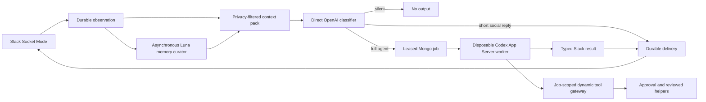

# tos-tag architecture

Status: implemented development architecture, 2026-08-01.

tos-tag is a Slack-native ambient agent control plane. It observes authorized
Slack traffic, builds privacy-filtered context, asks a small direct classifier
whether and how to participate, and starts a full Codex agent only for admitted
work. MongoDB is authoritative for observations, policy, decisions, jobs,
approvals, deliveries, directives, source-linked memory, routines, triggers,
usage, and audit data.

## Non-negotiable invariants

1. The classifier is a direct, stateless OpenAI Responses API call. It has no
   tools and never starts Codex App Server.
2. A private-channel, DM, or group-DM message is usable only for work whose
   destination is that same conversation. Private-channel awareness does not
   cross destinations, even without message text.
3. Slack scopes describe API capability, not runtime authority. Enrollment,
   participation mode, destination allowlists, requester policy, membership
   freshness, approvals, and kill switches are rechecked at every boundary.
4. MongoDB and external systems are authoritative. Classifier calls, Codex
   threads, workers, and delivery attempts are disposable compute.
5. Raw Slack, Mongo, provider, and connector credentials never enter prompts,
   behavioral skills, model-visible tool arguments, logs, or artifacts.
6. Models cannot choose a Slack destination or create privileged interactive
   blocks. The control plane owns both.
7. Every externally visible write is idempotent, auditable, and independently
   approved when its reviewed operation risk is not `read`.

## Runtime flow



The Slack event is persisted before acknowledgement. Duplicate Slack callbacks
may be observed, but only one observation wins admission and only one delivery
with a given idempotency key is accepted.

The optional user-authorized sync discovers public channels, private channels,
and DMs visible to the configured Slack user token and bootstraps a bounded
history once per conversation. Group DMs (mpim) are excluded from discovery,
and live group-DM events are acknowledged without registration or retention. MongoDB stores content-free bootstrap
completion and live-event watermarks independently from retained messages. If a
process restarts while a bounded catch-up is still active, the durable recovery
window is extended to the new startup boundary and its pagination restarts from
that upper bound; stale workers cannot complete the superseded window. This
prevents repeated restarts from advancing past a newer offline gap.
Completed bot-joined channels and direct-message conversations returned by the
bot token receive a bounded startup and periodic gap repair strictly after their
last watermark. User-token-only DMs remain available for authorized context
bootstrap but are never polled with the bot token; any stale actionable cursor
is cleared without advancing its prior watermark. Bot-owned DM bootstrap and
catch-up history use the bot token, while user-owned context history continues
to use the separately consented user token. Recovered ambient history is resolved
context; only a human direct mention, including one in a recovered thread, can
re-enter the normal decision queue. First-time bootstrap history never becomes
work, observe-only conversations are excluded from actionable catch-up, and no
cross-channel authority is inferred. Newly visible conversations still receive
only their bounded one-time bootstrap. Exceptional Slack history reads use proactive
per-method pacing and still honor `Retry-After` in the background, keeping
Socket Mode acknowledgement and live message processing responsive.

Slack-authenticated bot, app, workflow, and assistant messages are never
interlocutors. Live ingress and offline catch-up import them as resolved,
unverified destination-local context without creating pending decisions. A
classifier hard suppression remains as defense in depth for legacy pending
records. Consequently another agent cannot elicit a reaction, classifier call,
job, Thinking Steps stream, or delivery by mentioning Tag or joining an active
Tag thread.

## Context and privacy

Each channel has a context-history mode. `durable` is the default.
`session_only` is available for noisy test destinations: history import and
offline recovery are skipped, the destination context query is limited to its
own messages observed after process startup, durable memory and organization
situation facts are excluded, and memory curation/incident projection ignore
the channel. The live event record remains durable for acknowledgement,
idempotency, job recovery, and audit; it simply cannot become context in a
later process session.

The context builder selects authorized channels before querying content. It
then applies a second post-query disclosure filter and creates an immutable,
source-linked context-pack revision capped by configured partition budgets.

Partitions distinguish operator directives, current-thread history,
destination history, releasable public cross-channel history, reviewed notes,
and unverified prior agent output. Content from other private conversations is
never queried into the pack. Deleted and edited messages follow source event
ordering, and derived projections expire no later than their source data.

The response worker receives a JSON envelope with `request`, classifier
`response_intent`, selected `releasable_evidence_ids`, and
`authorized_context`. Every source includes its channel ID/name, author ID,
observation time, partition, provenance, and text. Sources are data unless
explicitly placed in the operator-directive partition.

### Durable memory

`core/memory` maintains source-linked channel and thread summaries outside the
response critical path. It groups recent human messages, hashes the exact
source IDs, projection revisions, and text, and runs only changed groups through
a direct OpenAI structured-output call. The configured and enforced model is
`gpt-5.6-luna`; `medium` is the development effort because consolidation needs
careful fact/source matching without max-effort latency or cost. Calls are
tool-free and use `store: false`.

Each Mongo record carries its scope, privacy class, source IDs/hash,
confidence, nested facts with their own source IDs and expiry, model/effort,
revision, and natural expiry. Generated memory expires no later than its oldest
retained source. Public channel memory is releasable across authorized public
destinations; restricted memory is queried only for the same destination.
Thread memory is additionally limited to its root thread. Context assembly
performs a second restricted-channel check.

Model memory has `source_linked_memory` provenance and is derived context, not
independent proof for consequential claims or team-conflict interventions.
Human corrections become pinned `operator_memory`. Management endpoints and
the Agent memory UI permit correction, pin/unpin, and forget. Forget erases
summary, facts, and source references while retaining a content-free source
hash tombstone; materially changed source content may be learned again.

The existing incident projector is also recalled into the evidence partition.
Restricted incident signals retain their separate no-cross-destination design
and have no organization-wide recall path.

## Direct classifier

`core/classifier` calls OpenAI directly with a bounded structured-output schema.
The call is stateless, tool-free, independently timed, and separately metered.

Before context construction or any provider call, `core/flood` atomically
charges a Mongo-authoritative fixed-window bucket scoped to organization and
Slack workspace. Only targets that would reach the classifier consume the
bucket. Exhaustion records an auditable silent decision and produces no
reaction, job, agent call, or Slack delivery; bucket-store errors fail closed.
The default is 1,000 eligible messages per one-hour bucket, independently
configurable from per-channel response admission and worker concurrency.
Its API key remains in the Go control plane and is never reused by Codex App
Server.

The classifier chooses:

- silence, reaction only, a short direct social reply, or full-agent work;
- in-channel versus threaded placement;
- a reaction from the configured Slack emoji allowlist;
- one enabled model profile and its corresponding model strength and reasoning
  effort; and
- source-linked reason codes and evidence.

A brief, self-contained answer unlikely to continue normally belongs in the
channel. A narrow investigation, multi-step answer, tool-heavy action, or
conversation likely to continue belongs in a thread. Once a tos-tag thread is
active, the same direct classifier evaluates each human reply before any
full-agent fail-safe, and any response stays in that thread. The classifier may
answer greetings, thanks, and light banter directly, but substantive content
must be admitted to the full agent. Channel cooldown is an ambient anti-chatter
control and is bypassed for a direct mention or a human reply in an active Tag
thread; per-hour response budgets, concurrency, and the organization flood gate
remain enforced.

The classifier may also admit an ambient alignment intervention when a current
human statement materially conflicts with a recent destination-safe public
report from another human or a clear fact and surfacing it would prevent
confusion, duplicated work, a bad decision, or a missed incident. It defaults
silent for opinions, weak inferences, ambiguous entities, and stale or
immaterial differences. Recent destination participants are a conversational
signal, not a channel-membership claim. The worker uses `team-alignment` to
attribute reports neutrally and verify when needed. Restricted context and
unverified agent output can never ground this behavior.

Assist-mode initiative is a deterministic control-plane grant, not a model
judgment. Full-agent work is allowed for direct mentions, active Tag threads,
explicit addresses, clear questions, conversationally addressed requests,
authoritative product questions, destination-safe alignment interventions, and
operator-created triggers. A leading mention of another Slack user in an active
Tag thread is deterministically treated as a human-to-human handoff when the
turn neither mentions nor explicitly addresses Tag; it is suppressed before a
provider call. Mentions used later as requested recipients remain available.
The fact that Tag authored the previous channel turn is useful only for routing
a question or request; it does not authorize a bare declarative status update.
The classifier service suppresses an unauthorized recommendation with
`policy.unsolicited_assist_work`, and the pipeline applies the same check again
immediately before admission. Proactive channels retain classifier-gated
initiative for declarative failures and incidents.

Natural messages are evaluated without prompt-like hints such as “stay silent”
or “reply in a thread.” Those phrases are tested only when they are the user's
actual placement instruction.

## Jobs, routing, and concurrency

Accepted full-agent work becomes a Mongo job with an immutable model-route
snapshot, context revision, destination, generation, lease, steering epoch,
attempt counter, and expiry. Workers claim jobs with compare-and-swap leases,
heartbeat while active, and abort immediately when the lease, policy, channel
membership, generation, or kill switch changes.

Concurrency is configurable and intended to allow several independent jobs at
once. Admission (`classifier.maxConcurrentJobs`) and execution
(`jobs.workerConcurrency`) are separate controls; both default to `8` in
development. Ordering is enforced per Slack thread generation; unrelated
channels and threads can run concurrently. A suspended approval releases its
worker and later resumes as a fresh, newly fenced attempt carrying the exact
approved action hash.

Model profiles are project-owned policy. The development strong/default route
is `chatgpt-sol-medium`, which resolves to OpenAI model `gpt-5.6-sol` and
effort `medium`. The classifier selects Luna low or Luna medium for ordinary
work and reserves Sol medium for durable document authoring, complex tool use,
tricky debugging/root-cause analysis, incidents, security, and other
high-consequence work. The selected model and effort are passed directly to
Codex App Server at turn start.

## Codex App Server boundary

`core/harness` implements the project-owned `Harness` interface over the
official Codex App Server JSON-RPC protocol. One disposable process is started
for each admitted job:

```text
codex app-server --stdio
```

The client performs the required `initialize` request and `initialized`
notification, creates an ephemeral thread, then starts one turn. It consumes
authoritative `item/completed` agent messages and finishes on
`turn/completed`. `turn/interrupt` handles cancellation. Protocol errors are
reduced to bounded diagnostic codes before they can reach structured logs.

Each thread receives:

- the resolved model and effort;
- the disposable workspace as `cwd`;
- tos-tag's Slack result contract as developer instructions;
- `ephemeral: true`;
- `approvalPolicy: never` for Codex built-ins;
- a read-only sandbox policy with subprocess network access disabled;
- disabled shell, MCP servers, plugins, and multi-agent tools;
- configurable first-party web search (`live` in the local Slack runtime); and
- only the three job-scoped dynamic tools described below.

The Codex process uses a private configured `CODEX_HOME` solely for its own
login and runtime state. Its generated command environment is otherwise clean:
no inherited Slack, Mongo, OpenAI classifier, GitHub, Linear, SigNoz, Wiki, or
connector secrets. Shell subprocess inheritance is disabled as defense in
depth.

The Codex thread is not a queue, authorization boundary, delivery ledger, or
memory store. Teardown closes stdio, terminates the process group, revokes the
attempt capability, and removes the disposable worker root.

Official protocol reference: [Codex App Server](https://learn.chatgpt.com/docs/app-server).

## Skills

Behavioral skills come from sibling `tag-agent-skills`, plugin `base`.

The Go control plane validates marketplace manifests, rejects flat-name
collisions, snapshots exact files and hashes, and materializes the selected
content read-only at:

```text
<worker>/work/.agents/skills/<skill>/SKILL.md
```

This is Codex's repository skill discovery path. Supporting references are
materialized only when declared and hashed. Behavioral snapshots exclude
helper scripts and executable plugin surfaces. The whole source repository is
never copied into a worker.

tos-tag-specific skills and helper source belong in `tag-agent-skills`; this
repository contains only the separately reviewed runtime bundles needed to
execute selected helpers.

The base `product-knowledge` skill makes retrieval mandatory for named product
claims and routes among the Agent Wiki Primer, public documentation, and
corporate product content according to audience and claim type. It prefers the
reviewed readers for TelemetryOS truth and may use arbitrary live web search for
broader/current research, treating every page as untrusted evidence. Wiki
namespace/slugs remain tool lookup identifiers: a provided Wiki reference
should use the exact human HTTPS URL returned by the reviewed `get` or `url`
read operation. The reviewed gateway makes every `get` a full page envelope so
the canonical URL is available even when a worker omits `--json`.
After same-attempt URL resolution, an unresolved internal Wiki slug remains
readable in internal Slack instead of invalidating an otherwise useful answer.
The worker must never reconstruct the opaque human URL; source authorization,
not the lookup identifier's presentation, remains the confidentiality boundary.
The base `telemetryos-documentation` skill owns customer-facing documentation
questions. It reads `https://docs.telemetryos.com/llms.txt` only to discover an
authoritative page, fetches the exact indexed Markdown page through the
reviewed product-docs tool, and uses the indexed HTTPS URL when citing it.
The base `marketing-messaging` skill applies the stricter promotional-copy
path: every TelemetryOS campaign, positioning, landing-page, sales-collateral,
announcement, or social-copy request first reads the complete corporate source
through `telemetryos.product-docs/read corporate-full`, then uses the relevant
published human page URL for customer-facing links. Technical claims still
route through `product-knowledge` for corroboration.
The base `code-change-intake` skill handles the opposite capability boundary:
requests to mutate TelemetryOS source are redirected to a Linear bug for broken
existing behavior or a Linear feature for new or changed behavior.

## Dynamic tools and credentials

Codex App Server receives three experimental dynamic function tools at
`thread/start`:

- `tos_tag_tool` accepts a reviewed non-Wiki `tool_id`, `operation_id`, bounded
  argv, and optional exact `approval_id`.
- `tos_tag_wiki` accepts a typed page operation and semantic fields including
  page reference, title, body, tags, and note. Go validates field combinations
  and constructs the reviewed Wiki CLI arguments; generic Wiki argv is rejected.
- `tos_tag_trigger` manages classifier-gated heartbeat subscriptions in the
  current Slack channel.

Typed Wiki validation failures expose and persist only closed, content-free
codes. A corrected call reuses the same Slack Thinking Steps card, so a
self-corrected validation attempt does not leave a separate failure card.

The App Server sends `item/tool/call` to the Go client. The control plane, not
the Codex process, attaches the random attempt capability and calls a loopback
gateway. Every call rechecks the job lease, steering epoch, expiry,
organization, workspace, channel, and tool allowlist.

Reviewed tool bundles contain `SKILL.md`, `tool.json`, and one pinned script.
Each operation declares exact environment names, timeout, output bound, and
risk. Secret values are encrypted in the organization-scoped keystore and are
resolved only into the exact helper subprocess environment. Arguments that
contain a secret value are rejected, and output is redacted and bounded. A
reviewed operation may separately declare an HTTPS `*_URL` binding as
`public_env`; it is excluded from argv rejection and output redaction only when
it has no embedded credentials, query, or fragment. The Wiki URL uses this path
so canonical page links remain visible while `WIKI_TOKEN` remains secret.

The current reviewed catalog is:

| Tool | Risk classes | Approval | Boundary |
| --- | --- | --- | --- |
| `telemetryos.code` | `read` | Risk-based | Bounded list/search/read below the server-owned Aion source root; no mount, shell, traversal, symlinks, runtime env, credential ledger, or private tool state |
| `telemetryos.product-docs` | `read` | Never | Credential-free, fixed-host reads of `docs.telemetryos.com/llms.txt`, its `docs/` or `reference/` Markdown pages, and `www.telemetryos.com/llms-full.txt`; no redirects or arbitrary URLs |
| `telemetryos.linear` | `read`, `write` | Risk-based | Typed Linear helper operations |
| `telemetryos.wiki` | `read`, `write`, `delete` | Never for page read/write; always for recoverable page soft-delete | Page-only CRUD; namespace, asset, publish-file, cascading move, activity, undo, and admin operations are unavailable |
| `telemetryos.otel` | `read` | Risk-based | Bounded SigNoz/OpenTelemetry queries |
| `telemetryos.analytics` | `read` | Never | Fixed production/QA funnel, website, account, and event GETs; internal records, direct identifiers, free-form properties, arbitrary paths, and exports are unavailable |
| `telemetryos.device-logs` | `read`, `write` | Risk-based | Device-log queries and reviewed log-level changes |
| `telemetryos.mongo` | `read` | Risk-based | Bounded Mongo fetch operations |

`telemetryos.code` is the only source-tree capability. The worker never receives
the Aion checkout or its path. The server validates typed read arguments against
`TAG_AION_DEVELOPER_PATH` and returns only bounded results through the same
capability gateway.
The tool loader and executor independently reject any `telemetryos.code`
operation that is not exactly read-only. There is no Slack approval path for
source edits, patches, commits, pushes, merges, or deployments.

`telemetryos.product-docs` is a separate deterministic public-network
capability. Its script constructs requests from fixed TelemetryOS hosts
and a constrained documentation path grammar. Product retrieval can combine it
with destination-authorized `telemetryos.wiki` Primer reads without exposing
Wiki credentials to the worker. Native Codex live web search is independently
available for arbitrary public research; it has no credential, destination, or
private-context authority and every completed search is audit-receipted by hash.
When the classifier marks authoritative product retrieval as required, the
pipeline accepts a final answer only after that same worker attempt completes a
full Primer page, docs page, or corporate full-content read. Search/index/web
results, Slack context, and model memory do not satisfy the delivery gate.

`telemetryos.analytics` is a separate read-only marketing evidence boundary.
It authenticates server-side with a Site Analytics Token, calls only reviewed
Gateway funnel endpoints, and removes email, IP, visitor/session/event tokens,
click IDs, raw user-agent data, event properties, and self-reported free text
before returning JSON to a worker. Marketing behavior composes it through the
funnel-review, account-journey, and optional draft-only unstall skills; it does
not grant campaign, CRM, message, billing, or device writes.

Because source reads return content rather than a shared filename, Wiki writes
accept an explicit inline body. The complete body is committed in the Wiki tool
execution audit receipt without being copied into broad audit listings.

Each operation manifest declares an approval policy. If omitted, the policy is
risk-based: `write` and `destructive` persist an exact canonical action and
require Slack-native approval. Admin-risk worker operations are invalid. The
reviewed Agent Wiki page read/write operations declare `never`, eliminating
normal authoring prompts without giving the model generic authority; its
recoverable page soft-delete declares `always`. Namespace and generic
administrative/destructive Wiki surfaces are absent. All executions still use attempt-scoped capabilities,
immutable reviewed scripts, exact argv and environment allowlists, bounded
timeouts/output, organization kill switches, and tamper-evident audit receipts.

## Slack rendering and delivery

The model returns `slack-output/v3`, a typed JSON result whose segment palette
is limited to header, mrkdwn text, context, divider, table, card, carousel,
image, and artifact. Captioned tables render as native sortable/paginated Data
Tables; uncaptioned tables retain the compact native Table. Cards and Carousels
are presentation-only and have no model-exposed action field. Approval buttons, notices, and
destination selection are control-plane-owned. Generated Slack mentions are
rejected unless the exact user ID was already named by the requester in the
current message or the exact user/channel ID came from classifier-selected
destination-safe evidence. The control plane excludes Tag's own invocation
mention from the request-derived allowlist; broadcast and user-group mentions
remain forbidden.

For a full-agent result, the harness captures the current turn's
provider-reported token breakdown from Codex App Server and the pipeline binds
it to the resolved model, effort, and elapsed execution time. This metadata is
stored outside model JSON. The renderer appends it as the final de-emphasized
context block on the final Slack payload. Classifier-only replies and
reaction-only outcomes never receive the footer.

Delivery uses a graduated surface policy. Short and medium answers remain
Slack-native. When the expected result is genuinely long and expository, or
its sections/evidence/navigation make it a durable document, the strong Sol-medium
worker first writes Markdown under the Agent Wiki `artifacts` namespace through
the reviewed page-only capability. Roughly 20,000 visible characters is a soft
signal, not a renderer cutoff. Only a successful tool result can supply the
artifact URL; otherwise the worker produces a compact Slack fallback and does
not claim publication. The Codex harness records artifact URLs from successful
reviewed tool responses as attempt-local events. Before completing the job, the
pipeline rejects every model-created artifact segment that does not match that
same-attempt provenance.

Before posting, the renderer validates every field, rejects privileged segment
types and generated special mentions, and creates a safe fallback string.
Long AI-authored section text sets Slack's `expand` hint so substantive answers
remain visible instead of being collapsed behind “see more.” Modal-only Alert
blocks communicate channel-directive scope; they are never posted to messages.
Native agent Cards, Carousels, and Data Tables travel in streamed block chunks;
ordinary posts and stream-failure fallback deterministically downgrade them to
standard Sections/Tables while preserving accessible message fallback text.
Formatted table cells are converted into native rich-text/link elements, and
the same validation rejects unproven mentions inside every cell type.
At the untrusted model boundary, typed table rows with missing cells are padded
and surplus cells are folded into the final declared column so one recoverable
shape mistake cannot discard an otherwise valid answer; all normal content,
size, link, mention, and formatting validation still runs afterward.
Unsupported model-created Slack link targets such as disposable local file
paths similarly degrade to their visible label before validation; HTTP(S)
references remain subject to the normal renderer link checks. Common
GitHub-Markdown links are normalized to Slack mrkdwn outside literal code;
unsafe targets degrade to their visible label instead of failing the job.
Delivery records are durable and leased. Multipart sends reconcile immutable
metadata so restart cannot duplicate already accepted parts.

Admitted full-agent thread work immediately acknowledges the source with the
classifier-selected reaction. If the job remains active after the configured
progress grace period, the control plane starts a Slack
[Thinking Steps](https://slack.dev/slack-thinking-steps-ai-agents/) stream in
the classifier-selected thread. Jobs that finish inside the grace period deliver
their final threaded answer without creating Slack's generic `Thinking...`
placeholder. The returned stream message timestamp is
persisted on the leased job. Reviewed harness events become concise task-card
updates from a fixed control-plane vocabulary. Every native or reviewed tool
call and every validated active skill replaces one shared current-action card,
so all steps are visible while they happen without leaving completed-card clutter.
Dynamic calls must declare active skill names from the injected allowlist. Raw prompts,
reasoning, tool arguments, tool output, and message deltas are never streamed. Exact HTTPS
artifact sources may be attached after the reviewed tool boundary validates
them. On success, the durable delivery record carries the stream timestamp and
`chat.stopStream` adds the validated Block Kit result as a chunks-mode block
and finalizes that same message. Successfully completed capability categories are
deduplicated into the control-plane-owned model footer.
Start reconciliation uses immutable Slack metadata, retries reuse the persisted
timestamp, and unsupported stream operations fall back to ordinary durable
delivery. Intentional reaction-only and short direct classifier outcomes do not
create a timeline. Slack requires `thread_ts` for streaming, so brief
classifier-selected in-channel jobs keep their direct placement and do not
attempt a progress stream.

The approved local development posture observes all user-authorized
conversations and enrolls new conversations as `observe`. When explicitly
enabled, it reconciles that human inventory with a bot-token inventory and
derives `assist` only for public/private channels Tag has joined; membership
events apply joins and leaves in real time, with bounded periodic inventory
reconciliation as a fallback. DMs are not auto-enabled, and group DMs (mpim)
are ignored entirely: excluded from discovery, never persisted, and hidden
from channel coverage. An optional destination allowlist can narrow this set
further.
Checked-in defaults remain stub/shadow/disabled and do not encode live IDs or
secrets.

## Channel directives, routines, and triggers

`/tag-directive` is available to any human user in the installed Slack
workspace and opens a modal that edits the current enrolled channel's
revisioned directive. Directive configuration does not reuse the reviewed-tool
approver list, but still fails closed for a missing scope, unenrolled channel,
or active channel kill switch. The directive is stored in MongoDB, audited,
placed in the system context partition, and shown to both classifier and
admitted agent. The management Directives page exposes the same create, edit,
activate, and restore lifecycle.

`/tag-mode` shows or changes the current channel's participation mode
(`observe`, `assist`, or `proactive`) with an ephemeral reply. The command is
workspace-bound, validated against the installation, audited as
`channel_policy.mode_command`, and an explicit choice clears
membership-managed participation so reconciliation cannot revert it. The
management Channel coverage page offers the same control as an inline
dropdown.

Routines enqueue ordinary reauthorized jobs on a standard five-field cron
schedule with an explicit IANA timezone. Trigger subscriptions wake on the
same cron model, rebuild the full destination-safe context, run the direct
classifier gate, and enqueue work only when admitted. The scheduler advances
past missed windows without replay storms. Older fixed-interval records remain
readable and executable until an operator migrates them. Neither path bypasses
policy, model routing, approval, or delivery controls.

The management **Automation** page combines classifier-gated subscriptions and
direct routines into one operator view. It resolves channel/session scope in
the control plane, exposes only the human schedule, timezone, instruction,
confidence, and enabled state, and never requires workspace or session IDs in
the browser form.

## Container topology

The development stack uses one Mongo container and a persistent workspace/home
volume shared by an operator container and the tos-tag service. Persistent data
includes source checkouts, Aion-managed code, Codex login state, logs, and
Mongo data. Slack job workspaces remain disposable under
`/workspace/state/workers`.

The host Docker socket is not mounted. Runtime secrets are bind-mounted as one
read-only ignored file and sourced only inside the process. Compose inspection
does not expand them.

The same ignored `runtime.env` may be used for host development and can contain
a host `TAG_AION_DEVELOPER_PATH`. Container startup overrides that value after
sourcing the file so reviewed source access always binds `/workspace/code`.
It also replaces host HTTP, Mongo, log, Codex, skill, and tool locations with
their container-owned addresses.

## Logging, audit, and retention

Every observation, classifier decision, reaction/delivery attempt, job lease,
worker stage, tool call, approval decision, directive change, routine/trigger
run, and usage record carries correlation identifiers. Operator diagnostics can
be written to an owner-readable JSONL file, while durable audit receipts remain
in MongoDB.

The management home page is an organization-scoped real-time activity feed.
A bounded in-memory hub receives safe structured lifecycle logs plus explicit
classifier and Codex protocol events, replays its recent window, and streams new
records through authenticated Server-Sent Events. Public classifier records
include a bounded single-line excerpt of the source Slack message and the
effective outcome, confidence, reaction, routing, effort, and reason codes.
Restricted conversation text is replaced before publication. Codex records
contain only direction, protocol method, status, and correlation identifiers;
prompts, output, provider bodies, tool arguments/results, and credentials never
enter the feed. The feed is diagnostic and disposable, not a durable authority.

JSONL logs, audit records, and broad data listings omit Slack message text,
provider bodies, prompts, results, secrets, lease tokens, and connector
credentials. Raw observations, normalized messages, prompt/context data, and
derived state follow configured TTL and source-linked deletion rules.

## Failure behavior

- Classifier failure selects a conservative deterministic fallback.
- Invalid classifier structure fails to silence or the deterministic fallback;
  it never starts unbounded work.
- App Server initialization, thread, or turn failure records only a bounded
  stage/code. Deterministic local provisioning/configuration failures fail once;
  transient worker failures release the job according to retry policy.
- Empty or invalid model output is not posted.
- Lease, policy, membership, or kill-switch revocation interrupts the turn and
  revokes tools.
- Tool transport failure exposes a bounded structured error to the model.
- Approval suspension releases compute and keeps only authoritative Mongo data.
- Slack retry or process crash resumes from durable delivery state.

## Verification gates

The normal gate is `make verify`: formatting, unit/integration tests, race
tests, vet, behavioral evals, gosec, and govulncheck. Network and credential
tests are opt-in. `integration/codex_live_test.go` verifies the installed App
Server handshake, dynamic-tool registration, model/effort routing, structured
output, event normalization, and teardown against a real authenticated Codex
runtime. `make eval-live` sends the 48 natural classifier messages through the
configured direct OpenAI provider and scores outcomes, source grounding,
restricted disclosure, placement, reaction semantics, and model/effort routing;
fixture names and expected results are never part of the provider request.

Live Slack validation must name the workspace and channel, keep output inside
the configured allowlist, watch redacted logs, measure latency, and distinguish
classifier evidence from full-agent evidence.

The maintained regression matrix also covers irrelevant-message silence,
direct social replies, mixed social/work messages, stable non-urgent metric
reactions without replies, destination-safe private-context refusals, reactions,
channel versus thread placement, model/effort routing, native Block Kit tables,
reviewed tool calls, exact-action
approval/resume, and multiple independent workers running concurrently.
