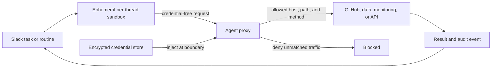
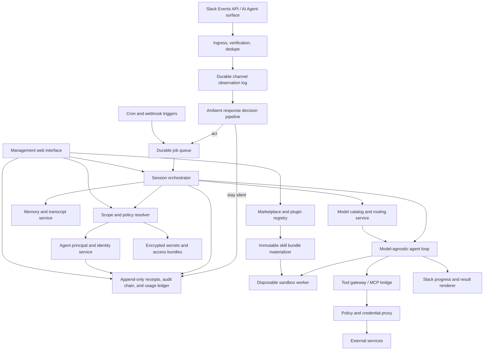

# Claude Tag research

Status: initial product and architecture research
Research date: 2026-07-30
Purpose: inform an open-source, model-agnostic experiment in `tos-tag`

## Executive summary

Claude Tag is Anthropic's shared, asynchronous AI teammate for Slack. A user
mentions `@Claude` in a channel or thread and hands it a task. Claude reads the
shared conversation, uses organization-provisioned tools, performs multi-step
work in an isolated cloud sandbox, shows progress in the Slack thread, and
returns an answer or durable artifact. It can also remember stable team context,
run scheduled or event-driven routines, and follow up without a new mention.

The essential product is not a Slack chatbot. It combines:

1. A multiplayer Slack interface in which a thread is a shared agent session.
2. Durable, place-scoped context and curated memory.
3. Long-running and proactive task orchestration.
4. Disposable, isolated compute for tool use and code execution.
5. An agent identity with admin-provisioned service accounts rather than the
   invoking user's credentials.
6. A credential-injecting, default-deny network proxy and complete audit trail.
7. Per-scope instructions, skills, tools, model choice, policy, and spend limits.

An open-source reimplementation should begin with the interaction model and
state boundaries, not attempt complete feature parity. A useful first milestone
would support one Slack workspace, durable observation of every eligible message
in one test channel, shadow-mode ambient decisions, mentioned tasks and thread
follow-ups, visible progress, resumable job state, an authenticated management
interface, an isolated worker, a small set of read-only tools, and an audit log.
Live ambient speech should be enabled only after shadow decisions are calibrated.
Proactive routines, shared memory, write tools, GitHub changes, and generalized
credential brokering should follow only after the authorization boundary is
sound.

## What Claude Tag does

Anthropic launched Claude Tag in public beta on June 23, 2026 for Claude Team
and Enterprise customers. Slack is its first host; Microsoft Teams is announced
as coming later. Anthropic describes it as an evolution of Claude Code for
proactive, collaborative work.

Its main user surfaces are:

- **Channel mentions:** mention `@Claude` with a task. Work and results remain
  visible in the Slack thread.
- **Shared thread sessions:** after Claude joins a thread, any channel member
  can add context, redirect the work, or continue it without mentioning Claude
  again.
- **Direct messages:** a private interaction using the individual's Claude
  account and personal connectors, not the channel's agent identity.
- **Slack AI assistant panel:** another entry point for the personal experience.
- **Ambient participation:** Claude may answer a top-level channel message it
  judges actionable even without a mention. A mention guarantees pickup.
- **Routines:** natural-language schedules, channel watches, and event-driven
  work such as following a pull request.

Representative tasks include:

- Summarize a long thread into decisions, owners, and open questions.
- Search channel history and connected documents.
- Query data systems and return metrics or charts.
- Turn discussions into documents or tickets.
- Triage requests or alerts and route work.
- Investigate a bug, clone a repository, run code, and open a draft pull
  request.
- Monitor a pull request, deployment, alert source, or channel and report when
  a condition changes.

### Why it is different from a conventional bot

A conventional Slack bot usually maps one event to one response. Claude Tag
instead treats the channel as a shared workplace and each thread as a durable
agent session:

- It accepts problems rather than requiring command-shaped prompts.
- It decomposes longer work and edits a progress checklist in place.
- A task can continue after the requester leaves.
- Any authorized channel member can steer the same session.
- The runtime can be destroyed and rebuilt without losing the visible thread,
  saved memory, or artifacts already written to external systems.
- It can create future work for itself and wake on schedules or events.
- It acts under a stable organizational identity and leaves records in both its
  own audit log and the connected service.

## Confirmed request lifecycle

Anthropic documents a five-step lifecycle:

1. A mention, routine, or external event starts a session.
2. An isolated sandbox is created for that Slack thread.
3. The agent plans and executes a tool-use loop using the channel's access.
4. It posts a reply, file, chart, hosted page, branch, or pull request back to
   the thread.
5. After a quiet period, the sandbox is released. The Slack thread and durable
   outputs persist; a later reply creates fresh compute and resumes from durable
   context.

Two threads in the same channel are separate sessions and do not share live
sandbox state. Files left only inside a sandbox disappear when it is released.
Claude advises users to post files or push work to a branch during long jobs so
important intermediate results survive.

For long tasks, Claude first posts a live checklist and edits that message as
items complete. A final delivery includes an “Open session in Claude” link to a
read-only record containing the tool calls. Slack replies are the control
surface: editing an earlier message does not redirect the job, deleting a reply
does not retract context already seen, and a new reply is required to correct
course.

### Conversation context

The documented behavior includes several important boundaries:

- A session reads its own thread and its channel, including pinned items.
- When first mentioned in an existing thread, Claude receives up to 50 messages
  from the beginning of the thread, with other bots' replies filtered out.
- It can use Slack search to find public-channel messages even where the app is
  not a channel member, similar to a Slack user. It must be invited to
  participate directly in a channel.
- Search is unavailable in channels containing guests.
- Thread conversations and session transcripts persist, but a sandbox's local
  filesystem does not.

An implementation should not silently pretend it has full thread context when
Slack pagination, retention, permissions, or a context budget prevented that.

## Scope, identity, and memory

Claude Tag's defining design decision is that shared-channel work uses the
agent's permissions, not the requester's permissions.

| Surface or scope | Credentials and tools | Memory | Attribution |
| --- | --- | --- | --- |
| Public channel | Agent access inherited from organization/workspace/channel scopes | Reads workspace memory; saves channel or workspace notes | Claude's service accounts |
| Private channel | Workspace baseline plus private-channel grants | Reads workspace memory; writes only to private-channel memory | A distinct private-channel agent identity |
| Direct message | User's personal Claude connectors | Separate from channel/workspace memory | User, except GitHub PR authorship remains the Claude GitHub App |
| Thread | Snapshot of its initial skills/plugins/instructions plus live connection policy | Transcript is durable; no independent cross-thread runtime state | Same identity as its channel scope |

Public-channel memories are available across the Slack workspace. Private
channels may read the public workspace memory but write to their own isolated
store. DMs and other workspaces remain separate. If a private channel becomes
public, its prior private memory is not migrated into the public workspace
store.

Memory is described as curated notes, not a verbatim transcript. It can be
created explicitly (“remember for this channel”), inferred by Claude while it
works, or reconstructed by reading prior session transcripts. Any channel
member can ask what is remembered and request corrections; admins can inspect
memory and owners can edit or delete it.

This model creates a deliberate “confused deputy” risk: a channel member who
cannot personally access a repository may still ask the channel's agent to read
it. Anthropic's present answer is to scope each channel to permissions suitable
for its least-privileged member and optionally restrict who can invoke the
agent. Its stated future direction is an additional user-level check and
just-in-time approval for sensitive actions.

## Tools, customization, and coding

Admins compose named **Access bundles**. A bundle contains credentials,
repository grants, allowed domains, plugins, and instructions. Capability-based
bundles such as `data-readonly`, `github-write`, and `monitoring` can be reused
and combined per organization, workspace, or channel scope.

Behavior is shaped by four layers:

1. Connections and repository grants determine what the agent can reach.
2. Plugins and skills teach it how to use tools and follow processes.
3. Custom instructions provide stable guidance at an organization, workspace,
   or channel scope and outrank channel memory.
4. Channel memory records stable facts learned during work.

Admins can also select a model, environment, auto-mode allow rules, feature
version, invocation policy, channel availability, and spend limits for a scope.
Channel work is consumption-billed to the organization; DMs use the member's
own account limits.

For GitHub work, Claude clones only a repository granted to the channel into
the thread's isolated workspace. It can inspect code, run commands, and return
a draft pull request authored by the Claude GitHub App. It reads repository
instructions such as `CLAUDE.md`. The public documentation does not establish
that it performs arbitrary unattended merges by default; an open-source version
should treat draft PR creation as a much safer initial boundary than merge or
deployment.

## Proactivity and commands

Claude Tag supports natural-language routines that use exactly the access of
the channel where they are created:

- Time schedules, such as a weekday standup summary.
- Periodic watches over one or more channels.
- Pull-request subscriptions that wake on CI, review, or merge changes.
- Periodic monitoring and first-pass incident investigation.
- Standing channel roles saved as channel memory, such as request triage.

Users can list and pause routines from Slack. The fixed command surface includes
`!help`, `!restart`, `!mute`, `!unmute`, `!feedback`, and `!routines`. Restarting
archives the current thread session and replaces it with a fresh one. Muting
provides a necessary escape hatch for ambient behavior.

Proactivity should be modeled as durable triggers that create ordinary jobs,
not as an immortal agent process. This keeps scheduled and human-started work on
the same authorization, execution, audit, and budget path.

## Security and governance model

Anthropic documents three trust zones:



The sandbox holds no service credentials. All outbound traffic passes through
an Agent Proxy, which matches policy, retrieves the credential from a separate
store, injects it at the network boundary, and blocks unmatched destinations.
Connections can be narrowed by host, path prefix, and HTTP method. Actions are
also visible in the connected system under the agent's own account.

The organization audit view records scheduled and one-time tasks, routines,
memory writes, and network calls made with the agent identity. Commits and pull
requests link back to the originating Slack thread. Admins can set organization
and per-channel spend caps, with alerts before the cap; work that would exceed a
limit is rejected rather than stopped silently mid-run.

Other documented limitations matter to a clone:

- Retained transcripts and channel memory make Claude Tag incompatible with
  Anthropic's Zero Data Retention mode.
- Removing the integration causes Claude-side copies of conversations to be
  deleted within 30 days, while Slack keeps data according to the workspace's
  retention policy.
- Artifact visibility follows channel membership and organization identity;
  it is not merely an unguessable public URL.
- Guest, external/shared, and private channels require explicit policy because
  workspace search and memory boundaries differ.

## What is public, inferred, and unknown

### Publicly confirmed

- Slack event and thread interaction behavior.
- The per-thread ephemeral sandbox lifecycle.
- Scoped agent identity and Access bundles.
- A separate credential store and credential-injecting Agent Proxy.
- Default-deny egress with destination/method constraints.
- Workspace versus private-channel memory boundaries.
- Scheduled, watched, and repository-event routines.
- GitHub cloning and draft PR delivery.
- Admin audit, role, model, environment, and spend controls.

### Reasonable implementation inferences

The following are design conclusions, not Anthropic disclosures:

- Slack events must be acknowledged quickly, deduplicated, and placed onto a
  durable queue so multi-minute work does not run in the event handler.
- `workspace + channel + thread_ts` is a natural session key, with an explicit
  session generation for `!restart`.
- Schedules and webhook subscriptions likely normalize into the same job type
  as mentions.
- Progress checklist edits require a stable Slack message identifier stored
  with the job.
- Durable artifacts and checkpoints are essential because worker filesystems
  are intentionally disposable.
- Memory retrieval likely combines curated notes with targeted transcript and
  Slack search rather than placing the entire channel history in every prompt.

### Not publicly specified

- Anthropic's exact prompts, planning algorithm, memory-extraction prompts, or
  ranking system.
- Internal database schemas, queue technology, sandbox runtime, encryption
  implementation, or multi-region architecture.
- Exact sandbox idle timeout and maximum job duration.
- Detailed prompt-injection defenses and approval heuristics.
- Model routing, context compaction, retry, and failure-recovery algorithms.
- Exact product behavior for every Slack edit, retention, enterprise-grid, and
  external-channel edge case beyond the documented examples.

The goal should be behavioral compatibility with the useful interaction model,
not an unsupported claim of reproducing Anthropic's internals.

## Buzz comparison and inspiration

Block's [Buzz](https://github.com/block/buzz) is a newly released Apache-2.0
self-hostable workspace in which humans and AI agents are first-class members.
It is broader than tos-tag: Buzz aims to replace parts of Slack, GitHub, CI,
automation, and project search with one Nostr-based relay, whereas tos-tag is an
agent control plane that deliberately meets an existing team inside Slack.

Buzz makes every chat message, reaction, workflow transition, approval, and Git
event a signed Nostr event. A relay URL identifies the community; the relay
authenticates event authors, verifies signatures, enforces channel membership,
persists and searches events, fans them out over WebSocket, and triggers
workflows. The current implementation is a Rust monorepo using Postgres, Redis,
and S3-compatible object storage. Its agent-facing surfaces include a JSON-in/
JSON-out CLI, an ACP bridge for agent subprocesses, MCP tools, YAML workflows,
and persona packs. See Buzz's [README](https://github.com/block/buzz/blob/main/README.md),
[architecture](https://github.com/block/buzz/blob/main/ARCHITECTURE.md), and
[agent design](https://github.com/block/buzz/blob/main/VISION_AGENT.md).

### Ideas worth carrying into tos-tag

| Buzz idea | tos-tag adaptation |
| --- | --- |
| Agents are members with stable identities, not anonymous bot invocations | Add a stable `AgentPrincipal` with owners, scope membership, access bundle, instructions, and audit identity. Keep it independent from the model profile so a channel can switch models without changing who acted. |
| One signed event shape links messages, jobs, patches, approvals, and workflows | Give every durable tos-tag transition a canonical event/receipt envelope with tenant, principal, kind, correlation and parent IDs, timestamp, payload hash, and audit-chain link. Keep Mongo projections for normal queries rather than rebuilding the service as a pure event-sourced system. |
| Answers and work products include receipts | Make Slack results link to the source messages, tool observations, artifacts, commits, approvals, and audit record used to produce them. “Evidence” should be a product surface, not only a debug log. |
| A branch can become a collaboration room | Treat a Slack job thread as the room for a coding task and attach its repository, branch, diffs, CI, review, and PR. Do not create a new Slack channel for every branch in the first experiment. |
| At most one agent prompt is active per channel in `buzz-acp` | Preserve tos-tag's more precise single-writer rule per Slack thread generation, with subsequent steering events durably queued or explicitly branched. |
| Agent-first CLI with JSON input and output | Add a `tos-tagctl`/admin interface with stable JSON output for inspect, replay, route-preview, plugin-preview, and test operations. The web UI and automation can share the same application services. |
| ACP separates the workspace transport from interchangeable agent runtimes | Keep the project-owned `Harness` interface. Use OpenCode HTTP/SSE first, but leave room for an ACP adapter after cancellation, permission, model-routing, and event-correlation semantics pass compatibility tests. |
| YAML workflows have typed triggers, approval steps, traces, and loop prevention | Make routines declarative and revisioned; tag their emitted events, prevent self-trigger loops, persist run traces, and suspend durably at approval gates. |
| Per-community hash-chained audit log | Add a per-organization tamper-evident audit chain over canonical metadata, with verification tooling and explicit retention behavior. Cryptographic signing by individual agents can be evaluated later; hash chaining gives useful integrity without introducing Nostr key management. |
| Channel membership is checked before private subscriptions are registered | Resolve and authorize the Slack scope before memory/search subscriptions or worker materialization, not after results begin streaming. |

The most important conceptual separation is:

```text
agent principal     = who is acting and whose authority is used
model profile       = which provider/model/options reason for this step
instruction profile = how the agent should behave
skill snapshot      = which versioned capabilities are prompt-visible
access bundle       = which external actions are actually permitted
```

This makes the dynamic model router safer. `#alerts` can move from one model to
another without silently creating a new identity, changing permissions, or
losing the continuity of its audit history.

### What not to copy

- Do not introduce Nostr or replace Slack for the experiment. Slack workspace,
  channel, thread, and user identities remain authoritative at ingress; an
  internal agent principal maps onto that verified scope.
- Do not copy Buzz's Rust/Postgres/Redis topology. Go plus Agent Wiki's MongoDB
  patterns remain the right fit, and Redis should be added only for measured
  scaling needs.
- Do not make chat, Git hosting, CI, media, and project publishing one initial
  product. tos-tag should integrate those systems through scoped connectors.
- Do not reduce authorization to channel membership. tos-tag still needs
  action-, destination-, method-, credential-, repository-, data-, and
  model-level policy.
- Do not put long-lived agent private keys in disposable OpenCode workers. If
  signed agent receipts are added later, signing belongs in the control-plane
  identity service or an external signer after authorization.
- Do not treat Buzz's vision documents as completed behavior. Its current
  architecture documentation says the ACP bridge does not persist state, rate
  limiting is not yet enforced, and search indexing, audit logging, and workflow
  triggering after event acceptance include asynchronous/fire-and-forget paths.
  Those are useful cautions for tos-tag's durable-job and completion contract.

### Resulting design changes

Buzz does not displace Slack or OpenCode in this design. It strengthens six
decisions: stable internal agent principals, receipt-oriented results, a
canonical append-only security event envelope, per-thread single-writer job
semantics, a JSON-first operator CLI, and a later optional ACP harness adapter.
The first tos-tag proof of concept should demonstrate these without adopting
Buzz's relay protocol or attempting to become a collaboration suite.

## Proposed open-source architecture for `tos-tag`



### Slack transport decision: Socket Mode

For the initial internal experiment, tos-tag will connect to the TelemetryOS
Slack workspace using **Slack Socket Mode**. The Slack adapter makes an outbound
WebSocket connection to Slack, so no public inbound webhook or Events API
request URL is required.

The WebSocket is the inbound event transport, not the job runner or durable
queue:

```text
Slack WebSocket
  -> Go slack-go Socket Mode adapter
  -> acknowledge envelope
  -> normalize and deduplicate event
  -> persist channel observation
  -> ambient response decision
     -> stay silent and record the decision, or
     -> persist tos-tag job -> durable queue -> isolated OpenCode worker
  -> optional Slack Web API reaction/reply/progress update
```

Socket Mode requires two separate Slack credentials with different purposes:

- Slack's App-Level Token (`xapp-...`, with `connections:write`) opens and refreshes
  the WebSocket connection.
- Slack's Bot User OAuth Token (`xoxb-...`) reads allowed Slack context and calls Slack's Web API
  to post, edit, react, upload, or otherwise respond.

Slack may also issue a User OAuth Token (`xoxp-...`) for user-consented scopes.
The current runtime names and stores that credential distinctly but does not use
it until a user-authorized feature is explicitly enabled.

The app-level and OAuth tokens belong only in the tos-tag Slack adapter/control
plane. They must never be copied into an OpenCode worker, model prompt, MCP
server environment, repository, log, or generated artifact.

The first app manifest should use the minimum scopes and events needed for a
single allowlisted test channel. The intended ambient design requires
`message.channels` and/or `message.groups` plus `channels:history` and/or
`groups:history`; retain `app_mention`/`app_mentions:read` as an explicit hard
trigger and use `chat:write` for output. Direct messages, multiparty DMs,
workspace-wide search, files, reactions, canvases, and user lookup should be
added only when a tested feature requires them.

Operational rules:

- Acknowledge every Socket Mode envelope immediately after the event is durably
  accepted; never run the agent before acknowledging Slack.
- Persist Slack's event/envelope identity and make job creation idempotent,
  because reconnects and retries can redeliver work.
- Treat `team_id + channel_id + thread_ts` as the external session key; preserve
  the root message timestamp when a reply has its own timestamp.
- Let the Go Socket Mode client manage URL creation, WebSocket refresh,
  reconnects, and envelope acknowledgements rather than implementing Slack's
  protocol directly.
- Expect connections to refresh every few hours. If multiple connections are
  added for graceful restart or scale, do not assume event affinity or ordering;
  Slack may deliver any payload on any active connection.
- Send ordinary thread replies and progress edits through the Slack Web API.
  Some interactive envelopes allow a small response payload in the
  acknowledgement, but that is not the general delivery mechanism for agent
  results.
- Record connection health, reconnect count, last envelope time, acknowledgement
  latency, retry/deduplication count, and queue latency without logging tokens or
  sensitive Slack payloads.

The selected `slack-go` client consumes Slack `disconnect` frames internally
and automatically reconnects, so application code cannot reliably treat those
frames as public events. The adapter instead records the client's connected
event generation (`connection_count`) and whether it represents a reconnect.
Deterministic transport tests cover the critical retry contract: a persistence
failure is not acknowledged, a retried duplicate is durably recognized and
acknowledged, and reconnect generation metadata remains observable. A natural
Slack-requested refresh still requires a long-running live observation because
Slack normally rotates Socket Mode connections only every few hours.

Socket Mode is currently unavailable to apps distributed through the public
Slack Marketplace. That is acceptable for an internal TelemetryOS experiment.
Keep the Slack adapter behind an internal event interface so a future public
deployment can replace Socket Mode with signed HTTP Events API delivery without
changing jobs, sessions, workers, or memory.

Primary Slack references:

- Slack, [Using Socket Mode](https://docs.slack.dev/apis/events-api/using-socket-mode/).
- slack-go, [Slack API in Go and Socket Mode client](https://github.com/slack-go/slack).
- Slack, [AI in Slack overview](https://docs.slack.dev/ai/).

### Ambient channel observation and session model

tos-tag should receive every eligible message in every channel to which its bot
has been added. In Slack terms this means subscribing to `message.channels` for
public channels and `message.groups` for private channels, with
`channels:history` and `groups:history` respectively. DMs and multiparty DMs are
separate opt-in surfaces using `message.im`/`message.mpim` and their history
scopes. The Events API only delivers events within the app's granted scopes and
conversations of which it is a party; “all channels” must never mean bypassing
Slack membership. Slack's current event details are documented under the
[message event](https://docs.slack.dev/reference/events/message/).

Every delivered message is **processed**, but that should not mean launching a
full OpenCode session for every message. Processing has three progressively
more expensive stages:

1. Durably ingest, deduplicate, classify the Slack subtype, apply edits/deletes,
   resolve tenant/channel membership, and append the observation to the channel
   and organization intelligence timelines.
2. Run deterministic trigger/suppression rules and, for every remaining human
   message, a tool-free structured classifier over an immutable organization
   context pack capped initially at 100k input tokens.
3. Only when the decision is to act, create a durable job and invoke the full
   routed OpenCode profile.

#### Scope and session hierarchy

A channel should be a durable context and policy scope, **not one unbounded
model session**:

```text
organization/workspace
  -> organization intelligence timeline         every eligible channel message
     -> situation facts and 100k classifier packs   bounded cross-channel awareness
  -> channel scope                         policy, members, memory, observer cursor
     -> channel observation stream         every normalized message/edit/delete
     -> thread session                     one root thread or task conversation
        -> session generation              restart/branch boundary
           -> job -> attempt               durable execution and retries
              -> disposable OpenCode session
```

Use these identifiers:

- Channel observer: `team_id + channel_id`.
- Interactive session: `team_id + channel_id + root_thread_ts + generation`.
- An existing threaded reply uses its `thread_ts`. An unthreaded root message
  uses its own `ts`; if tos-tag chooses to answer, that message becomes the root
  of a new Slack thread and session.

This avoids cross-talk between unrelated conversations in a busy channel,
allows multiple threads to run concurrently, and keeps restart/cancel semantics
precise. One single-writer lease applies per thread generation, while the
channel observer maintains ordered ingestion and a durable cursor. Slack event
IDs provide deduplication; stored receive sequence plus Slack timestamps provide
deterministic replay without assuming WebSocket delivery order.

The raw workspace stream is not copied wholesale into each prompt. A classifier
context materializer should assemble an immutable 100k-capped pack from the
active thread, target-channel history, a fair-sampled recent organization
timeline, related source-linked cross-channel evidence, active situation facts,
rolling summaries, and target-channel instructions/policy. All messages remain
retrieval candidates. Raw private context enters a response only when the
complete destination audience may receive it; otherwise a content-free
restricted signal may inform the classifier but never the final prose generator.

#### Response-decision pipeline

The ambient decision is a first-class, auditable policy result with one of five
outcomes:

```text
silent | react | reply_in_thread | reply_in_channel | start_background_job | escalate_for_approval
```

Resolution order:

1. **Hard suppressions:** ignore tos-tag's own output as a trigger; normally
   suppress other bot/integration messages, unsupported or hidden subtypes,
   deleted content, muted scopes, duplicate events, and workflow-originated
   events that would create a loop.
2. **Hard triggers:** a direct mention, reply in an active tos-tag thread,
   explicit command, assigned request, configured alert rule, or approved
   routine produces a job unless a stronger deny applies.
3. **Deterministic relevance rules:** channel-specific keywords, message types,
   user or group mentions, severity patterns, reactions, active commitments,
   cooldowns, and response budgets may decide without a model.
4. **Structured classifier:** every remaining human message uses a dedicated
   profile that returns only outcome, confidence, reason/evidence IDs, response
   intent, disclosure class, reply mode, and whether a higher-cost job is
   justified. It has no tools, secrets, long-running session, final prose, or
   authority to send a message directly.
5. **Admission policy:** apply the channel's threshold, cooldown, daily ambient
   response budget, data rules, and concurrency limits before enqueuing work.

Silence should be the default for ambiguous chatter. The classifier should
prefer speaking when it can correct a material error, answer a clear unresolved
question, surface relevant evidence, fulfill an existing commitment, or detect
an actionable incident. It should stay silent for social conversation,
already-answered questions, low-confidence repetition, messages outside its
configured role, and cases where a reaction is enough.

Each channel has an explicit participation mode:

| Mode | Observation | Proactive speech |
| --- | --- | --- |
| `observe` | Process and index all eligible messages; optionally record assist-style predictions under global shadow mode | Never; the effective decision remains silent and cannot enqueue work |
| `mention` | Process all messages for context | Only direct triggers |
| `assist` | Process all messages | High-confidence, low-frequency intervention |
| `proactive` | Process all messages | Channel-tuned alerts, suggestions, and routines within budgets |

Store a compact decision receipt for every message: event and policy revision,
context-pack revision/watermark, decision code, classifier model, confidence,
releasable evidence/restricted signals, reply mode, and any resulting job.
Do not store hidden chain-of-thought. Sample or aggregate verbose classifier
diagnostics, but retain enough structured evidence to explain why the bot spoke
or stayed silent.

Observe-mode shadow evaluation is deliberately asymmetric: hard suppressions
run first, the candidate is classified with assist semantics, and only the
prediction is retained. The enforced decision remains
`admission.channel_mode`, so measuring precision does not authorize speech,
model work, tools, jobs, or deliveries.

#### Authority and safety

Ambient awareness does not imply ambient authority. A message observed in a
channel may justify a reply or a read-only analysis, but it must not implicitly
authorize external writes. Write-capable tools require an explicit authorized
requester, a pre-approved routine/service authority, or an approval. The
response classifier itself cannot call tools or promote its model/access level.

Debounce short message bursts before classification so a person can finish a
thought, but acknowledge explicit mentions immediately. Re-evaluate or cancel a
pending ambient action when its source message is edited or deleted. Apply
per-channel rate limits and cooloffs to avoid a “helpful” bot dominating the
conversation, and expose recent silent/speak decisions plus threshold tuning in
the management UI.

High-signal events should also reconsider a bounded recent window of unanswered
messages. This lets an alert that arrives just after “is the system down?” make
the support question answerable without creating a permanent shared model
session. An observation-level output guard prevents duplicate replies.

### Components

1. **Slack adapter**
   - Authenticate Socket Mode with the app-level token and validate the Slack
     installation, workspace, channel, and bot identity on received events.
     Per-request HTTP signature verification is not used on Slack's
     pre-authenticated WebSocket transport.
   - Receive app mentions, relevant message events, assistant-thread events,
     reactions, and channel membership changes.
   - Acknowledge immediately after durable acceptance; the observation store
     deduplicates by Slack event ID before any ambient decision or job enqueue.
   - Render acknowledgements, editable progress blocks, files, and final output.
   - Use Socket Mode for the internal experiment while keeping the normalized
     event interface portable to signed HTTP delivery later.

2. **Channel observer and ambient decision service**
   - Persist every eligible message/edit/delete before deciding whether it
     deserves a job; maintain one ordered observer cursor per channel.
   - Apply hard triggers and suppressions, channel participation mode,
     cooldown/rate/budget rules, and an optional tool-free structured
     classifier.
   - Produce a compact decision receipt for both silent and active outcomes.
   - Materialize bounded, source-linked channel and thread context only after a
     job is admitted.

3. **Scope and policy service**
   - Resolve organization, workspace, public/private channel, thread, and user.
   - Resolve the stable internal agent principal independently from its current
     model, instructions, skills, and access bundle.
   - Compose inherited access bundles and explicit denies.
   - Check whether the invoker may use the agent and whether a requested action
     is pre-approved, requires approval, or is forbidden.
   - Snapshot instructions, channel-directive revision, skill versions, and
     tool versions for reproducibility while enforcing credential, connection,
     and network policy live.

4. **Session and job orchestrator**
   - Maintain one durable session record per thread generation.
   - Serialize or deliberately branch simultaneous replies to avoid two workers
     racing on the same session.
   - Support cancellation, restart, timeout, retry, heartbeat, and checkpointing.
   - Normalize mentions, schedules, channel watches, and webhooks into jobs.

5. **Model catalog and routing service**
   - Maintain named model profiles that resolve to an OpenCode provider/model,
     provider-specific variant or options, capabilities, data policy, budget,
     timeout, and an approved fallback chain.
   - Resolve a profile at each inference boundary from organization, workspace,
     channel, routine, skill, tool-adjacent phase, and explicit job policy.
   - Validate configured profiles against OpenCode's current provider/model
     catalog and preserve a decision trace with actual model usage.
   - Keep provider credentials in a gateway outside the disposable worker.

6. **Agent runtime**
   - Use OpenCode's provider adapters and per-message model/agent selection so
     the project can run hosted APIs or local open-weight models.
   - Implement a bounded plan/tool/result loop with budgets for turns, tokens,
     elapsed time, and tool calls.
   - Make policy decisions outside the model. The model can request an action;
     it cannot grant itself authority.

7. **Sandbox manager**
   - Start a disposable container or stronger microVM per active thread.
   - Apply CPU, memory, process, filesystem, and wall-clock limits.
   - Provide a reproducible base image and optional repository checkout.
   - Deny direct network access; route allowed calls through the tool proxy.
   - Export declared artifacts before teardown.

8. **Tool runner, credential gateway, and keystore**
   - Expose one compact typed tool surface plus MCP-compatible adapters where
     useful.
   - Store encrypted secret references outside OpenCode and bind only
     manifest-declared ENV names in the UI.
   - After policy passes, launch the exact pinned helper outside OpenCode with a
     minimal process environment, constrained egress, output/time limits, and
     teardown.
   - Record requester, session, tool, normalized arguments, policy decision,
     destination, response metadata, and result.

9. **Context, search, notes, and memory service**
   - Keep transcripts separate from curated memory.
   - Search normalized MongoDB messages only after resolving the authorized
     channel intersection; return capped source-linked excerpts.
   - Keep revisioned channel notes as reference data and channel directives as
     separately revisioned prompt instructions.
   - Use explicit scope keys and enforce private-channel write isolation in code
     and database policy, not only in prompts.
   - Store source, timestamp, author/session, confidence, and supersession links
     for every memory entry.
   - Allow channel members to inspect/correct memory and owners to delete it.
   - Begin with explicit memories only; automatic memory extraction can wait.

10. **Routine scheduler and event subscriptions**
   - Persist a human-readable instruction, normalized schedule/event filter,
     timezone, output channel, access scope, owner, and enabled state.
   - Re-authorize at execution time; disabling a tool or identity must stop old
     routines from retaining access.
   - Use idempotency keys and last-observed state so monitors report changes
     rather than repeat the same result.

11. **Behavioral skill marketplace and plugin registry**
   - Register Git or local marketplaces, discover their plugin catalogs, and
     retain immutable version/commit snapshots.
   - Validate skills and classify agents, commands, hooks, MCP declarations,
     helper scripts, executable plugins, and required capabilities before a
     plugin can be enabled. Do not execute helpers from this marketplace.
   - Bind approved plugins or individual skills to organization, workspace,
     channel, routine, or job scopes, with deterministic collision handling.
   - Materialize only the approved content into an isolated worker and generate
     its OpenCode skill configuration and permissions.

12. **Executable tool marketplace**
   - Register immutable bundles containing `SKILL.md`, `tool.yaml`, one exact
     reviewed helper entrypoint, and contract tests.
   - Validate operation schemas, ENV declarations, destinations, dependencies,
     limits, risk classes, hashes, paths/symlinks, and exit/output contracts.
   - Resolve `ToolSnapshot` dependencies at admission; workers cannot install,
     update, or select arbitrary executables.

13. **Management web interface**
   - Serve a first-party management application from the same Go binary.
   - Show runtime health, Slack connection state, queue depth, active workers,
     jobs, sessions, pending approvals, routines, memory, access policy, usage,
     and audit history.
   - Provide authenticated management actions for cancellation/retry, channel
     enablement, policy and budget changes, routine control, memory correction,
     channel directives/notes, marketplace bindings, and write-only secret ENV
     bindings. Tool definitions and scripts remain Git-defined artifacts.
   - Use durable state as the source of truth; live updates are a convenience,
     not the only way to observe a job.

13. **Audit and usage service**
   - Append-only audit events for messages, job transitions, tool requests,
     approvals, memory changes, artifacts, and errors.
   - Canonical receipt envelopes with correlation/parent IDs and keyed payload
     commitments; append to a per-organization tamper-evident hash chain through
     compare-and-swap and provide verification without exposing sensitive
     payloads.
   - Per-job token, model, sandbox, and connector cost.
   - Hard organization/scope budgets checked before starting and before costly
     phases.

### Dynamic model routing

Model selection should be policy-driven rather than a single global setting.
Administrators work with stable, named profiles such as `alerts-fast` or
`product-deep`; a profile maps to the exact provider/model and that model's
supported variant or provider options. This avoids pretending that labels such
as `medium` or `xhigh` mean the same thing for every provider. For example,
`claude-sonnet-medium` is a tos-tag profile name whose implementation is the
currently approved Sonnet model plus the closest explicitly configured
Anthropic option; it is not a portable OpenCode effort value.

Example policy, subject to the provider catalog available at deployment time:

| Routing context | Profile | Illustrative target | Intent |
| --- | --- | --- | --- |
| Slack channel `#alerts` | `alerts-fast` | Claude Sonnet with an approved moderate compute profile | Low-latency incident triage |
| Slack channel `#product` | `product-deep` | GPT 5.6 with `xhigh`, when supported | Deliberate product analysis |
| Phase `classifier` | `classifier` | A structured-output, no-tools model authorized for the 100k organization pack | Decide whether speaking is justified and select releasable evidence/reply mode |
| Skill `security-review` | `security-deep` | An approved high-reasoning coding model | Override the channel for this bounded step |
| Tool-adjacent phase `telemetry-result-summary` | `telemetry-fast` | A fast model with the required context window | Interpret a large read-only result cheaply |

Tools themselves do not execute on a model. “Use another model for this tool
call” therefore means route the inference step that plans the call or interprets
its result, or dispatch a bounded subtask to a separate OpenCode agent/session.
The tool gateway and its authorization remain model-independent.

The deterministic resolution order, highest precedence first, should be:

1. An authorized one-job or one-step override.
2. An exact skill or tool-adjacent phase rule.
3. A routine or event-subscription rule.
4. A channel rule.
5. A Slack workspace rule.
6. An organization default.
7. A deployment fallback.

Hard constraints always outrank those preferences: data classification and
residency, provider allow/deny policy, required capabilities, context size,
tool support, cost ceiling, and credential availability. A skill or model may
request a stronger profile, but it cannot grant itself that escalation.

Every job snapshots the routing-policy revision when it is admitted. Each new
inference step resolves against that snapshot, allowing different steps in one
job to use different profiles without making replay nondeterministic. New jobs
use newly published routing policy. Live safety denies, credential revocation,
provider disablement, and hard budget exhaustion are checked on every call and
take effect immediately; an in-flight provider request is never silently
switched underneath the caller.

Fallback is also policy, not an SDK default. Retry the selected target for an
eligible transient failure, then walk only an administrator-approved fallback
chain. Each fallback must still satisfy data, capability, context, tool, and
budget constraints. Never silently move restricted data to another provider or
downgrade a required reasoning profile. Record the requested profile, matched
rules, effective provider/model/variant, fallback reason, latency, token usage,
and cost in the job and audit ledger.

OpenCode makes the boundary practical: its message and asynchronous-prompt
server endpoints accept per-request `model` and `agent` selections. tos-tag can
materialize a generated OpenCode agent for each active profile when
provider-specific model options are needed, then select that agent and model at
each prompt. The adapter must contract-test this mapping against the pinned
OpenCode version because available variants and provider options are
model-specific.

### Management web interface

The management interface is part of the initial product architecture, not a
separate future SPA. Follow Agent Wiki's human-facing pattern: server-rendered
Go `html/template` views, static assets embedded with `go:embed`, Navaros routes,
shared session/auth middleware, and a small amount of browser JavaScript where
interactivity is useful. This keeps the experiment in one Go build and avoids a
second frontend toolchain before the product shape is understood.

Initial screens:

- **Overview:** service version, MongoDB, Socket Mode, queue age/depth, worker
  capacity, scheduler state, model/OpenCode health, recent failures, and spend.
- **Jobs and sessions:** search and inspect Slack-thread sessions, attempts,
  progress, OpenCode/tool events, artifacts, usage, and correlated audit rows;
  cancel, retry, or restart with an explicit generation.
- **Approvals:** pending and historical requests with requester, scope,
  normalized operation, risk, expiry, and approve/deny controls.
- **Slack:** installation status, bot identity, allowlisted channels, channel
  instructions, participation mode, ambient confidence threshold, classifier
  profile, cooldown/budget, recent speak/silent decisions, reply policy, and a
  transport test. Tokens are never displayed.
- **Agents and receipts:** stable agent principals, owners and scope bindings,
  instruction/model/skill/access separation, recent signed-or-hash-chained
  receipts, evidence links, and audit-chain verification status.
- **Access:** bundles, channel/user bindings, connectors, repository grants,
  network rules, model limits, and budgets.
- **Models and routing:** provider/catalog health, named profiles, supported
  variants and options, capability/data constraints, channel/routine/skill/
  phase bindings, fallback chains, budgets, and a route simulator that explains
  the effective result before publishing policy. Provider secrets are never
  displayed.
- **Marketplaces and plugins:** add or remove a catalog, sync it, inspect
  available plugins and compatibility findings, install/update an immutable
  revision, bind skills to scopes, and promote or roll back the active version.
- **Routines:** create, edit, pause, run now, inspect history, and show the
  authorization that will be re-evaluated at execution time.
- **Memory:** inspect, correct, supersede, and forget curated entries by scope;
  keep raw transcripts visually and structurally separate.
- **Audit and usage:** filterable activity, external actions, policy decisions,
  failures, token/cost totals, and export with secret redaction.

The first version can expose only an administrator role, but authorization must
still be centralized so operator and read-only auditor roles can be introduced
without rewriting handlers. Every mutating form uses same-origin and CSRF
protection, rechecks live permissions, records an audit event, and requires an
explicit confirmation for destructive or access-expanding operations. Secret
inputs are write-only: after storage the UI shows metadata and rotation status,
never the credential value.

For live jobs, use SSE from the service's best-effort `core/events` broker to
refresh progress and status. On connection, reconnect, or dropped updates, the
page must fetch the current durable job state. Management commands such as
cancel, retry, approve, and pause go through normal authenticated HTTP handlers
and the durable domain stores; they are not sent over the SSE channel.

### Plugin marketplaces and OpenCode skill injection

#### Decision

`tos-tag` should provide its own marketplace registry and installation model.
OpenCode is the execution target, but it does not natively consume Codex,
Claude Code, or Cursor marketplace manifests. `tos-tag` should understand those
catalog formats, resolve an immutable plugin artifact, adapt its portable
surfaces, and then build an OpenCode configuration for each worker.

The first supported marketplace should be the TelemetryOS Git repository
`telemetryos-agent-skills`. Its current generated artifacts demonstrate the
shape that matters:

- `.agents/plugins/marketplace.json` and `.claude-plugin/marketplace.json`
  list the `telemetryos-eng`, `telemetryos-staff`, and
  `telemetryos-automation` plugins.
- Each generated plugin contains a `skills/` tree with `SKILL.md` files,
  shared `.references/` and `.scripts/`, per-skill assets/scripts, optional
  `agents/`, hooks, and MCP declarations.
- The generated plugin directory is the installable artifact. The marketplace
  repository's `src/` tree is its authoring source and should not be assembled
  ad hoc by `tos-tag`.

The general pipeline is:

```text
Git/local marketplace
  -> catalog sync and manifest adapters
  -> plugin inventory and compatibility report
  -> immutable commit/version snapshot
  -> administrator scope binding
  -> per-job plugin/skill snapshot
  -> worker-safe materialization
  -> generated OpenCode config with skills.paths + skill permissions
  -> OpenCode advertises approved skills and loads one on demand
```

OpenCode's native skill loader is the preferred injection point. It discovers
one `SKILL.md` per skill directory, advertises only skill name/description to
the model, and loads the full body through its `skill` tool when needed. That
keeps 30-plus skill bodies out of every system prompt and preserves relative
supporting-file paths.

For an explicit Slack invocation such as `$fix ENG-1234`, `tos-tag` resolves the
command against the active scope's installed skills and tells the OpenCode
session to load that exact skill before acting. For ordinary prose, OpenCode may
choose among the permitted advertised skills. The job records whether a skill
was explicitly selected or model-selected, plus the marketplace, plugin,
revision, skill name, and content hash.

#### Local compatibility result

The generated `telemetryos-eng/skills` artifact was checked against OpenCode's
current skill rules:

- It contains 33 `SKILL.md` files.
- Every skill has a required `name` and `description`, and every `name` matches
  its containing directory.
- The extra `effort` and `context` frontmatter used by some TelemetryOS skills
  is ignored by OpenCode rather than making the skill invalid.
- An isolated OpenCode 1.18.4 `debug skill --pure` run, configured with that
  generated `skills/` directory through `skills.paths`, discovered TelemetryOS
  skills including `fix`, `pr`, `merge`, `merge-and-qa`,
  `github-workflow-manager`, `telemetry-otel-fetch`, and `tos-setup`.
- OpenCode's diagnostic output includes full skill bodies and caps large
  output, so the filesystem validation—not a truncated diagnostic count—is the
  evidence for the complete 33-skill inventory.

The `telemetryos-agent-skills` checkout already had unrelated uncommitted
changes during this read-only inspection. No files in that repository were
changed, and these results establish format compatibility rather than certifying
or publishing a particular marketplace release.

This proves the core skill format is directly reusable. It does not prove that
every skill can complete in a tos-tag worker: many depend on particular CLIs,
credentials, runtime integrations, delegated agents, or human interaction that
must be declared and adapted.

#### Compatibility tiers

Marketplace content must be classified before installation:

| Surface | Default handling | Reason |
| --- | --- | --- |
| `SKILL.md` instructions | Validate and materialize when approved | Native OpenCode format; still untrusted prompt instructions |
| Skill references/assets | Copy with the owning skill | Needed for relative links and templates |
| Helper scripts | Do not execute from the behavioral marketplace; migrate/register in the executable tool marketplace | They are trusted code with different review, secret, and runtime requirements |
| Marketplace agent definitions | Translate explicitly or mark unsupported | Model names, tool restrictions, and frontmatter differ by runtime |
| Commands | Map explicit Slack commands to an approved skill or translated OpenCode command | Codex `$name` and Claude `/plugin:name` are not OpenCode invocation syntax |
| Hooks | Disabled unless a reviewed OpenCode/tos-tag adapter exists | Runtime hook schemas and security semantics differ |
| MCP declarations | Treat as requested capabilities, never copy credentials | Must terminate through the tos-tag policy/credential gateway |
| JavaScript/TypeScript OpenCode plugins | Disabled by default; reviewed and run only inside workers | They execute in-process and can intercept tools, prompts, and environment |
| Codex/Claude/Cursor manifests | Catalog metadata only | They describe installation but are not executable OpenCode configuration |

TelemetryOS agent definitions need translation rather than direct copying. For
example, aliases such as `opus`, fields such as `effort`, `readonly`, or
`disallowedTools`, and runtime delegation rules do not directly express an
OpenCode provider/model ID and permission object. `tos-tag` should initially
keep agent-role selection in its own policy and support translated agents only
after a compatibility test proves the intended restrictions.

Likewise, a helper such as a Linear or GitHub script must not receive a durable
organization token in the OpenCode environment. A compatible skill calls the
generated tos-tag tool adapter; the gateway launches the exact reviewed helper
as a separate subprocess and injects only its manifest-declared ENV bindings.
Any transformation produces a derived bundle with both original and
materialized hashes in the audit log; the system must not silently claim it ran
the upstream artifact unchanged.

#### Installation and update semantics

- Support local directories for development and authenticated Git repositories
  for shared marketplaces. HTTP skill catalogs can be added later behind the
  same interface.
- Sync marketplaces in the Go control plane, not from an OpenCode worker. A
  job must never clone or update its own instructions.
- Resolve each installed plugin to an immutable commit plus the manifest
  version when present. A tracked branch may detect updates, but active jobs
  always retain their original snapshot.
- Separate **sync** from **promotion**. Sync discovers a candidate; promotion
  makes it active. Trusted marketplaces may opt into tested auto-promotion,
  while the default requires review of the compatibility and content diff.
- Never run repository hooks, package lifecycle scripts, or marketplace code
  during catalog inspection. Reject path traversal, escaping symlinks,
  duplicate files, excessive file sizes, invalid frontmatter, and undeclared
  executable content.
- Verify license and access policy before installation. A private or
  unlicensed plugin remains private even if its skills are technically
  loadable.
- Keep immutable source snapshots in a content-addressed registry cache and
  garbage-collect only revisions not referenced by a job, routine, rollback,
  or audit-retention rule.

#### Worker materialization and conflicts

At job admission, policy resolves the exact plugin/skill set available to that
Slack scope. The worker materializer creates a read-only bundle containing only
those skill directories and their required references and assets,
then points OpenCode `skills.paths` at that bundle. It also generates explicit
OpenCode `permission.skill` rules as defense in depth.

Do not mount a complete marketplace into every worker and merely hide denied
skills in the prompt: the agent could still find their files with ordinary file
tools. Content absent from the job's authorization should be absent from its
filesystem.

Internally, a skill is addressed by
`marketplace/plugin/revision/skill`, while OpenCode requires a flat skill name
within a worker. If two active plugins provide the same name, a configured
scope precedence must choose one. An unresolved collision blocks the job rather
than silently changing behavior. The chosen definition and shadowed candidates
are visible in the management UI and audit record.

OpenCode configuration is created before its per-job server starts and remains
immutable for that worker generation. Updating or changing scope bindings
affects new workers; an administrator can explicitly restart a session into a
new generation to adopt the new bundle.

#### Management surface

The web interface should expose:

- Marketplace URL/type, authentication reference, tracked branch, last sync,
  current commit, failures, and update availability.
- Plugin name, description, version, license, inventory counts, content hash,
  compatibility status, and source revision.
- Skill descriptions and supporting files, declared/runtime-detected
  requirements, requested tools/network/connectors, and compatibility notes.
- Scope bindings and effective skill inventory for a workspace, channel,
  routine, or job preview.
- Install, disable, sync, promote, roll back, and diff operations with audit and
  explicit confirmation.
- A worker preview that generates the exact OpenCode skill paths and permission
  policy without launching a model.

Primary OpenCode references:

- OpenCode, [Agent Skills](https://opencode.ai/docs/skills).
- OpenCode, [Plugins](https://opencode.ai/docs/plugins/).
- OpenCode, [configuration schema](https://opencode.ai/config.json).

### Executable tool marketplace and ENV keystore

Behavioral skills and executable tools should use separate marketplaces.
`telemetryos-agent-skills` remains the source of workflow instructions. A
proposed `telemetryos-agent-tools` marketplace contains logical tool bundles,
each made of:

```text
tool-name/
  SKILL.md                 model-facing usage and compact output contract
  tool.yaml                enforced operations, arguments, ENV, network, limits
  scripts/tool-name.sh     reviewed deterministic implementation
  tests/                   fixture and contract tests
```

The management UI must not be a tool-definition builder. Operations, schemas,
entrypoints, dependencies, risk classes, network destinations, ENV requirements,
timeouts, output caps, and exit semantics come from the reviewed immutable
marketplace artifact. The UI may sync/install/promote/rollback and scope-bind a
tool, but its editable authentication surface is a write-only keystore that
maps a manifest-declared ENV name such as `LINEAR_API_KEY` to an encrypted
secret reference.

The current TelemetryOS
[`linear.sh`](../telemetryos-agent-skills/src/skills/.scripts/linear.sh) helper
is the reference pattern:

- the agent retains judgment while the script handles mechanical Linear API
  reads and lifecycle writes;
- verbs such as `get`, `comments`, `mine`, `search`, `history`, `update`,
  `create`, `upload`, and `download` are explicit and bounded;
- reads return selected/capped data rather than raw GraphQL responses;
- output uses compact fixed `KEY=value` contracts and explicit success/usage/
  API-rejection exit codes;
- `LINEAR_API_KEY` is read from the environment, never printed, and passed to
  curl through a `0600` temporary header file rather than process argv; and
- runtime dependencies and destinations are knowable (`bash`, `curl`, `jq`,
  Linear API/upload hosts).

That design saves context and agent work without making the shell script a
policy boundary. tos-tag should expose one compact generated tool interface to
OpenCode. A skill calls it with structured `tool_id + operation + arguments`;
the gateway validates the immutable `ToolSnapshot` and launches the exact
pinned script outside the OpenCode environment.

Secret ENV injection must be process-scoped. The tool runner creates a minimal
environment and injects declared secret values only into the one trusted child
process. It executes an argv array rather than `bash -c`, constrains egress to
manifest destinations, caps output/time/files, redacts results, records a
receipt, then destroys the environment and private temporary directory. The
OpenCode worker must not be able to inspect the tool process environment or
receive MongoDB/provider/connector credentials.

A tool script is trusted executable code for every secret and destination it
can access. Tool promotion therefore requires stronger review than a prompt-only
skill: immutable hashes, path/symlink checks, manifest validation, operation and
argument schemas, static checks, contract tests, exact dependencies, risk
classification, and explicit network policy. A worker cannot install/update a
tool or invoke an executable absent from its job snapshot.

Behavioral skills may declare logical tool/version dependencies. Job admission
resolves both an immutable `SkillSnapshot` and `ToolSnapshot`; missing,
conflicting, unapproved, or unbound requirements block the job rather than
falling back to arbitrary shell/API code.

### Cross-channel conversational search, notes, and directives

Sessions in different channels should share knowledge through an authorized
retrieval layer, not through a shared mutable OpenCode session. All normalized
Slack messages already live in MongoDB, so tos-tag should maintain a searchable
projection and inject a core `conversation-search` tool into every admitted
worker.

The tool should initially provide bounded operations such as:

```text
search(query, channels?, since?, author?, limit?)
thread(channel, root_thread_ts)
around(channel, message_ts, before, after)
recent(channel, limit)
notes.search(channel?, query, limit)
```

Results contain capped excerpts, channel/thread/message IDs, timestamps,
authors where permitted, and source links. They do not silently paste months of
history into the prompt. Keyword/metadata search behind a project interface is
enough initially; Atlas Search or embeddings/vector retrieval can be evaluated
later without changing the model-facing contract.

Cross-channel authorization is computed before the database query. The
searchable set is the intersection of the agent principal's scope, the explicit
requester or routine owner's Slack visibility, the complete destination
audience's visibility, organization quote-out/sharing policy, active bot search
authority, and any narrower job/channel restriction. Ambient classification with no
explicit requester may use content safe for the complete destination audience
plus separately labeled content-free restricted signals; the response job sees
releasable evidence only. Stale membership fails closed. Unauthorized channel
names, counts, notes, and snippets must not leak
through empty results or errors. The search wrapper calls a control-plane API
with a short-lived tool capability; it never receives MongoDB credentials.

Per-channel notes and channel prompts are different objects:

- **Channel notes** are revisioned, source-linked reference memory. They may be
  edited in the UI or through an explicitly authorized note-write operation and
  are retrieved on demand. Agent-authored revisions remain pending and absent
  from context until human activation. Their default visibility is the owning
  channel.
- **Channel directives** are revisioned prompt instructions configured in the
  management UI. The active revision is injected into both ambient and full
  agent context for that channel.

Prompt precedence should be: immutable system/safety instructions,
organization/workspace and agent instructions, active channel directive,
thread/task context, then skill instructions. Policy remains outside prompts and
cannot be overridden by a directive. Notes are data, not instructions.

Directive and note changes carry authorship, revision history, activation or
supersession, audit receipts, preview, and rollback. New jobs adopt the active
directive revision; an admitted job retains its instruction snapshot until an
explicit restart/new generation.

### Minimal data model

- `organizations`, `slack_installations`, `workspaces`, `channels`, `members`
- `channel_observations`, `channel_observer_cursors`, `channel_receive_counters`
- `organization_receive_counters`, `classifier_decisions`, `classifier_reconsiderations`
- `users`, `web_sessions`, `roles`
- `agent_principals`, `agent_principal_bindings`, `instruction_profiles`
- `scopes`, `access_bundles`, `scope_bundle_bindings`
- `connections`, `credential_refs`, `network_rules`, `repository_grants`
- `model_catalog_snapshots`, `model_profiles`, `model_routing_rules`
- `model_route_decisions`, `model_usage_events`
- `skills`, `skill_versions`, `instructions`
- `skill_marketplaces`, `skill_marketplace_syncs`, `plugins`, `plugin_versions`
- `plugin_compatibility_reports`, `scope_plugin_bindings`, `job_skill_snapshots`
- `tool_marketplaces`, `tool_marketplace_syncs`, `tool_bundles`, `tool_versions`
- `tool_compatibility_reports`, `scope_tool_bindings`, `job_tool_snapshots`
- `secret_refs`, `secret_env_bindings`
- `sessions`, `session_generations`, `messages`, `jobs`, `job_steps`
- `artifacts`, `external_actions`
- `memory_entries`, `memory_revisions`, `conversation_search_documents`
- `organization_context_segments`, `context_pack_revisions`, `situation_facts`
- `restricted_signals`, `channel_rolling_summaries`, `source_derivations`
- `channel_notes`, `channel_note_revisions`
- `channel_directives`, `channel_directive_revisions`
- `routines`, `routine_runs`, `event_subscriptions`
- `approvals`, `event_receipts`, `audit_events`, `audit_chain_heads`
- `usage_events`, `spend_limits`

Every durable record should carry tenant and scope IDs. Authorization queries
must fail closed if a scope cannot be resolved unambiguously.

## Recommended experimental roadmap

### Phase 0: prove the Slack interaction

- One development workspace and at least two explicitly allowlisted alert and
  support channels.
- Ingest every eligible message/edit/delete in those channels. Build the
  organization timeline, situation projector, immutable 100k context packs,
  and retroactive-correlation queue. Run the ambient
  classifier in shadow mode while only `@tos-tag` mentions start a job; replies
  in that thread steer it.
- Immediate acknowledgement, editable progress message, and final reply.
- Final replies include a durable job/receipt link and evidence references rather
  than leaving provenance only in logs.
- MongoDB persistence for events, sessions, messages, jobs, and audit, following
  Agent Wiki's standalone Go + MongoDB operating model.
- Revisioned channel directives and channel notes in the management UI; only the
  active directive is injected into new jobs, while notes remain reference data.
- Authenticated management pages showing Socket Mode health, queue state, jobs,
  attempts, sessions, and correlated audit events, with cancel and retry.
- Two catalog-validated model profiles, channel bindings, and a route simulator;
  use a fake model adapter in this phase so routing can be proven without
  provider credentials or spend.
- No live ambient replies, DMs, memory, external tools, or code execution until
  shadow decisions have been reviewed and thresholds calibrated.

Success: event replay is idempotent; a synthetic alert is correlated with an
unmentioned support question without disclosing restricted evidence; concurrent
replies have deterministic ordering; restart/cancel work; every response links
to an auditable job record.

### Phase 1: safe agent work

- Enable `assist` mode in the test channel with a conservative confidence
  threshold, cooldown, response budget, tool-free classifier, and an immediate
  admin kill switch. Compare live behavior with retained shadow decisions.
- Dynamic model routing through real OpenCode prompts, including per-channel
  profiles, one skill/phase override, an approved fallback, and a bounded tool
  loop. Verify the actual provider/model/variant in usage and audit records.
- Register the TelemetryOS marketplace, install an immutable plugin revision,
  bind a small read-only skill set to the test channel, and materialize it into
  the OpenCode worker through native skill discovery.
- Register the separate executable-tool marketplace, package one reviewed
  read-only helper, and resolve both skill and tool snapshots at job admission.
- Add authorized cross-channel conversational search and one read-only external
  connector. Search must filter the channel set before querying MongoDB.
- Bind the helper's required ENV name to a write-only secret reference and prove
  that only its isolated subprocess receives the raw value.
- Disposable local container with no secrets and no unrestricted egress.
- Time/token/tool budgets and clean timeout behavior.

Success: a task can combine thread context and a read-only tool, survive worker
failure, and finish without exposing credentials to OpenCode, arbitrary worker
commands, or logs.

### Phase 2: richer memory and routines

- Explicit `remember`, `show memory`, `correct`, and `forget` flows.
- Expand source-linked channel notes and conversational retrieval without
  weakening public/private-channel authorization.
- Cron routines first; webhook/event watches second.
- Routine listing, pausing, ownership, and execution-time authorization.

Success: automated tests prove that private memory cannot be retrieved from a
public channel and revoked access immediately blocks an existing routine.

### Phase 3: access bundles and approvals

- Admin UI for composable bundles, repository grants, tool-policy constraints,
  secret ENV bindings, domains, paths, methods, and instructions. Tool schemas
  remain in the immutable marketplace manifest.
- Per-action approval and “always allow in this scope” policy.
- Usage accounting and hard scope budgets.

Success: prompt injection cannot turn a read-only connection into a write or
send a secret to an unapproved destination.

### Phase 4: coding workflow

- GitHub App identity and repository allowlist.
- Ephemeral clone, branch, tests, checkpoint pushes, and draft PR creation.
- Repository instruction discovery and explicit verification reporting.
- Human approval before any merge, deployment, or destructive operation.

Success: a bug report in Slack produces a reproducible draft PR and complete
audit trail without granting the model a human's GitHub token.

## Suggested initial technology choices

These choices are settled for the first experiment unless a proof-of-concept
invalidates them:

- **Language:** Go 1.26, matching the current Agent Wiki module and the locally
  installed Go 1.26.5 toolchain.
- **Slack integration:** `github.com/slack-go/slack` for its Web API and
  `socketmode` packages. This is a mature community Go SDK, not an official
  Slack Bolt implementation, and it has not reached a v1 major release; pin an
  exact reviewed version and wrap it behind a project-owned interface.
- **API/control plane:** one standalone Go service. Keep the orchestrator and
  Slack adapter independent of OpenCode's generated TypeScript SDK by calling
  OpenCode's HTTP/SSE API through a small Go adapter.
- **Management UI:** server-rendered `html/template` views and `go:embed`
  assets, served by the same Go process with a small progressive-enhancement
  JavaScript layer. Reconsider a separate SPA only if the management workflows
  prove to need it.
- **Behavioral skill marketplaces:** a tos-tag-owned Git/local catalog and
  immutable installation registry. Adapt portable `SKILL.md` bundles into per-worker
  OpenCode `skills.paths`; do not expect OpenCode to understand Codex or Claude
  marketplace manifests directly.
- **Executable tool marketplaces:** a separate Git/local catalog of immutable
  `SKILL.md` + `tool.yaml` + reviewed shell helper bundles. The UI binds
  manifest-declared ENV names to write-only secret references; it does not
  author tool schemas or scripts.
- **State:** MongoDB, using the same connection, instrumentation, and
  index-ensure-on-start pattern as Agent Wiki. Do not add Redis as a default
  dependency; introduce it only if measured coordination needs outgrow MongoDB.
- **Jobs:** begin with a database-backed queue; consider Temporal only when
  timers, retries, signals, and multi-day workflows justify its operational
  cost.
- **Sandboxes:** Docker is acceptable for a single-user local experiment, but
  production multi-tenancy should evaluate a hardened runtime such as gVisor,
  Kata Containers, Firecracker, or an open-source agent sandbox layer.
- **Agent sandbox projects to evaluate:**
  [Sandbox0](https://github.com/sandbox0-ai/sandbox0),
  [OpenSandbox](https://github.com/opensandbox-group/OpenSandbox), and
  [agent-sandbox](https://github.com/agent-sandbox/agent-sandbox). Verify
  licenses, maturity, isolation claims, and maintenance before adopting one.
- **Tool protocol:** one compact tos-tag tool call surface for marketplace
  helpers, plus MCP where it provides reusable schemas and transports. Every
  executable path remains behind the project-owned policy/credential boundary.
- **Models:** OpenCode provider adapters behind a tos-tag model gateway, plus a
  project-owned catalog, named profiles, deterministic routing rules, approved
  fallbacks, and usage accounting. Profiles carry provider-specific options;
  there is no universal reasoning-effort enum. “Open source” describes the
  orchestration system and does not require every compatible model to be
  open-weight.

Slack's official [AI in Slack overview](https://docs.slack.dev/ai/) and
[Socket Mode protocol guide](https://docs.slack.dev/apis/events-api/using-socket-mode/)
are the primary platform references. The
[slack-go repository](https://github.com/slack-go/slack) is the concrete Go
client reference. Socket Mode avoids a public inbound endpoint and is suitable
for this internal experiment; Slack does not allow Socket Mode apps in its
public Marketplace.

## Go service architecture patterned after Agent Wiki

### Decision

`tos-tag` should be a standalone Go service whose repository shape, process
lifecycle, configuration, routing, persistence, observability, and verification
conventions closely follow `telemetryos-agent-wiki`. This is more specific than
merely choosing Go: an engineer familiar with Agent Wiki should know where to
find startup, configuration, routes, domain stores, database models, wire
types, and tests in `tos-tag`.

Copy the architecture's shape, not its Wiki-specific domain behavior. `tos-tag`
does not need page rendering, sanitization, GridFS assets, PDF generation, or
the Wiki permission model. Conversely, Agent Wiki's best-effort in-process
event stream is not durable enough to run Slack-triggered jobs.

The Agent Wiki evidence used for this decision is:

- Its live [Introduction](https://agentwiki.telemetryos.com/pages/6a5e5958a6c7e8b84770d961),
  [CLI guide](https://agentwiki.telemetryos.com/pages/6a5be5e197f4814880ffd286),
  [MCP guide](https://agentwiki.telemetryos.com/pages/6a5be5e297f4814880ffd288),
  and [API-token guide](https://agentwiki.telemetryos.com/pages/6a5be5e897f4814880ffd298)
  establish the agent-first API, deterministic addressing, read/write
  capability separation, live authorization, and audit/versioning principles.
- The current local design's
  [service architecture](../telemetryos-agent-wiki/DESIGN.md#8-service-architecture-go)
  specifies a standalone Go runtime using Navaros, Orale, Blackbox, MongoDB,
  OpenTelemetry, operational dot-routes, and a thin command entry point around
  a `core` lifecycle.
- [core/core.go](../telemetryos-agent-wiki/core/core.go) builds the dependency
  graph without network work, then owns ordered `Start` and `Stop` operations.
- [routes/routes.go](../telemetryos-agent-wiki/routes/routes.go) uses a root
  router, one package per resource, shared route dependencies, centralized
  middleware, and dot-routes.
- [core/events/broker.go](../telemetryos-agent-wiki/core/events/broker.go)
  explicitly identifies its in-process fan-out as best-effort and not a source
  of truth. That is the boundary `tos-tag` must preserve.
- The [Makefile](../telemetryos-agent-wiki/Makefile) makes tests, race detection,
  vet, gosec, and govulncheck one verification chain.

### Repository shape

The initial repository should use this layout:

```text
tos-tag/
  cmd/
    api/main.go              thin service entry point
    admin/main.go            JSON-first tos-tagctl: inspect, preview, replay, repair
  core/
    core.go                  object graph plus ordered Start/Stop
    config/                  Orale configuration and validation
    logger/                  Blackbox setup
    database/                Mongo client, instrumentation, and indexes
    server/                  internal HTTP listener and graceful shutdown
    slack/                   Socket Mode ingress and Slack Web API egress
    events/                  normalized external and internal event types
    observer/                channel streams, cursors, and ambient decisions
    jobs/                    durable queue, leases, attempts, and transitions
    sessions/                Slack-thread generations and steering rules
    opencode/                HTTP/SSE harness adapter
    modelcatalog/            provider/model capabilities and catalog snapshots
    modelrouter/             profiles, precedence, constraints, and fallback
    workers/                 sandbox and OpenCode process supervision
    skillmarketplaces/       behavioral catalog sync and immutable snapshots
    toolmarketplaces/        executable catalog sync and immutable snapshots
    plugins/                 inventory, compatibility, installs, and bindings
    skills/                  validation and per-worker bundle materialization
    tools/                   manifests, dependency resolution, and snapshots
    toolrunner/              isolated exact-helper subprocess execution
    keystore/                write-only secret references and ENV bindings
    identity/                stable agent principals and scope bindings
    policy/                  pure authorization and approval decisions
    users/                   administrators, roles, and web sessions
    credentials/             references to gateway-managed credentials
    conversationsearch/      authorized source-linked transcript retrieval
    notes/                   revisioned channel reference notes
    directives/              revisioned channel prompt directives
    memory/                  scoped curated memory and revisions
    routines/                schedules, watches, and execution-time auth
    audit/                   receipts, append-only events, and hash-chain integrity
    usage/                   token, time, connector, and budget accounting
    janitor/                 retention and expired-lease cleanup
    tagerr/                  domain sentinel errors
    web/                     parsed templates and embedded UI assets
      templates/
      assets/
  models/                    Mongo persistence documents only
  routes/
    routes.go                root Navaros router and middleware order
    dotroutes.go             health, version, and redacted status
    shared/                  route dependency bundle and error mapping
    jobs/                    one handler file per operation
    sessions/
    routines/
    approvals/
    skillmarketplaces/
    toolmarketplaces/
    tools/
    plugins/
    models/
    notes/
    directives/
    admin/
    auth/                    login, logout, and account/session routes
    web/                     management pages; catch-all routes mounted last
  types/                     public HTTP and boundary DTOs only
  docs/
  DESIGN.md
  AGENTS.md
  CLAUDE.md
  SECURITY.md
  Makefile
  Dockerfile
  docker-compose.yml
  runtime.env
```

The separation between `models/` and `types/` is important. Mongo-specific IDs,
lease fields, indexes, and internal policy state must not leak into public API
payloads or OpenCode/Slack boundary types.

### Fleet conventions to copy

- Go 1.26 and one module for the control plane.
- `cmd/api/main.go` only loads config, constructs logging/telemetry, starts
  `core`, waits for coordinated exit, and stops it.
- `core.New` constructs and validates the object graph without connecting to
  MongoDB, binding sockets, opening Slack, or spawning OpenCode.
- `core.Start` performs network and background startup in dependency order;
  `core.Stop` reverses it with bounded graceful shutdown.
- `orale.Load("tag")` with built-in local defaults, selected config files, then
  `TAG__*` environment variables/flags; environment wins.
- `blackbox` logging, `go-shared/tel` OpenTelemetry, `go-shared/buildmeta`, and
  `go-shared/dotroutes` for `/.health`, `/.version`, and redacted `/.status`.
- `navaros` over plain `net/http` for the internal/admin API. Socket Mode is a
  separate lifecycle component, not an HTTP route.
- Server-rendered `html/template` management views and `go:embed` assets,
  parsed and validated once in `core.New` so broken templates fail startup.
- MongoDB driver v2 plus its v2 `otelmongo` adapter, with required indexes ensured during
  startup.
- A root router, resource route packages, one handler per operation, and one
  `routes/shared.Deps` bundle. Translate domain sentinel errors to stable HTTP
  envelopes in one place.
- Pure policy resolution over explicit principals and scope records. Slack
  tokens or OpenCode sessions carry no authority of their own; authorization
  is resolved from current policy for every sensitive action.
- Local tests require no hidden services; Mongo integration, Slack live tests,
  and provider-backed OpenCode tests are explicitly opt-in and separately
  labelled.
- `make verify` runs `go test ./...`, `go test -race ./...`, `go vet ./...`,
  gosec, and govulncheck.

Do not add NATS, Zephyr, Gateway registration, Valkey, or any other fleet
transport merely for architectural symmetry. Agent Wiki's useful precedent is
to adopt fleet conventions while omitting infrastructure the standalone
service does not need.

### Lifecycle and readiness

Startup order should be deliberate:

1. Load and validate configuration; create logging and optional telemetry.
2. Build the complete dependency graph with no network side effects.
3. Connect to MongoDB, ensure indexes, and verify required schema invariants.
4. Recover jobs whose worker leases expired during a crash and make replay
   decisions before accepting new Slack events.
5. Start the janitor, routine scheduler, durable job dispatcher, and worker
   supervisor.
6. Bind the internal HTTP server and expose readiness only when the durable job
   path is available.
7. Open Socket Mode last. Do not receive work until deduplication and durable
   enqueue are ready.

Shutdown should stop Slack ingress first, then stop claiming jobs, allow active
jobs a bounded checkpoint/drain period, terminate remaining workers, stop
schedulers, drain HTTP, and disconnect MongoDB. Acknowledged Slack work must
remain durable across shutdown.

`/.health` should mean that the process and MongoDB are usable. `/.status`
should additionally report, without secrets, Socket Mode connection state,
last envelope time, queue depth/oldest age, worker capacity, OpenCode adapter
version/health, scheduler state, and telemetry state. Readiness must be false if
the service cannot durably accept a Slack event.

### Durable jobs versus best-effort events

Use two explicitly different mechanisms:

1. `core/jobs` is the source of truth. A Slack envelope is deduplicated and
   converted into a MongoDB job with an atomic idempotency key before the agent
   is allowed to run. Workers claim jobs using a lease owner, lease expiry,
   heartbeat, attempt counter, generation, and compare-and-swap state
   transition. Results and external actions carry their own idempotency keys.
2. `core/events` is an in-process, bounded, best-effort fan-out for admin UI
   refreshes and live progress hints. Slow consumers may drop updates because
   durable job state can always be fetched again.

For the experiment, this MongoDB queue avoids introducing another service and
matches Agent Wiki's deployment shape. Keep the queue behind an interface so a
future measured need can replace it without changing Slack, sessions, or
OpenCode orchestration.

The first critical unique indexes should cover Slack installation/workspace
identity, `team_id + event_id` observation deduplication, one ambient decision
per event/policy revision, external session key
`team_id + channel_id + root_thread_ts + generation`, job idempotency key, and
routine execution key. Indexes for per-channel ordered observation scans,
runnable/leased jobs, and retention timestamps are also required.

For tos-tag, the practical default is to persist every normalized message from
every enrolled Slack channel in MongoDB with a 30-day rolling retention window.
Each document uses an absolute `expires_at` anchored to the original Slack
message time and a TTL index configured with `expireAfterSeconds: 0`; queries
must still exclude expired records because TTL deletion is asynchronous. Raw
Slack envelopes and materialized prompt payloads can expire after 24 hours.
Search projections, summaries, situation signals, and other derived content
must expire no later than their earliest source and participate in immediate
edit/delete fan-out. Jobs, curated human-approved notes, artifacts, and
content-free audit receipts need separate policies rather than inheriting the
message TTL blindly.

### Go integration boundaries

The core should depend on narrow project-owned interfaces rather than concrete
Slack or OpenCode clients:

```go
type SlackIngress interface {
    Start(context.Context, func(context.Context, SlackEnvelope) error) error
    Stop(context.Context) error
}

type ObservationStore interface {
    AcceptSlackEnvelope(context.Context, SlackEnvelope) (ChannelObservation, bool, error)
    ApplyMessageMutation(context.Context, ChannelObservation) error
}

type AmbientDecider interface {
    Decide(context.Context, ChannelObservation, AmbientContext) (AmbientDecision, error)
}

type JobQueue interface {
    EnqueueDecision(context.Context, AmbientDecision) (Job, bool, error)
    Claim(context.Context, WorkerID, time.Duration) (Job, error)
    Heartbeat(context.Context, JobID, LeaseToken) error
    Complete(context.Context, JobID, LeaseToken, Result) error
    Fail(context.Context, JobID, LeaseToken, Failure) error
}

type Harness interface {
    Start(context.Context, Workspace) (HarnessSession, error)
    Prompt(context.Context, HarnessSession, Prompt, ResolvedModel) error
    Events(context.Context, HarnessSession) (<-chan HarnessEvent, error)
    ResolvePermission(context.Context, PermissionDecision) error
    Abort(context.Context, HarnessSession) error
    Close(context.Context, HarnessSession) error
}

type ModelProfile struct {
    ID                 string
    ProviderID         string
    ModelID            string
    Variant            string
    ProviderOptions    map[string]any
    RequiredCapabilities []string
    AllowedDataClasses []string
    FallbackProfileIDs []string
    MaxInputTokens     int
    MaxOutputTokens    int
}

type ModelRouteContext struct {
    OrganizationID string
    WorkspaceID    string
    ChannelID      string
    RoutineID      string
    SkillName      string
    Phase          string // for example: tool planning or result interpretation
}

type ResolvedModel struct {
    ProfileID   string
    ProviderID  string
    ModelID     string
    AgentName   string
    Variant     string
    PolicyRev   string
}

type ModelRouter interface {
    Resolve(context.Context, ModelRouteContext) (ResolvedModel, DecisionTrace, error)
}

type MarketplaceRegistry interface {
    Sync(context.Context, MarketplaceID) (MarketplaceRevision, error)
    Install(context.Context, PluginRef) (PluginVersion, CompatibilityReport, error)
    Resolve(context.Context, Scope, JobID) (SkillSnapshot, error)
}

type SkillMaterializer interface {
    Materialize(context.Context, SkillSnapshot, WorkerRoot) (OpenCodeSkillConfig, error)
}
```

`core/slack` may implement `SlackIngress` with `slack-go/slack/socketmode` and
use the same library's Web API client for replies. Slack's official SDK/Bolt
recommendations cover Java, JavaScript, and Python rather than Go, so this
community dependency should be version-pinned, wrapped, and exercised by
contract tests. Its current repository warns that pre-v1 minor versions can
contain backward-incompatible changes.

`core/opencode` should implement `Harness` directly against OpenCode's OpenAPI
HTTP endpoints and SSE stream. Do not embed the TypeScript SDK in the Go
control plane. Generate Go types from a pinned OpenAPI document only if that
proves simpler than maintaining the small hand-written boundary; either way,
keep OpenCode API/version compatibility tests at this adapter.

### Security adaptations

Agent Wiki's local-open/deployed-auth switch should not be copied literally for
an agent that can run code. If `auth.enabled=false`, the internal HTTP server
must validate that it is bound only to loopback. Any non-loopback deployment
requires authentication. Socket Mode credentials remain in `core/slack`; model,
repository, Slack, and connector secrets must never enter the OpenCode process.

Use Agent Wiki's live-permission principle: resolve Slack user, workspace,
channel, thread, job, requested tool, and current access bundle on every
sensitive action. A previously issued approval or running routine must stop
working when access is revoked unless it represents a narrowly specified,
audited one-time capability that has not expired.

Audit records should be append-only and correlate Slack envelope/event IDs,
session generation, job and attempt, worker and OpenCode session, permission
request/decision, external action, artifact, usage, and final Slack message.
User-editable objects such as routines, access bundles, and curated memories
should be revisioned and soft-deleted; high-volume progress events need not be
fully revisioned.

### Build sequence

Mirror Agent Wiki's incremental build style, but order around the durable Slack
boundary:

1. Scaffold the Go service, config, logging, telemetry, MongoDB, dot-routes,
   authenticated management shell, skill/tool marketplace registries, model
   catalog and routing policy, channel note/directive stores, embedded assets,
   Docker development environment, and verification chain.
2. Add Socket Mode receive/ack, normalized channel observations, message edit/
   delete handling, deduplication, per-channel cursors, shadow ambient decisions,
   durable jobs for explicit mentions, a deterministic echo worker, and
   management views for transport health, decisions, and jobs. This proves the
   observe/decide/act boundary without AI action risk.
3. Add skill validation/materialization, a fake OpenCode HTTP/SSE server, model
   route simulator, and adapter contract tests. Prove an approved TelemetryOS
   skill is visible while an unbound skill is absent from both discovery and
   the worker filesystem; prove channel and skill/phase routes resolve to the
   expected generated OpenCode model/agent request.
4. Add the executable-tool registry, one reviewed read-only helper,
   process-scoped ENV injection, and authorized conversational search. Prove
   OpenCode cannot see the helper's secret or MongoDB credential.
5. Run a real OpenCode server inside one disposable local worker, with no
   organization credentials and default-deny egress.
6. Map one Slack thread generation to one durable session, including steering,
   cancellation, progress edits, restart, and expired-lease recovery.
7. Add policy/approval flows and the credential/model gateways before any
   write-capable external connector. Test fallback, budget exhaustion, provider
   disablement, and data-policy denial without silently changing models.
8. Add explicit memory and routines plus their remaining management screens
   only after isolation and replay tests pass.

## OpenCode as the AI harness

### Verdict

**Yes: OpenCode is a strong candidate for the model-facing agent harness, but
only inside a tos-tag-owned isolation and orchestration layer.** It already has
the headless modes, session API, agent loop, model/provider abstraction, coding
tools, permission events, MCP integration, structured output, and progress
state that would otherwise take substantial effort to build.

It should not be treated as the complete Claude Tag replacement or exposed as
tos-tag's multi-tenant control plane. OpenCode explicitly says it does not
sandbox the agent and that its permission system is a user-awareness feature,
not security isolation. Its server uses optional HTTP Basic authentication,
not organization/channel identities, scoped service accounts, or tenant-aware
authorization. OpenCode belongs inside the disposable worker shown in the
proposed architecture; tos-tag must retain ownership of Slack, tenancy, queues,
memory, policy, credentials, schedules, audit, budgets, and worker lifecycle.

OpenCode is MIT-licensed and describes itself as an open-source coding agent,
so it is compatible in spirit with this experiment. Adoption still requires a
normal dependency/license review and clear non-affiliation language if its name
is used publicly.

### Confirmed headless interfaces

OpenCode has three relevant non-TUI interfaces:

1. **One-shot CLI:** `opencode run [message..]` runs non-interactively. It can
   select a model and agent, continue or fork a session, attach files, emit raw
   JSON events with `--format json`, and resume by session ID.
2. **Persistent HTTP server:** `opencode serve` starts a standalone headless
   server. The server publishes an OpenAPI 3.1 specification at `/doc`, exposes
   Server-Sent Events at `/event`, and can be protected with
   `OPENCODE_SERVER_PASSWORD` using HTTP Basic authentication.
3. **Typed SDK:** `@opencode-ai/sdk` can start a server and client together or
   attach a client to an existing server. Its types are generated from the
   server's OpenAPI specification.

`opencode run --attach http://localhost:4096 "..."` combines the simple CLI
interface with a long-lived server, avoiding repeated MCP startup cost. OpenCode
also exposes an ACP server over stdin/stdout, but HTTP plus the typed SDK is a
closer fit for tos-tag's asynchronous worker orchestration.

The server API exposes the primitives tos-tag needs:

- Create, inspect, update, fork, summarize, abort, and delete sessions.
- Send blocking prompts or enqueue asynchronous prompts with
  `/session/:id/prompt_async`.
- Select `model` and `agent` on each message or asynchronous prompt, which lets
  tos-tag route different inference steps in one workflow independently.
- Read messages, todos, status, and file diffs.
- Answer permission requests explicitly through the API.
- Subscribe to real-time server/session/message/tool events over SSE.
- List agents, providers, configured MCP servers, files, and VCS state.
- Request JSON output validated against a supplied JSON Schema.

### Local verification

The initial 2026-07-30 Linux verification used:

- Executable: `/home/gersham/.local/bin/opencode`
- Version tested: `1.18.4`
- `opencode --help` lists both `run` and `serve`.
- `opencode run --help` confirms `--format json`, `--session`, `--fork`,
  `--attach`, `--dir`, model/agent selection, Basic-auth flags, and abortable
  non-interactive operation.

A localhost-only smoke test was run from `tos-tag` with isolated temporary XDG
state and a disposable Basic-auth password:

- `opencode serve --hostname 127.0.0.1 --port 47129` started successfully.
- An unauthenticated `GET /global/health` returned HTTP `401`.
- An authenticated `GET /global/health` returned HTTP `200` and
  `{"healthy":true,"version":"1.18.4"}`.
- An authenticated `GET /session` returned HTTP `200` and an empty session
  list.
- The smoke-test server was stopped after verification.

This proves the installed binary's HTTP and authentication path, not model
execution: no provider-backed prompt or tool call was run during this check.

### Recommended integration boundary

| Concern | OpenCode should own | tos-tag should own |
| --- | --- | --- |
| Agent loop | Prompt/model/tool iteration, compaction, agent selection | Job budgets, retries, deadlines, cancellation policy |
| Working session | In-job messages, todos, diffs, tool events | Slack-thread mapping, durable transcript, restart generations |
| Coding | Repository inspection, edits, tests inside its assigned workspace | Worktree provisioning, repository grants, durable pushes/PR policy |
| Tools | Built-in coding tools and MCP/custom-tool adapters | Which tools exist in a scope, credentials, external authorization, audit |
| Skills | Discover permitted materialized `SKILL.md` bundles and load them on demand | Marketplace sync, versions, compatibility, scope bindings, filesystem materialization and audit |
| Permissions | Emit a request and enforce explicit deny rules | Decide approvals using channel/user/scope policy; present approvals in Slack |
| Models | Provider adapters, per-message model/agent selection, provider-specific model options, structured output | Catalog validation, named profiles, scope/skill/phase routing, data constraints, credentials, fallback, quotas, spend and route audit |
| Compute | Run inside the prepared filesystem | Container/microVM creation, isolation, egress, limits, teardown |
| Memory | Short-lived working context and session compaction | Workspace/channel memory, retention, correction and access boundaries |
| Proactivity | Execute a task when prompted | Schedules, webhooks, watches, idempotency and wakeups |
| User interface | None in worker mode | Slack messages, progress blocks, approvals, results and admin UI |

The clean conceptual API is:

```text
Slack event -> tos-tag job -> isolated worker -> OpenCode session
           <- progress/SSE <- tool and model events <-+
```

tos-tag should map one Slack thread generation to one OpenCode session while a
worker is active. When idle compute is destroyed, tos-tag should remain the
authoritative store and either rehydrate a new OpenCode session from the Slack
thread plus curated memory, or restore a per-thread session volume after a
careful security review. OpenCode's local database should not become the only
copy of team memory or audit history.

### Preferred server topology

For the experiment, use **one OpenCode server per isolated worker or active
thread**, bound to `127.0.0.1` and unreachable from Slack or the public network.
The tos-tag worker adapter should connect through the SDK, subscribe to SSE,
and shut the server down when the job becomes idle.

Do not begin with one shared OpenCode server for an entire Slack workspace:

- The server is a powerful local coding-agent API, including shell and file
  operations.
- Basic auth provides one coarse server credential, not per-channel RBAC.
- Configuration, plugins, provider authentication, MCP connections, and disk
  state are process/user scoped and could create cross-channel leakage.
- One project working directory and global process state are awkward boundaries
  for many concurrent, differently authorized Slack threads.
- A failure or malicious tool invocation would have a larger blast radius.

A warm pool of prebuilt worker images can address startup cost later without
sharing live agent state. `opencode run --attach` is useful for local experiments
and repeated prompts against one trusted worker, but the SDK is preferable once
tos-tag needs mid-task progress, approval handling, cancellation, and multiple
concurrent sessions.

### Permission and approval handling

OpenCode permissions resolve tool actions to `allow`, `ask`, or `deny`, with
fine-grained patterns for shell commands, paths, tools, skills, and subagents.
That is useful policy input, but it is not sufficient authorization for a
shared organizational agent.

Important operating rules:

- Do not use `--auto` as tos-tag's default. It converts every otherwise-asked
  permission into approval unless an explicit deny matched.
- Start from `"*": "deny"` or `"*": "ask"`, then explicitly allow the
  minimum read-only operations for the assigned worker profile.
- Subscribe to permission events and translate them into a durable tos-tag
  approval object. A Slack approval response should be checked against the
  approver's current identity and the job's scope before tos-tag calls the
  OpenCode permission-response endpoint.
- Time out and fail clearly if a permission request cannot be surfaced. A
  headless agent with an unresolved `ask` must not appear to be silently
  working forever.
- Keep permanent scope policy in tos-tag. OpenCode's “always” approval lasts
  only for its current session and must not silently become organization policy.
- Explicitly deny direct access outside the prepared project directory even
  when the surrounding container is expected to enforce isolation.

### Credential and network problem

This is the most important integration risk. OpenCode normally reads provider
and MCP credentials from its configuration, environment, or local auth storage,
and its built-in shell/filesystem tools run in the same local environment.
OpenCode's official threat model says there is no sandbox. Giving a worker raw
organization credentials would therefore fall well short of Claude Tag's
credential-free sandbox and boundary-injection model.

For tos-tag:

- Run OpenCode inside a container or microVM with default-deny network egress.
- Never put GitHub, Linear, data warehouse, Slack, or other organization tokens
  into OpenCode's environment, project files, or local MCP-server environment.
- Expose external actions through a tos-tag tool gateway that rechecks scope,
  injects credentials after authorization, redacts responses, and audits use.
- Prefer remote MCP/tool adapters that terminate at that gateway; do not assume
  MCP itself supplies credential isolation.
- Route model traffic through a model gateway with a short-lived, task-scoped
  credential and hard budget. The gateway should inject the upstream provider
  key so the worker never receives it.
- Permit only the model gateway, tos-tag tool gateway, and explicitly required
  package/repository endpoints. A permission rule is defense in depth; network
  policy is the real boundary.

### What OpenCode accelerates

Using OpenCode can remove or shorten several large workstreams:

- Multi-provider model integration and model selection.
- The iterative agent/tool loop and context compaction.
- Coding-oriented built-ins for files, search, shell, LSP, formatters, Git, and
  diffs.
- Repository instruction and agent/skill loading.
- MCP and custom-tool discovery.
- Session forking, abort, summaries, todos, and structured output.
- Machine-readable event streaming for Slack progress updates.

It does **not** remove the need to build:

- Slack ingestion, thread semantics, ambient-response policy, and rendering.
- Durable queues, timers, routines, watches, and recovery.
- Organization/workspace/channel/user identities and access inheritance.
- Shared versus private channel memory and retention.
- Credential brokering and destination-scoped network egress.
- Tenant-safe sandbox provisioning.
- Audit correlation from a Slack requester through every external action.
- Spend limits and administrative governance.

### Focused proof of concept

Before committing to OpenCode as a core dependency, build a narrow adapter that:

1. Starts `opencode serve` in a disposable local container with isolated XDG
   directories and no organization credentials.
2. Connects with `@opencode-ai/sdk` and verifies the reported version.
3. Creates one session for a synthetic Slack thread key.
4. Sends an asynchronous prompt, consumes SSE events, and maps todos/tool status
   to a simulated Slack progress message.
5. Routes `#alerts` and `#product` prompts to two generated model profiles, then
   routes a synthetic tool-result interpretation step through a third profile;
   assert the model/agent request and recorded effective model for every step.
6. Exercises an eligible fallback and proves that a data-policy or budget deny
   fails closed rather than silently switching provider or reasoning profile.
7. Exercises `abort`, resume/rehydration, structured output, and a permission
   request without using `--auto`.
8. Mounts a disposable test repository, allows reads, denies writes and shell,
   and proves denied actions cannot bypass policy.
9. Restarts the worker and reconstructs the task from tos-tag-owned durable
   state rather than relying solely on OpenCode's local database.
10. Captures an audit record that correlates the synthetic Slack event, tos-tag
   job, OpenCode session/message/tool IDs, model usage, and result.

Go/no-go criteria should include stable SDK/API behavior, clean cancellation,
no hanging permission requests, deterministic session/thread mapping, usable
event granularity, acceptable cold-start time, and proof that secrets never
enter the worker.

### OpenCode sources

Implementation validation on 2026-07-30 used installed OpenCode `1.18.4` and
the current documented server contract: `GET /global/health`, `POST /session`,
`POST /session/{id}/prompt_async`, `GET /event`, plural
`POST /session/{id}/permissions/{permissionID}`, and
`POST /session/{id}/abort`. A real disposable local server was started with
`opencode serve --pure --hostname 127.0.0.1` on a reserved ephemeral port, reached
healthy state, created a session, accepted abort, and was terminated as a
process group. Provider inference was intentionally not invoked because the
worker receives no provider credential by default. This confirms that headless
OpenCode is a viable harness while keeping MongoDB, routing, authorization,
memory, and credential ownership in tos-tag.

The 2026-07-31 dependency refresh upgraded the macOS user-local binary from
`1.2.10` to `1.18.10`. A clean temporary XDG-state smoke reached
`GET /global/health` with `{"healthy":true,"version":"1.18.10"}`, created a
session, opened the session-filtered SSE endpoint with HTTP 200, and accepted
abort. The pre-existing host OpenCode state did not start after the updater's
database migration (`no such column: name`); it remains preserved for separate
repair and is not used by tos-tag's disposable clean-XDG workers.

Subsequent implementation validation removed `--pure` because that mode also
suppressed the project-local custom tool. The final disposable worker instead
uses a clean home/XDG tree and a generated default-deny permission policy; real
anonymous provider routing, model-based classification, and a model-initiated call
through `tos_tag_tool` all passed. The local worker remains process/environment
isolated rather than a network namespace.

- OpenCode, [CLI reference](https://opencode.ai/docs/cli/).
- OpenCode, [headless server and HTTP API](https://opencode.ai/docs/server/).
- OpenCode, [JavaScript/TypeScript SDK](https://opencode.ai/docs/sdk/).
- OpenCode, [permissions](https://opencode.ai/docs/permissions/).
- OpenCode, [agents](https://opencode.ai/docs/agents/).
- OpenCode, [models and provider-specific variants](https://opencode.ai/docs/models/).
- OpenCode, [MCP servers](https://opencode.ai/docs/mcp-servers/).
- OpenCode, [storage and troubleshooting](https://opencode.ai/docs/troubleshooting/).
- OpenCode GitHub, [security policy and threat model](https://github.com/anomalyco/opencode/security).
- OpenCode GitHub, [repository and MIT license](https://github.com/anomalyco/opencode).

## Risks that must be explicit

1. **Prompt injection through shared context.** A malicious Slack message,
   issue, document, or repository file can ask the agent to misuse tools.
   Untrusted content must never define policy.
2. **Confused deputy behavior.** Channel-scoped access may exceed an individual
   member's access. Start with channels whose members share the same trust level,
   and add user-level action checks for sensitive operations.
3. **Secret exfiltration.** Never put raw credentials in prompts, environment
   variables, sandbox files, tool results, or model-visible logs. A simple MCP
   server that receives a token inside the worker is not equivalent to Claude
   Tag's credential boundary.
4. **Cross-channel leakage.** Scope IDs must be part of every storage query,
   cache key, retrieval operation, and audit record. Test public/private channel
   transitions and Slack Connect explicitly.
5. **Duplicate and reordered events.** Slack retries events. Jobs and external
   writes require idempotency keys and deterministic session sequencing.
6. **Concurrent steering.** Multiple people can reply while a job is running.
   The design needs a visible rule for queueing, interruption, or branching.
7. **Ephemeral compute loss.** Workers can disappear. The agent must checkpoint
   externally before claiming durable progress.
8. **Ambient-agent noise.** Unprompted replies can damage trust quickly. Do not
   enable ambient behavior until users have mute controls and precision metrics.
9. **Cost runaway.** Long tasks, recursive tool loops, watchers, and large Slack
   searches require hard budgets and rate limits.
10. **Incorrect model routing.** A friendly channel label must never override
    data residency, provider restrictions, required context/tool capabilities,
    or a hard budget. Profile resolution and fallback need table-driven tests,
    decision traces, and fail-closed behavior for ambiguous or stale catalog
    entries.
11. **Audit without replayability.** Logs need stable model, prompt/instruction,
    skill, policy, and tool versions, plus redacted inputs and outputs, or they
    cannot explain why an action occurred.
12. **Marketplace supply-chain execution.** Skills are untrusted instructions,
    helper scripts are executable code, and OpenCode plugins run in-process.
    Pin immutable revisions, review updates, materialize only approved content,
    disable executable surfaces by default, and never let a worker update its
    own marketplace or install dependencies from the network.
13. **Identity conflation.** Agent principal, model profile, instruction profile,
    skill snapshot, tool snapshot, secret binding, and access bundle must remain
    separate versioned concepts.
    Switching from Sonnet to GPT must not silently change permissions, ownership,
    memory scope, or the identity shown in receipts.

## Naming and project posture

Claude Tag is Anthropic's product name. An open-source project should not use
Anthropic's name, logos, or imply compatibility or endorsement in its public
branding. `tos-tag` is a workable internal experiment name, but a public release
should use its own identity and describe itself generically as a shared Slack
agent runtime.

The project should distinguish:

- **Open-source control plane:** Slack adapter, orchestration, policy, memory,
  scheduler, sandbox integration, audit, and admin UI.
- **Pluggable dependencies:** model providers, vector stores, secret managers,
  sandbox runtimes, and tool servers.
- **Deployment profiles:** a low-friction single-workspace development profile
  and a hardened multi-tenant profile with materially stronger isolation.

## Primary sources

- Anthropic, [Introducing Claude Tag](https://www.anthropic.com/news/introducing-claude-tag)
  (2026-06-23).
- Claude documentation, [Claude Tag overview](https://claude.com/docs/claude-tag/overview).
- Claude documentation, [How Claude Tag works](https://claude.com/docs/claude-tag/concepts/how-it-works).
- Claude documentation, [How agent identity works](https://claude.com/docs/claude-tag/concepts/agent-identity).
- Claude documentation, [Security and data handling](https://claude.com/docs/claude-tag/concepts/security-and-data).
- Claude documentation, [Give Claude access to your tools](https://claude.com/docs/claude-tag/admins/add-connections).
- Claude documentation, [Customize Claude Tag](https://claude.com/docs/claude-tag/admins/customize).
- Claude documentation, [What Claude Tag remembers](https://claude.com/docs/claude-tag/users/memory).
- Claude documentation, [Set up routines](https://claude.com/docs/claude-tag/users/proactivity).
- Claude documentation, [Work with GitHub repositories](https://claude.com/docs/claude-tag/users/use-cases/work-with-github).
- Anthropic, [Agent identity: a new access model](https://claude.com/blog/agent-identity-access-model)
  (2026-06-24).
- Claude Help Center, [What is Claude Tag?](https://support.claude.com/en/articles/15594475-what-is-claude-tag).
- Slack developer documentation, [AI in Slack overview](https://docs.slack.dev/ai/).
- Slack developer documentation, [message events and channel-specific subscriptions](https://docs.slack.dev/reference/events/message/).
- Slack developer documentation, [developing an agent](https://docs.slack.dev/ai/developing-agents/).
- Slack developer documentation, [Bolt AI Assistant tutorial](https://docs.slack.dev/tools/bolt-js/tutorials/ai-assistant/).
- Slack developer documentation, [formatting message text](https://docs.slack.dev/messaging/formatting-message-text/).
- Slack developer documentation, [Block Kit table block](https://docs.slack.dev/reference/block-kit/blocks/table-block/).
- Block, [Buzz repository and README](https://github.com/block/buzz).
- Block, [Buzz architecture](https://github.com/block/buzz/blob/main/ARCHITECTURE.md).
- Block, [Buzz agent and MCP design](https://github.com/block/buzz/blob/main/VISION_AGENT.md).
- Block, [Buzz testing guide](https://github.com/block/buzz/blob/main/TESTING.md).
